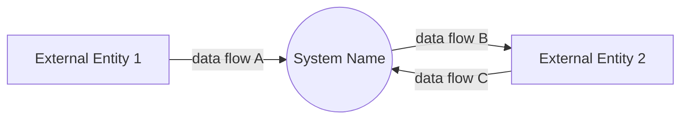
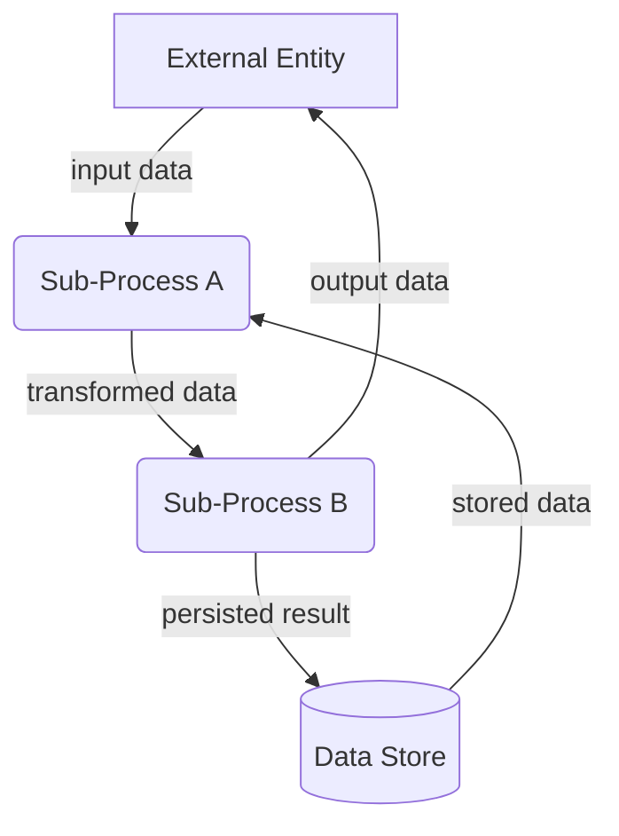
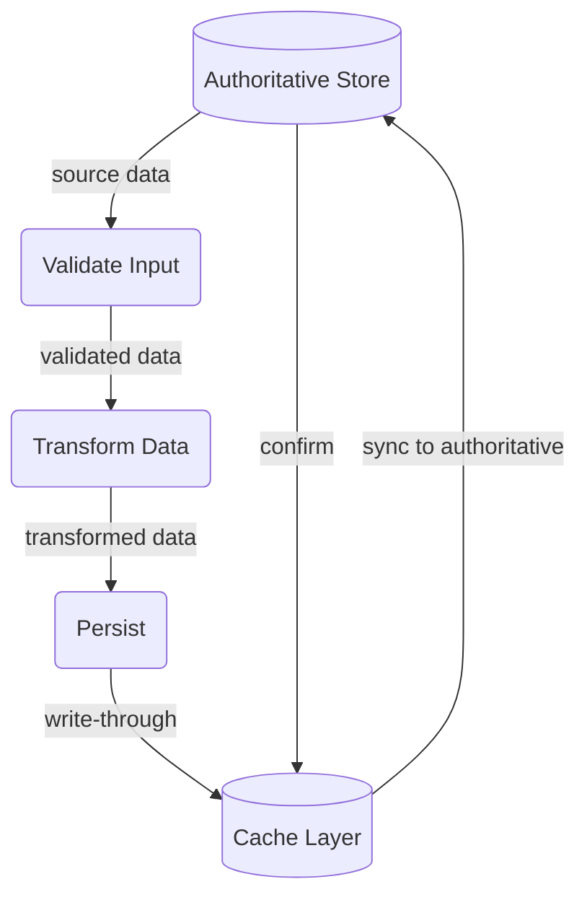

# dfd-md — Data Flow Diagram (dfd) Guide in Markdown

## Purpose

DFDs model **how data moves** — _what_ flows, not _how_ it's implemented. Every
DFD must be:

- **Data-movement focused** — arrows are data packets, not control flow, UI, or
  implementation details
- **Level-appropriate** — one level per diagram; don't mix levels
- **One dataflow per file** — a `.md` file contains **exactly one** dataflow
  (one Mermaid diagram). Never pack multiple flows, flows plus unrelated
  reference material, or level 2 diagrams into one file
- **Verifiable** — every flow maps to a real API call, function parameter, DB
  read/write, or message queue in the codebase
- **Constraint-verified** — DFDs are verified against explicit constraints (e.g.,
  top-10 user stories, nonfunctional requirements); every constraint must be
  traceable to ≥1 flow in the diagram. Constraints are never complete — extra
  flows beyond those required by the specified constraints are expected and
  allowed
- **Compact & cohesive** — split large systems across multiple small files,
  each a standalone dataflow. Happy paths stay under 5–7 nodes; split flows
  rather than growing a diagram
- **Low redundancy** — cross-reference instead of duplicating flows. Never
  repeat the same data structure or flow in multiple DFDs; reference the
  original document instead
- **Data-structure coupled** — DFDs are linked together through shared data
  structures: an upstream DFD produces a data shape that a downstream DFD
  consumes. Every cross-DFD reference must name the specific data structure
  (section 3 / `structures.md`) that forms the coupling

## DFD Flow

0. **Integration probe (data collection; optional, manual only)** — a
   live-data probe (no mocking; targets a live server, API, or resource) to
   collect actual data shapes for DFD revision. Skip if the project already has
   sufficient real-world data to reference, and **only run when explicitly
   requested** — it is not part of the routine change cycle. Use collected data
   as reference for the DFD revision and implementation phases.
1. **Revise DFD** — design or update the DFD so it accurately models the
   desired data movement.  Base the data structures on the shapes observed in
   the integration probe (step 0) when available.  Keep at the correct level;
   use the notation and structure rules above.
2. **Implement data flow validation constraints** — enforce data structure
   correctness through code-level constraints (see
   [Type-Driven Design & Validation Implementation](#type-driven-design--validation-implementation)
   below).  Parse and validate at subsystem entry points ("parse, don't
   validate"); cross-DFD shared structures defined once in a canonical location
   and imported by both producer and consumer modules for compile-time (or
   static-analysis) enforcement.  Where runtime validation is unavoidable, fail
   fast naming the expected DFD data structure and offending field.
3. **Concrete implementation** — code the types, core logic, and wiring
   described by the DFD. Favour incremental, type-first implementation.

## DFD Review (all diagrams)

Run independently of the change workflow — as a periodic audit or before a
release. The goal is to confirm every DFD in the project still matches the
code:

- **Enumerate** — list every `.md` file under the project's DFD root, including
  `level-2/`, `level-3/`, `shared/`, and every `structures.md`.
- **Compare against code** — for each DFD, walk its flows and data structures
  and confirm each one maps to real code (an API call, function parameter, DB
  read/write, or message). Verify producer/consumer couplings still agree on
  the shared data structure.
- **Update drift** — if the code has changed without a matching DFD update,
  revise the DFD to match reality; conversely, implement any DFD describing
  not-yet-built behaviour.
- **Prune** — delete flows and structures that no longer exist in code; remove
  references to deleted files.

## Type-Driven Design & Validation Implementation

DFD data structures are implemented following strict
**"Parse, don't validate"** discipline.  These principles apply regardless of
language:

- **Parse at boundaries** — all external input (wire formats, config files, CLI
  args) is parsed into domain types at the subsystem entry point.  After
  parsing, the rest of the system uses only those types — never raw strings,
  untyped dictionaries/maps, or loose primitives.
- **Make invalid states unrepresentable** — any value carrying an invariant
  (non-empty string, valid email, bounded number, well-formed URL) must be
  wrapped in a dedicated type whose constructor enforces the invariant at
  creation time.  Holding an instance of the type *guarantees* the invariant;
  no downstream validation needed.
- **Newtype / wrapper pattern** — single-field types that wrap a primitive and
  expose only valid constructions (fallible factory function, builder, private
  constructor).  Equivalent patterns exist in every language: data classes with
  private constructors, tagged types, opaque types, smart constructors, or
  newtype structs with a `TryFrom` impl.
- **Type-first implementation** — design types from the data structure tables
  *before* writing functions.  Each table row becomes a record or enum
  variant.  Functions operate on those types; the compiler/type-checker
  enforces correctness at every call site.
- **Cross-DFD shared types** — a data structure consumed by multiple DFDs is
  defined once in a canonical location.  Both producer and consumer modules
  import it, making type mismatches a **compile-time (or static-analysis)
  error** — no runtime check or test suite needed.
- **Fallible construction** — all constructors that can reject invalid input
  return a typed error (result type, checked exception, optional chaining with
  diagnostics) naming the DFD data structure and the offending field.  Errors
  are self-documenting.
- **No bare panics/asserts in production** — use structured errors or checked
   exceptions.  Unrecoverable programmer bugs (invariant violations indicating
   a logic error) are the only acceptable use of panics/asserts.

## Notation

### Symbol Mapping

| Element                                                  | Mermaid Shape       | Example                    |
| -------------------------------------------------------- | ------------------- | -------------------------- |
| **External Entity** (person, org, external system)       | `[Square brackets]` | `USER[User]`               |
| **Process** (transforms input → output data)             | `(Rounded)`         | `VALIDATE(Validate Input)` |
| **Data Store** (persistent repository)                   | `[(Cylinder)]`      | `DB[(Database)]`           |
| **Data Flow** (directional data movement)                | `-->|label|`        | `USER -->|"login request"| VALIDATE` |
| **Flow Split/Join** (same data to/from multiple targets) | Multiple arrows     | See examples               |

### Naming Conventions

| Element         | Convention                    | ✓ Good                                | ✗ Bad                        |
| --------------- | ----------------------------- | ------------------------------------- | ---------------------------- |
| External Entity | Singular noun, Title Case     | `Customer`, `PaymentGateway`          | `customers`, `my-api`        |
| Process         | Verb phrase, imperative       | `ValidateOrder`, `SendEmail`          | `OrderValidation`, `sending` |
| Data Store      | Singular noun, Title Case     | `OrderDb`, `ConfigStore`              | `database`, `orders_db`      |
| Data Flow       | Lowercase noun phrase, quoted | `"invoice pdf"`, `"user credentials"` | `send data`, `InvoicePDF`    |

## DFD Levels

DFDs use levels 0, 1, and 2. Level 3 is optional and only used when a Level 2
diagram itself needs decomposition.

| Level                     | Location                                  | Filename                |
| ------------------------- | ----------------------------------------- | ----------------------- |
| Level 0 — context         | `context-diagram.md` (one per project)    | `context-diagram.md`    |
| Level 1 — sub-process     | ✓ of the DFD directory                    | `{flow}.md`             |
| Level 2 — detail          | ✓/level-2/ of the DFD directory           | `{concern}.md`          |
| Level 3 — deeper detail   | ✓/level-3/ of the DFD directory           | `{concern}.md`          |
| Shared (cross-cutting)    | `_dfd/shared/` (project root)             | `{concern}.md`          |

The directory layout:

```
_dfd/
  context-diagram.md            # Level 0 — one dataflow (system + externals)
  shared/                       # cross-cutting concerns reused across DFDs
    error-toast.md
  {domain}/                     # e.g. memory, tools, agent, ...
    {dfd-name}/                 # one directory per DFD
      {flow}.md                 # Level 1 — ONE dataflow per file
      level-2/
        {concern}.md            # Level 2 — ONE dataflow per file
      level-3/
        {concern}.md            # Level 3 — only if a Level 2 needs decomposition
      structures.md             # reference doc (NO diagrams) — shared data
                                # structures, configuration, integration tables
```

### Level 0 — Context (`flowchart LR`)

Single process = entire system. External entities only. No internal processes or
data stores.



**Rules:**

- One system process
- All external entities that directly exchange data with the system
- Every external entity has ≥1 flow to/from the system
- No data stores

### Level 1 — Sub-Process Decomposition (`flowchart TD`)

Decomposes the Context diagram's single process into major sub-processes. Adds
data stores where processes read/write persistent data.

A Level 1 DFD is a set of **small, standalone, simple happy flows** (and other
primary data paths), one per file. Keep each dataflow under 5–7 nodes.
Exception handling, non-functional concerns, and abstract components belong in
Level 2 diagrams — never mixed into the happy flow, never in the same file.

Happy flows may share one subsystem-level `structures.md` (data structures,
configuration, integration tables) instead of duplicating tables per file.

**Happy Flow example (one dataflow, one file):**



**Rules:**

- Each process maps to one identifiable subsystem or module
- Each dataflow file is a self-contained data path — a reader can understand it
  without consulting other files
- Data stores appear only when ≥2 processes read/write the same store
- Every process must be reachable from ≥1 flow
- Caching layers are Level 2 details; at Level 1, show only the authoritative
  store
- Error paths, fallbacks, rate limits, and other non-functional concerns go in
  Level 2 files — not in the happy flow

### Level 2 — Detail Diagrams (`{dfd-name}/level-2/`)

Level 2 diagrams live as **separate files** in the `level-2/` subdirectory of
their DFD — never inline, never in the same file as a Level 1 flow. One diagram
per concern or process.

Level 2 diagrams cover categories of detail that are never mixed into the
happy flow:

| Category | When to use |
| -------- | ----------- |
| **Exceptional Handling** | Error paths, fallbacks, retries, edge-case recovery diverging from the happy path |
| **Non-Functional Requirements** | Rate limits, throttling, debouncing, security checkpoints, input sanitization, data retention/cleanup |
| **Abstract Components** | Caching layers, shared utilities, retry mechanics, cross-cutting infrastructure |
| **UI/UX Flow** | User-facing states matter — loading spinners, empty states, progressive disclosure, interaction sequences, optimistic updates |
| **Process Deep Dive** | Internal transformation logic inside a Level 1 process that is too complex for Level 1 |
| **Other Implementation Detail** | Any cross-cutting concern or subsystem internals that don't fit the categories above but are worth documenting |

**Example — Abstract Component (Cache Layer):**



**Rules:**

- One file per concern or process, named `{concern}.md` (e.g.
  `rate-limiting.md`, `validate-prompt-deep-dive.md`) — no `2c`/`2d`
  numbering; the filename is the title
- Filename should read as `{level-1-flow}-{concern}` when the detail ties to a
  single flow (e.g. `charge-payment-idempotency.md`), otherwise just
  `{concern}` (e.g. `error-handling.md`)
- Dashed `-.->` arrows for fallback paths (cache-miss reads, retries, error
  recovery, silent fallbacks with no user-visible error)
- Use `_dfd/shared/{concern}.md` when the same detail diagram is reused across
  multiple DFDs

### Level 3 — Deeper Detail (`{dfd-name}/level-3/`)

Only when a Level 2 diagram itself needs decomposition. Same rules as Level 2,
located in the `level-3/` subdirectory of the DFD directory. Keep this level
rare — deeper decomposition usually means a separate Level 1 subsystem DFD
instead.

## File Naming

| Level                  | Filename                                                                 |
| ---------------------- | ------------------------------------------------------------------------ |
| Context (Level 0)      | `context-diagram.md` (one per project)                                   |
| Level 1                | `{domain}/{dfd-name}/{flow}.md` — one dataflow per file                  |
| Level 2                | `{domain}/{dfd-name}/level-2/{concern}.md` — one dataflow per file       |
| Level 3                | `{domain}/{dfd-name}/level-3/{concern}.md` — one dataflow per file       |
| Shared (cross-cutting) | `shared/{concern}.md` — for concerns reused across multiple DFDs         |
| Structures (shared types, no diagrams) | `{domain}/{dfd-name}/structures.md`                              |

## Document Structure

Every dataflow `.md` file uses the numbered sections below. Never include more
than one diagram in a file, and never mix levels in one file.

### Anti-Patterns

- **Context diagram references** — do not list `context-diagram.md` in
  References. Every DFD lives in the same project; the reader already knows the
  context diagram exists. Only link diagrams with direct data-flow coupling.
- **Duplicate data structures** — if a data shape already appears in another
  DFD (or in the same DFD's `structures.md`), reference that file instead of
  copying the table.
- **Boilerplate "See also" blocks** — section 1 References should list only
  files that are _functional prerequisites or shared dependencies_ of this
  diagram's flows. Omit the section entirely when there are no such links.
- **Multi-diagram files** — a `.md` file holds exactly ONE dataflow. Multiple
  happy flows live in separate files; detail diagrams live in `level-2/`
  (or `level-3/`) files.
- **Unnumbered-anchor drift** — since section numbering grows per file (see
  `{file}#2. Diagram`), always link to the flow *file*, not to the old
  `#2a` anchors.

### Level 1 file

```markdown
# {Flow Name}

## 1. Purpose

Single sentence describing the dataflow. May include an optional **References**
bullet list linking to upstream/downstream DFDs, API docs, or shared diagrams.

## 2. Diagram

Mermaid `flowchart` block — ONE dataflow. Keep under 5–7 nodes for happy
paths. Apply shape conventions from the notation table above.

(optional) Notes defining the data flowing over each arrow.

## 3. Data Structures

Only shapes documented by THIS flow — the rest belongs to
`structures.md` in the same DFD directory. Cross-references mandatory:
- A shape shared within the DFD → reference `{dfd-name}/structures.md`.
- A shape produced/consumed by another DFD → reference that DFD's
  `structures.md` or defining flow file, naming the shape.
```

### Level 2 / Level 3 file

```markdown
# {Concern Name}

## 1. Purpose

Single sentence describing the concern. Optional **References** to the parent
Level 1 flow file and any shared diagrams.

## 2. Diagram

Mermaid `flowchart` block — ONE dataflow. Dashed `-.->` arrows for fallback
paths.

No Data Structures section: reference `structures.md` or the parent Level 1
file for shapes.
```

### `structures.md` (reference doc — no diagrams, no dataflows)

One per DFD directory, when the DFD's flows share data structures,
configuration, or integration tables:

```markdown
# {DFD Name} — Shared Structures

## 1. Overview

Preserved subsystem overview/Purpose prose. No diagrams.

## 3. Data Structures

One table per distinct data shape flowing through the DFD. Keep fields
compact — link full schemas where applicable.

#### `OrderRequest`

| Field              | Type      | Description |
| ------------------ | --------- | ----------- |
| `items`            | `Item[]`  | ...         |

## 4. Configuration

Configuration keys consumed by this DFD's flows.

## 5. Integration

Integration tables with the agent harness, platform, or other subsystems.
```
