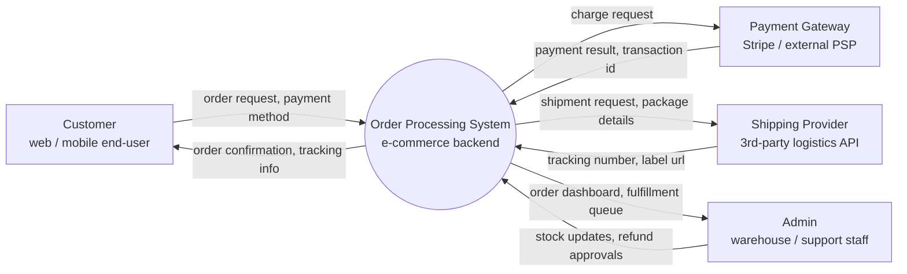

# Order Processing System — Context Diagram Example

### 1. Purpose

Model the top-level data flows between the order processing system, its users,
and external dependencies.

### 2. Diagram

- Single system process `(( ))`: the entire order processing backend.
- Four external entities `[ ]`: `CUSTOMER`, `PAYMENT`, `SHIPPING`, `ADMIN`.
- No data stores — those appear at Level 1.
- Every external entity has ≥1 flow to/from the system.
