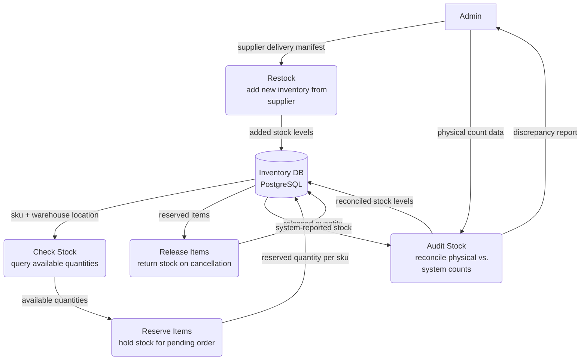
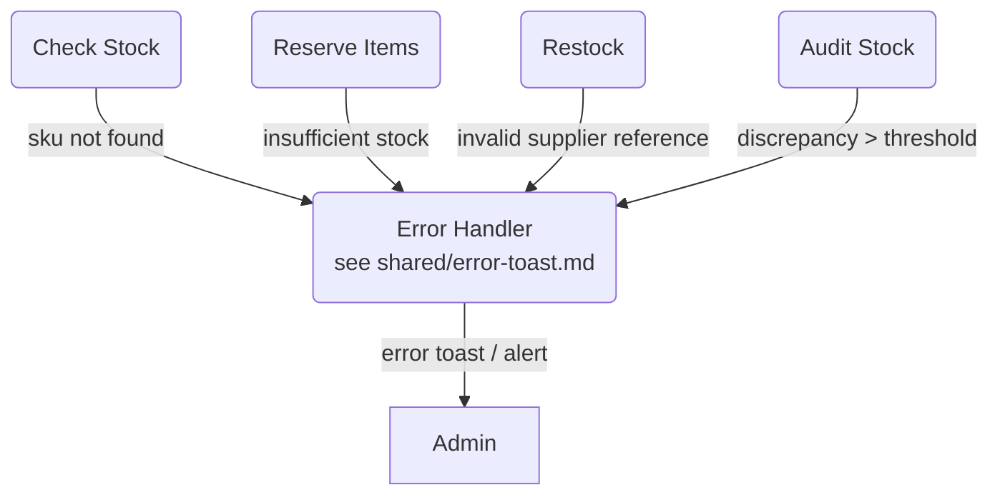
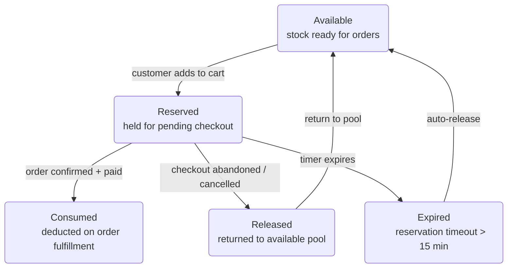
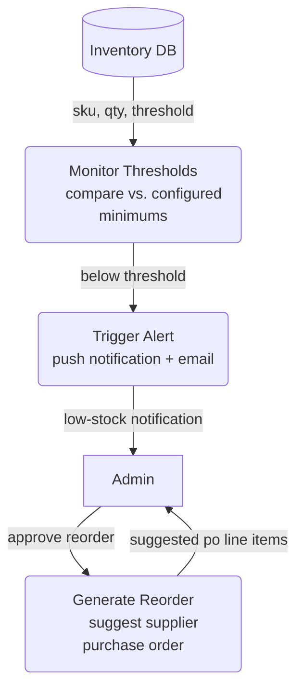

# Inventory Management — Level 1 DFD Example

A second Level 1 DFD demonstrating how shared cross-cutting diagrams are
referenced from multiple subsystems.

---

### 1. Purpose

Model the data flow for checking, reserving, releasing, and updating inventory
stock levels — supporting both the order pipeline and admin operations.

**References:**

- Upstream DFD: [`order-processing.md`](./order-processing.md) (RESERVE +
  RELEASE consumer)
- Shared diagrams: [`error-toast.md`](./shared/error-toast.md)

### 2. Diagram

#### 2a. Happy Flow (Main Success Path)

- `RESERVE` is called by the order pipeline during checkout.
- `RELEASE` is the compensating action triggered by order cancellations or
  payment failures.
- `RESTOCK` and `AUDIT` are admin-driven operations.

#### 2b. Error Handling & Fallbacks

- Stock shortages and data integrity issues flow to `ERROR` and surface to
  `ADMIN`.
- `ERROR` is the shared [`error-toast.md`](./shared/error-toast.md) component.

#### 2c. Reservation Lifecycle (UI/UX Flow)

- Reservations time out after 15 minutes to prevent stock hoarding.
- `EXPIRED` auto-releases back to `AVAILABLE` without user interaction.

#### 2d. Low Stock Alerts (Non-Functional Concern)

- `MONITOR` runs periodically (cron) and compares stock levels against
  configured thresholds per SKU.
- `ALERT` pushes to admin dashboard and optionally sends email/Slack.
- `REORDER` suggests purchase order line items based on historical demand, but
  requires admin approval.

### 3. Data Structures

#### `InventoryRecord`

| Field           | Type       | Description                   |
| --------------- | ---------- | ----------------------------- |
| `sku`           | `string`   | Stock-keeping unit identifier |
| `warehouse_id`  | `string`   | Warehouse location code       |
| `available_qty` | `integer`  | Unreserved stock count        |
| `reserved_qty`  | `integer`  | Stock held for pending orders |
| `threshold`     | `integer`  | Low-stock alert trigger level |
| `updated_at`    | `datetime` | Last mutation timestamp       |

#### `Reservation`

| Field            | Type       | Description                                 |
| ---------------- | ---------- | ------------------------------------------- |
| `reservation_id` | `string`   | Unique reservation identifier               |
| `order_id`       | `string`   | Parent order (nullable for cart holds)      |
| `sku`            | `string`   | Reserved SKU                                |
| `quantity`       | `integer`  | Reserved count                              |
| `expires_at`     | `datetime` | Auto-release deadline (15 min TTL)          |
| `status`         | `enum`     | `active`, `consumed`, `released`, `expired` |
