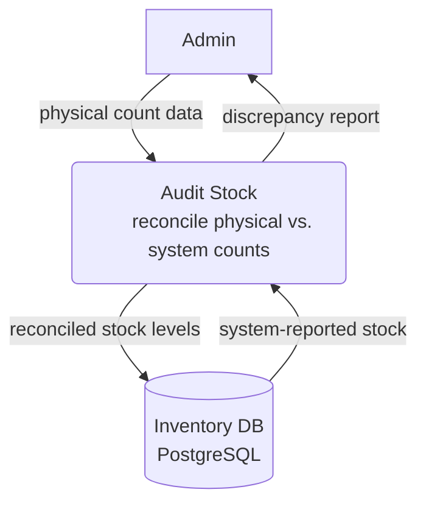

# Audit Stock — Level 1 DFD Example

## 1. Purpose

Admin-driven reconciliation of physical counts against system-reported stock.

## 2. Diagram

## 3. Data Structures

- `InventoryRecord` — see [`structures.md`](structures.md)
