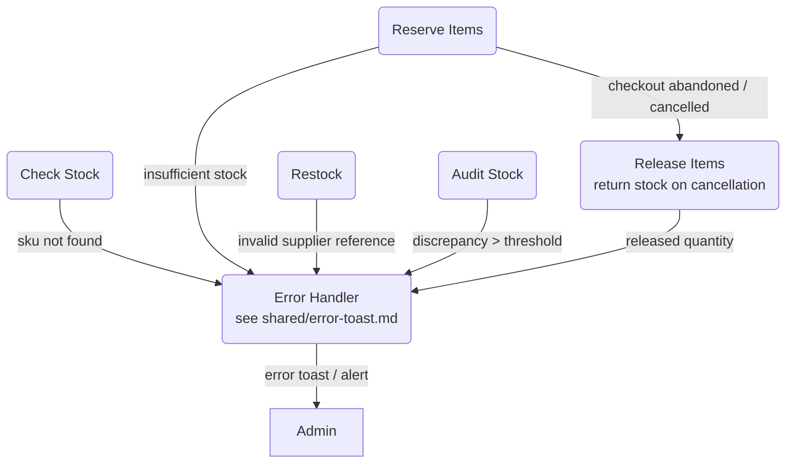

# Error Handling & Fallbacks — Level 2 DFD Example

## 1. Purpose

Exceptional paths diverging from the
[reserve-stock](../reserve-stock.md) and [restock](../restock.md) data paths —
stock shortages, data integrity issues, and the compensating release on
cancellation. The user-facing `ERROR` surface is shared:
see [`../../shared/error-toast.md`](../../shared/error-toast.md).

## 2. Diagram

- Stock shortages and data integrity issues flow to `ERROR` and surface to
  `ADMIN`.
- `RELEASE` is the compensating action triggered by order cancellations or
  payment failures.
- `ERROR` is the shared [`error-toast.md`](../../shared/error-toast.md) component.
