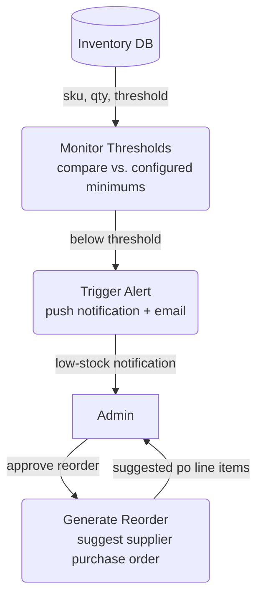

# Low Stock Alerts — Level 2 DFD Example

## 1. Purpose

Non-functional monitoring concern: compare stock levels against configured
thresholds and trigger reorder suggestions.

## 2. Diagram

- `MONITOR` runs periodically (cron) and compares stock levels against
  configured thresholds per SKU.
- `ALERT` pushes to admin dashboard and optionally sends email/Slack.
- `REORDER` suggests purchase order line items based on historical demand, but
  requires admin approval.
