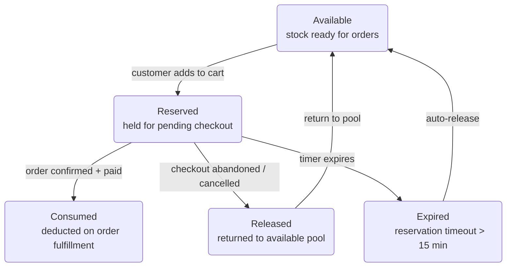

# Reservation Lifecycle — Level 2 DFD Example

## 1. Purpose

UI-visible states of a `Reservation` (see
[`structures.md`](../structures.md)) and their transitions.

## 2. Diagram

- Reservations time out after 15 minutes to prevent stock hoarding.
- `EXPIRED` auto-releases back to `AVAILABLE` without user interaction.
