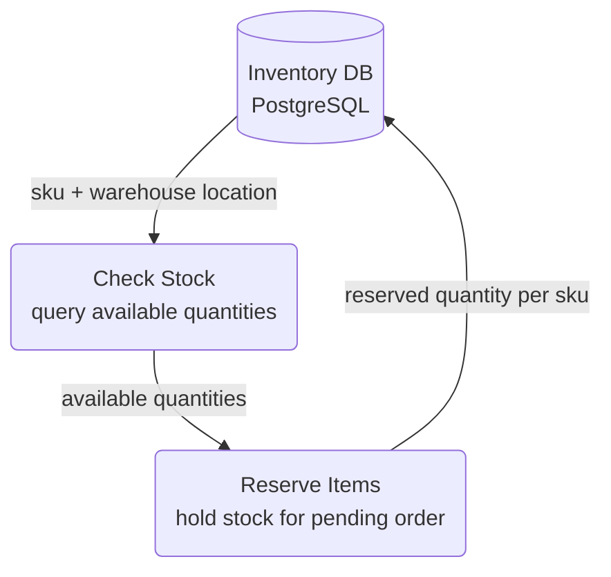

# Reserve Stock — Level 1 DFD Example

## 1. Purpose

The checkout-time data path: check available quantities, then hold stock for a
pending order. Called by the order pipeline during checkout (see
[`../order-processing/order-pipeline.md`](../order-processing/order-pipeline.md)).
Compensating release on cancellation is a Level 2 concern
([`level-2/error-handling.md`](level-2/error-handling.md)).

## 2. Diagram

- `RESERVE` is called by the order pipeline during checkout.

## 3. Data Structures

- `InventoryRecord` — see [`structures.md`](structures.md)
- `Reservation` — see [`structures.md`](structures.md)
