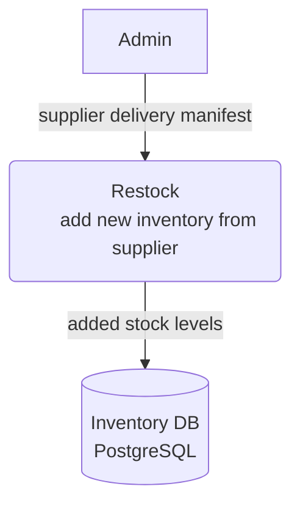

# Restock — Level 1 DFD Example

## 1. Purpose

Admin-driven data path adding new inventory from a supplier delivery.

## 2. Diagram

## 3. Data Structures

- `InventoryRecord` — see [`structures.md`](structures.md)
