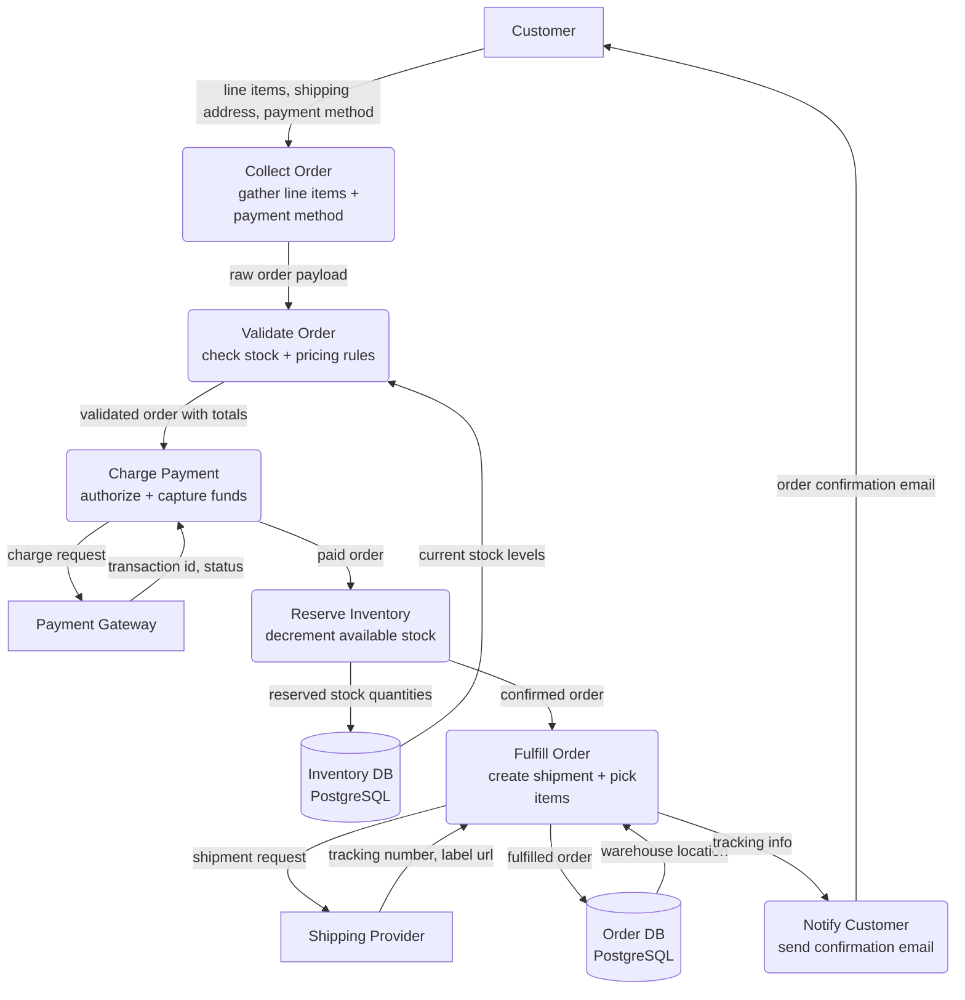
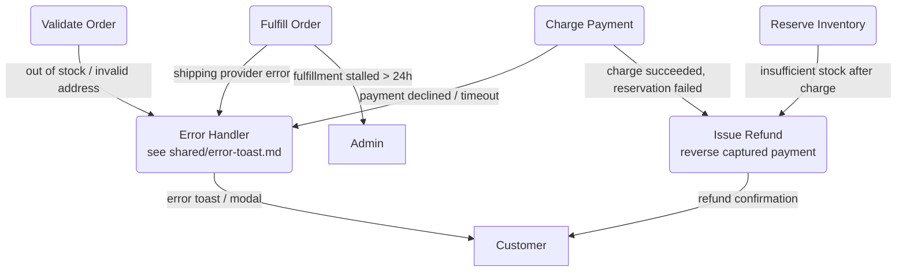
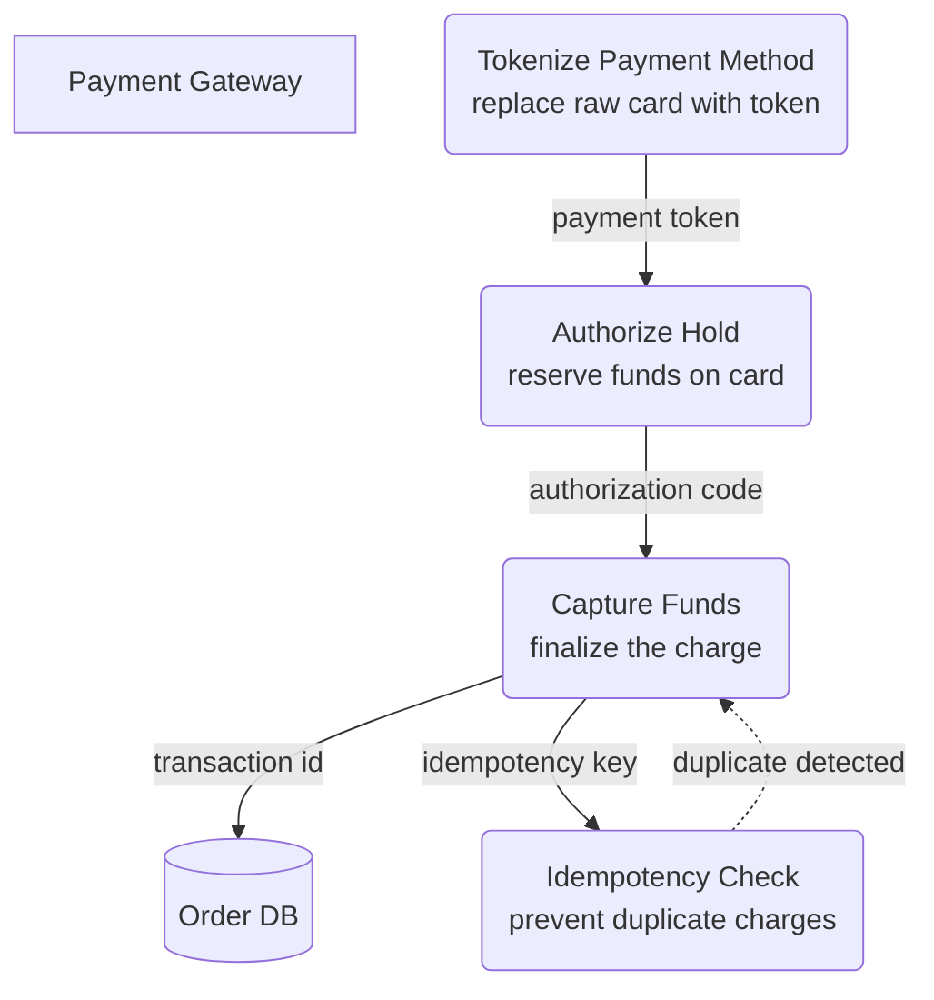
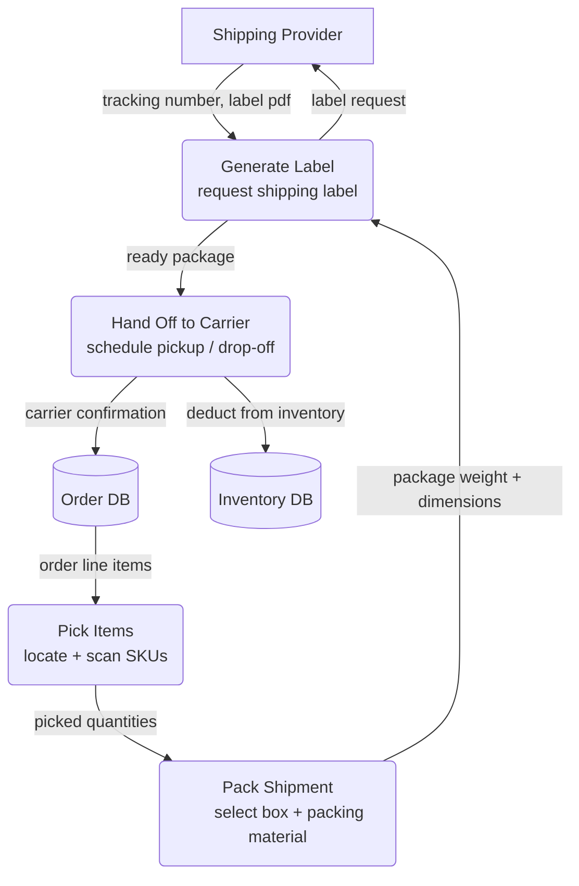
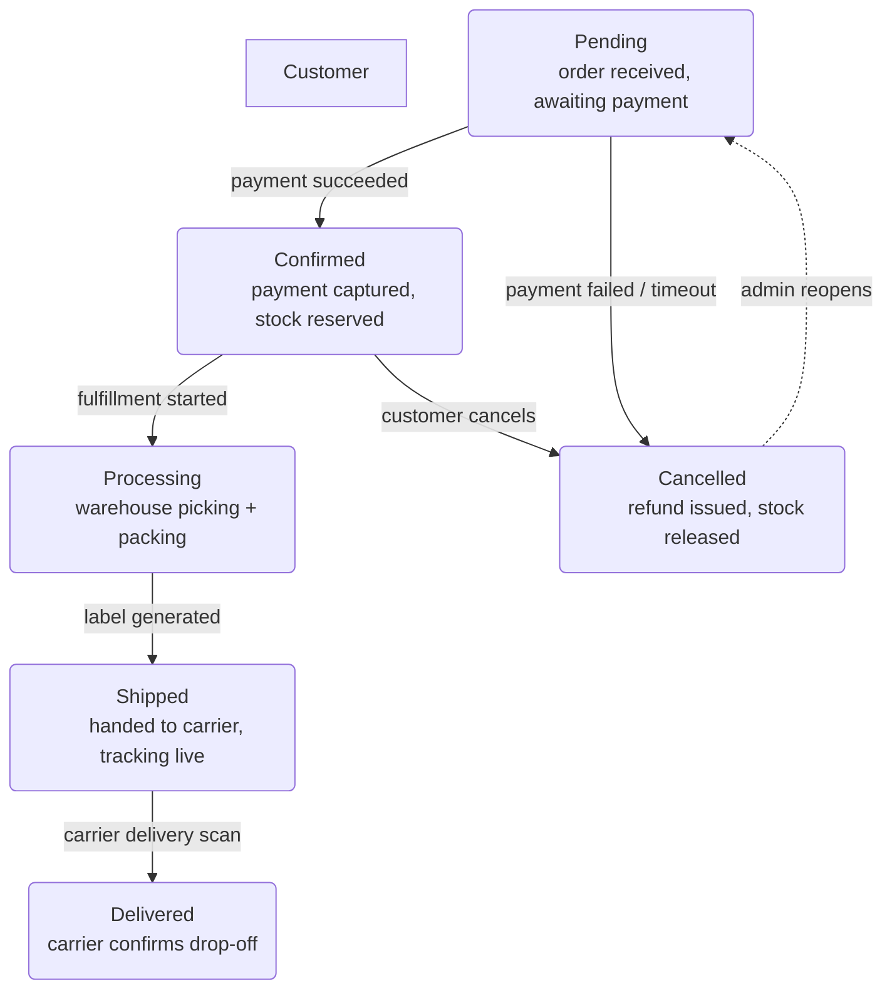
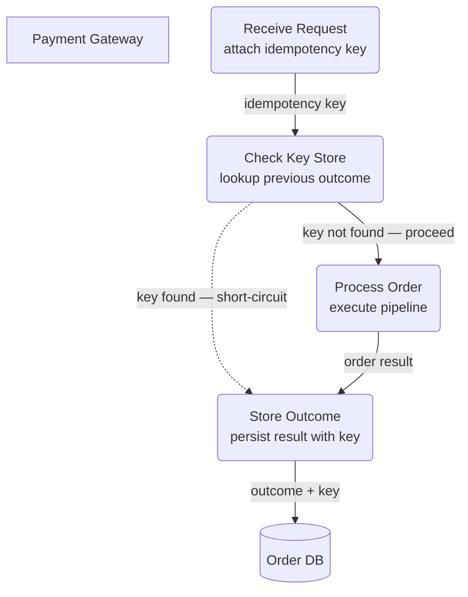

# Order Processing Pipeline — Level 1 DFD Example

This file demonstrates a complete Level 1 DFD with multiple inline Level 2
diagrams (process deep-dives, UI/UX flows, non-functional concerns) and
references to shared cross-cutting diagrams — following the
[dfd-md skill](../../SKILL.md) conventions.

---

### 1. Purpose

Model the data flow through the order processing pipeline — collecting the
order, validating payment, reserving inventory, fulfilling the shipment, and
notifying the customer.

**References:**

- Upstream DFD: [`inventory-management.md`](./inventory-management.md) (stock
  reservation)
- Shared diagrams: [`error-toast.md`](./shared/error-toast.md),
  [`rate-limiting.md`](./shared/rate-limiting.md)
- Stripe API docs: https://stripe.com/docs/api

### 2. Diagram

#### 2a. Happy Flow (Main Success Path)

- **External entities** (`[ ]`): `CUSTOMER`, `PAYMENT`, `SHIPPING`.
- **Data stores** (`[( )]`): `ORDERDB`, `INVENTORYDB` — relational databases.
- **Processes** (`( )`): six sub-processes forming the order pipeline.
- `CHARGE` communicates with the external payment gateway; `FULFILL` talks to
  the shipping provider.

#### 2b. Error Handling & Fallbacks

- Payment failures flow to `ERROR` and surface to the customer.
- `REFUND` handles the compensating action when payment succeeds but downstream
  steps fail.
- Stalled fulfillments escalate to `ADMIN` for manual intervention.
- `ERROR` is detailed in the shared [`error-toast.md`](./shared/error-toast.md)
  diagram.

#### 2c. `Charge Payment` Deep Dive (Process Deep Dive)

- `TOKENIZE` replaces raw PCI-sensitive card data with a gateway token.
- The dashed `-.->` from `IDEMPOTENCY` back to `CAPTURE` represents a silent
  short-circuit — if the same idempotency key is replayed, the previous result
  is returned instead of charging again.
- See also shared [`rate-limiting.md`](./shared/rate-limiting.md).

#### 2d. `Fulfill Order` Deep Dive (Process Deep Dive)

#### 2e. Order Status Lifecycle (UI/UX Flow)

- Six UI states cover the entire order lifecycle.
- Dashed `-.->` from `CANCELLED` to `PENDING` represents an admin-only re-open
  path — not a standard user flow.

#### 2f. Idempotency & Retry Safety (Non-Functional Concern)

- Every incoming order request carries a client-generated idempotency key.
- `CHECK` short-circuits duplicate requests to the cached outcome, preventing
  double-charges.
- Dashed `-.->` marks the cache-hit path — transparent to the client.

### 3. Data Structures

#### `OrderRequest`

| Field               | Type         | Description                         |
| ------------------- | ------------ | ----------------------------------- |
| `idempotency_key`   | `string`     | Client-generated unique key         |
| `customer_id`       | `string`     | Customer identifier                 |
| `line_items`        | `LineItem[]` | Products + quantities + unit prices |
| `shipping_address`  | `Address`    | Delivery destination                |
| `payment_method_id` | `string`     | Tokenized payment method reference  |
| `currency`          | `string`     | ISO 4217 (e.g. `"USD"`)             |

#### `Order`

| Field             | Type                | Description                                                                       |
| ----------------- | ------------------- | --------------------------------------------------------------------------------- |
| `order_id`        | `string`            | System-generated unique identifier                                                |
| `status`          | `enum`              | One of: `pending`, `confirmed`, `processing`, `shipped`, `delivered`, `cancelled` |
| `transaction_id`  | `string`            | Payment gateway transaction reference                                             |
| `tracking_number` | `string` (optional) | Shipping provider tracking code                                                   |
| `total_amount`    | `integer`           | Amount in minor currency units                                                    |
| `created_at`      | `datetime`          | ISO 8601 timestamp                                                                |
| `updated_at`      | `datetime`          | ISO 8601 timestamp                                                                |

#### `ShipmentRequest`

| Field           | Type        | Description                    |
| --------------- | ----------- | ------------------------------ |
| `order_id`      | `string`    | Parent order reference         |
| `origin`        | `Address`   | Warehouse address              |
| `destination`   | `Address`   | Customer shipping address      |
| `packages`      | `Package[]` | Weight + dimensions per box    |
| `service_level` | `string`    | e.g. `"standard"`, `"express"` |
