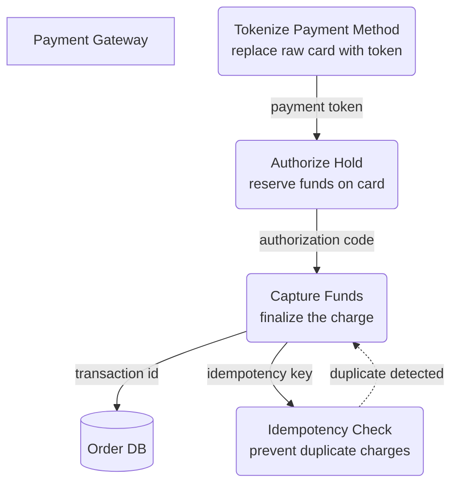

# Charge Payment Deep Dive — Level 2 DFD Example

## 1. Purpose

Internal transformation logic inside the
[`Charge Payment` process](../order-pipeline.md) — too complex for Level 1.

## 2. Diagram

- `TOKENIZE` replaces raw PCI-sensitive card data with a gateway token.
- The dashed `-.->` from `IDEMPOTENCY` back to `CAPTURE` represents a silent
  short-circuit — if the same idempotency key is replayed, the previous result
  is returned instead of charging again.
