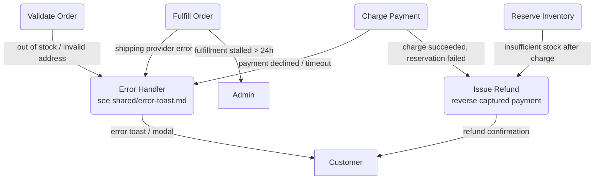

# Error Handling & Fallbacks — Level 2 DFD Example

## 1. Purpose

Exceptional paths that diverge from the
[order pipeline](../order-pipeline.md) happy path — failures, compensating
refunds, and admin escalation. The user-visible `ERROR` surface is shared:
see [`../shared/error-toast.md`](../../shared/error-toast.md).

## 2. Diagram

- Payment failures flow to `ERROR` and surface to the customer.
- `REFUND` handles the compensating action when payment succeeds but downstream
  steps fail.
- Stalled fulfillments escalate to `ADMIN` for manual intervention.
- Rate limiting is documented in the shared
  [`rate-limiting.md`](../../shared/rate-limiting.md) diagram.
