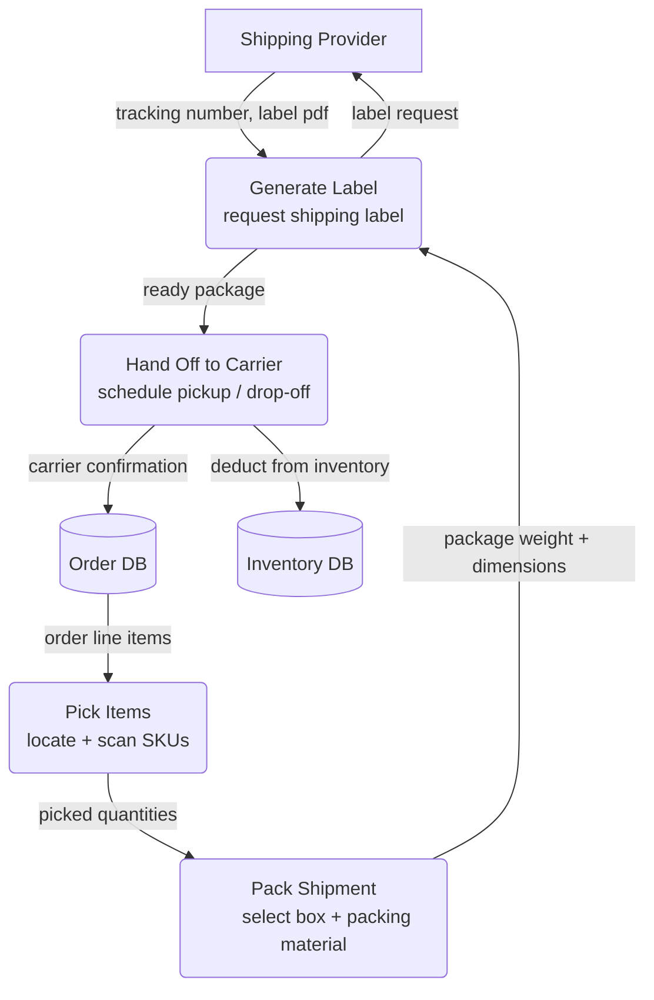

# Fulfill Order Deep Dive — Level 2 DFD Example

## 1. Purpose

Internal transformation logic inside the
[`Fulfill Order` process](../order-pipeline.md) — too complex for Level 1.

## 2. Diagram

```mermaid
flowchart TD
    SHIPPING["Shipping Provider"]
    ORDERDB[("Order DB")]
    INVENTORYDB[("Inventory DB")]

    PICK("Pick Items
      locate + scan SKUs")
    PACK("Pack Shipment
      select box + packing material")
    LABEL("Generate Label
      request shipping label")
    SHIP("Hand Off to Carrier
      schedule pickup / drop-off")

    PICK -->|"picked quantities"| PACK
    ORDERDB -->|"order line items"| PICK
    PACK -->|"package weight + dimensions"| LABEL
    LABEL -->|"label request"| SHIPPING
    SHIPPING -->|"tracking number, label pdf"| LABEL
    LABEL -->|"ready package"| SHIP
    SHIP -->|"carrier confirmation"| ORDERDB
    SHIP -->|"deduct from inventory"| INVENTORYDB
```
