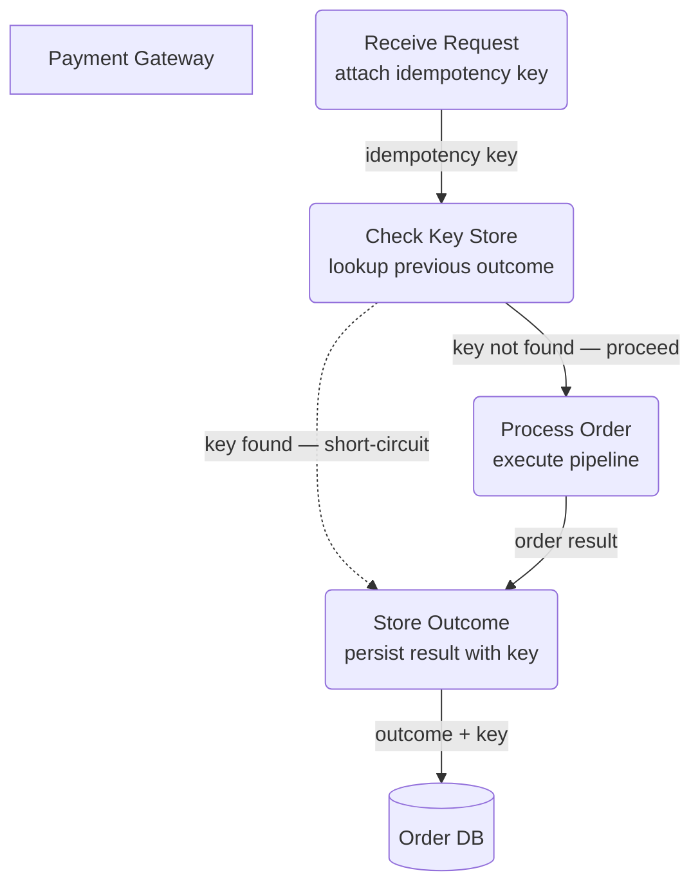

# Idempotency & Retry Safety — Level 2 DFD Example

## 1. Purpose

Non-functional safety mechanism guarding the
[order pipeline](../order-pipeline.md) against duplicate charges.

## 2. Diagram

- Every incoming order request carries a client-generated idempotency key.
- `CHECK` short-circuits duplicate requests to the cached outcome, preventing
  double-charges.
- Dashed `-.->` marks the cache-hit path — transparent to the client.
