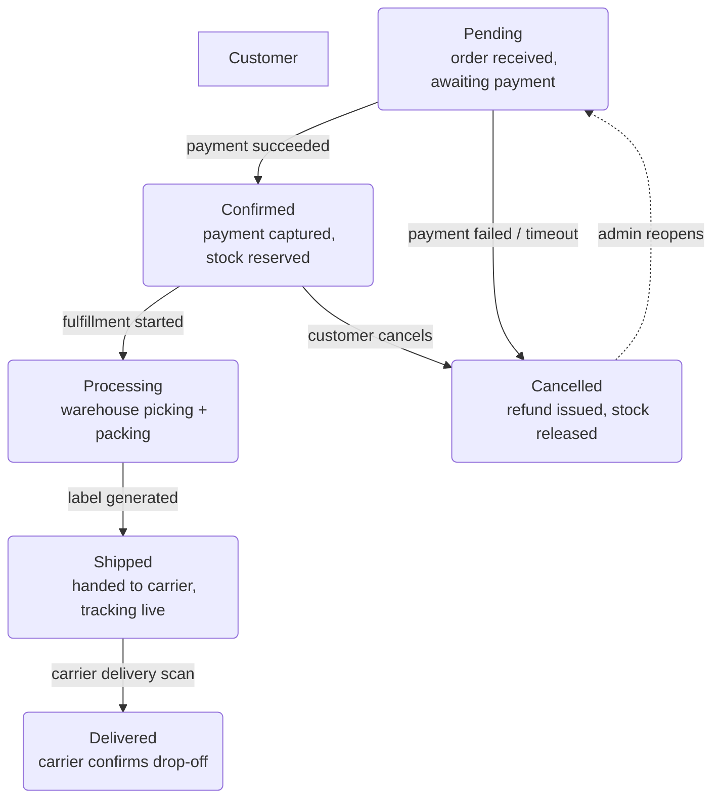

# Order Status Lifecycle — Level 2 DFD Example

## 1. Purpose

User-facing order states and their transitions — a UI/UX flow, not a
sub-process data path.

## 2. Diagram

- Six UI states cover the entire order lifecycle.
- Dashed `-.->` from `CANCELLED` to `PENDING` represents an admin-only re-open
  path — not a standard user flow.
