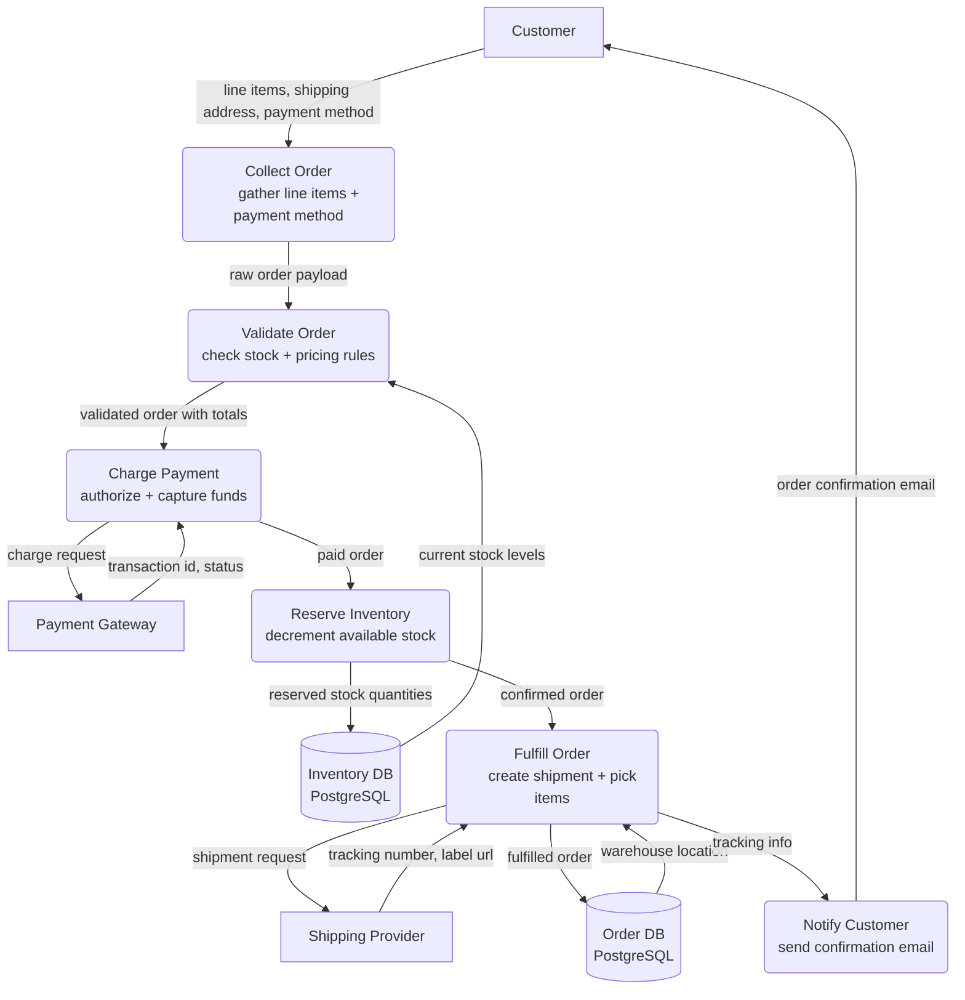

# Order Pipeline — Level 1 DFD Example

## 1. Purpose

Model the happy-path data flow through the order pipeline — collecting the
order, validating payment, reserving inventory, fulfilling the shipment, and
notifying the customer.

**References:**

- Upstream DFD: [`../inventory-management/reserve-stock.md`](../inventory-management/reserve-stock.md)
  (stock reservation, `InventoryRecord`)
- Shared diagrams: [`../shared/error-toast.md`](../shared/error-toast.md),
  [`../shared/rate-limiting.md`](../shared/rate-limiting.md)
- Stripe API docs: https://stripe.com/docs/api

## 2. Diagram

- **External entities** (`[ ]`): `CUSTOMER`, `PAYMENT`, `SHIPPING`.
- **Data stores** (`[( )]`): `ORDERDB`, `INVENTORYDB` — relational databases.
- **Processes** (`( )`): six sub-processes forming the order pipeline.
- `CHARGE` communicates with the external payment gateway; `FULFILL` talks to
  the shipping provider.

## 3. Data Structures

#### `OrderRequest`

| Field               | Type         | Description                         |
| ------------------- | ------------ | ----------------------------------- |
| `idempotency_key`   | `string`     | Client-generated unique key         |
| `customer_id`       | `string`     | Customer identifier                 |
| `line_items`        | `LineItem[]` | Products + quantities + unit prices |
| `shipping_address`  | `Address`    | Delivery destination                |
| `payment_method_id` | `string`     | Tokenized payment method reference  |
| `currency`          | `string`     | ISO 4217 (e.g. `"USD"`)             |

#### `Order`

| Field             | Type                | Description                                                                       |
| ----------------- | ------------------- | --------------------------------------------------------------------------------- |
| `order_id`        | `string`            | System-generated unique identifier                                                |
| `status`          | `enum`              | One of: `pending`, `confirmed`, `processing`, `shipped`, `delivered`, `cancelled` |
| `transaction_id`  | `string`            | Payment gateway transaction reference                                             |
| `tracking_number` | `string` (optional) | Shipping provider tracking code                                                   |
| `total_amount`    | `integer`           | Amount in minor currency units                                                    |
| `created_at`      | `datetime`          | ISO 8601 timestamp                                                                |
| `updated_at`      | `datetime`          | ISO 8601 timestamp                                                                |

#### `ShipmentRequest`

| Field           | Type        | Description                    |
| --------------- | ----------- | ------------------------------ |
| `order_id`      | `string`    | Parent order reference         |
| `origin`        | `Address`   | Warehouse address              |
| `destination`   | `Address`   | Customer shipping address      |
| `packages`      | `Package[]` | Weight + dimensions per box    |
| `service_level` | `string`    | e.g. `"standard"`, `"express"` |
