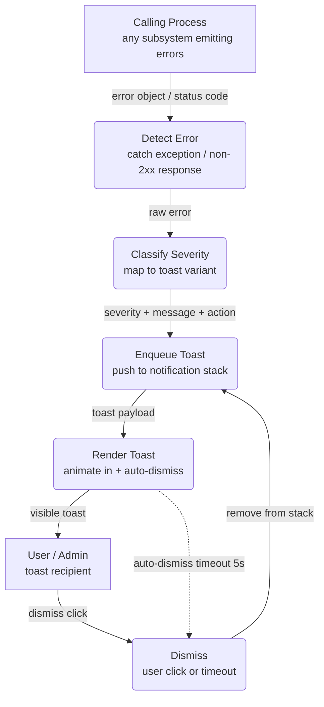

# Error Toast — Shared Cross-Cutting Diagram

This shared diagram models the common error display pattern reused by multiple
Level 1 DFDs. Reference it from any subsystem that surfaces errors to a user or
admin.

---

### 1. Purpose

Model the data flow from error detection through severity classification to
user-visible toast notification display and dismissal.

**Used by:** [`order-processing.md`](../order-processing.md),
[`inventory-management.md`](../inventory-management.md)

### 2. Diagram

- `CLASSIFY` maps severity: `4xx` → `warning`, `5xx` → `error`, network →
  `critical`.
- Dashed `-.->` from `RENDER` to `DISMISS` represents the auto-dismiss timer —
  non-interactive.
- `DISMISS` feeds back to `ENQUEUE` to show the next queued toast if any.

### 3. Data Structures

#### `ToastPayload`

| Field         | Type                     | Description                            |
| ------------- | ------------------------ | -------------------------------------- |
| `id`          | `string`                 | Unique toast identifier                |
| `severity`    | `enum`                   | `info`, `warning`, `error`, `critical` |
| `message`     | `string`                 | User-facing message text               |
| `action`      | `ToastAction` (optional) | Inline action button (e.g. "Retry")    |
| `duration_ms` | `integer`                | Auto-dismiss timeout (default 5000)    |

#### `ToastAction`

| Field      | Type       | Description              |
| ---------- | ---------- | ------------------------ |
| `label`    | `string`   | Button text              |
| `callback` | `function` | Handler invoked on click |
