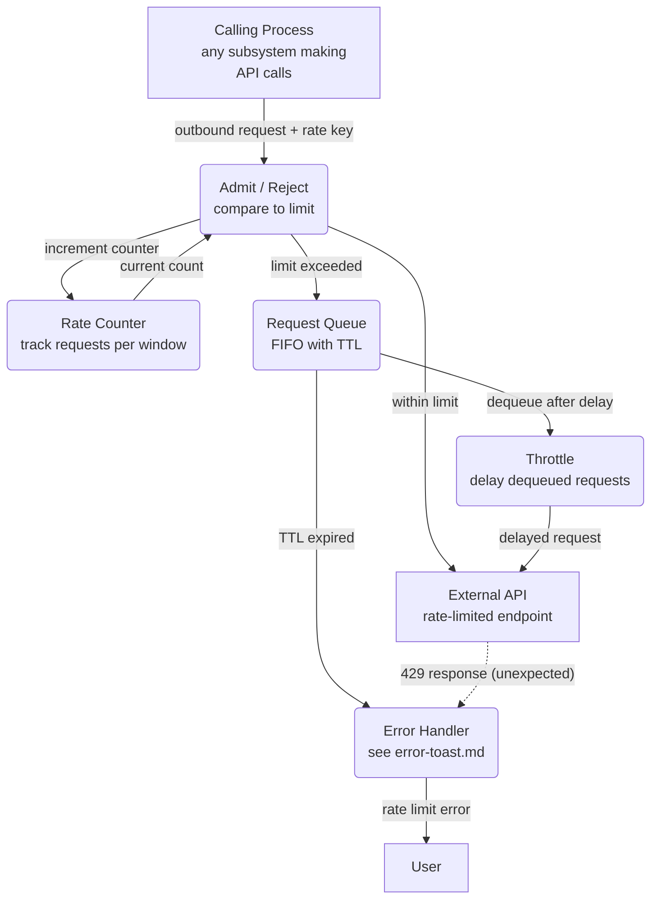

# Rate Limiting — Shared Cross-Cutting Diagram

This shared diagram models the common client-side rate limiting pattern used by
subsystems that call external APIs. Reference it from any Level 1 DFD that needs
to avoid 429 responses.

---

### 1. Purpose

Model the data flow for tracking, throttling, and queuing outbound API requests
to stay within provider rate limits.

**Used by:** [`order-processing.md`](../order-processing.md),
[`inventory-management.md`](../inventory-management.md)

### 2. Diagram

- `COUNTER` tracks requests in a sliding window (e.g. 60 seconds).
- `ADMIT` uses the counter to decide: forward directly or enqueue.
- Dashed `-.->` from `API` to `ERROR` is a safety net — the client-side limiter
  should prevent 429s, but unexpected rejections still surface.
- `QUEUE` entries have a configurable TTL; expired entries are dropped with a
  user-visible error.

### 3. Data Structures

#### `RateLimitConfig`

| Field               | Type      | Description                          |
| ------------------- | --------- | ------------------------------------ |
| `window_ms`         | `integer` | Sliding window duration (e.g. 60000) |
| `max_requests`      | `integer` | Request cap per window               |
| `queue_ttl_ms`      | `integer` | Max time a request waits in queue    |
| `throttle_delay_ms` | `integer` | Delay between dequeued requests      |

#### `RateKey`

| Field      | Type     | Description                             |
| ---------- | -------- | --------------------------------------- |
| `api_name` | `string` | Target API identifier (e.g. `"stripe"`) |
| `endpoint` | `string` | Specific route (e.g. `"/v1/charges"`)   |
| `scope`    | `string` | `"global"` or `"per-user"`              |
