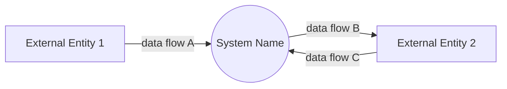
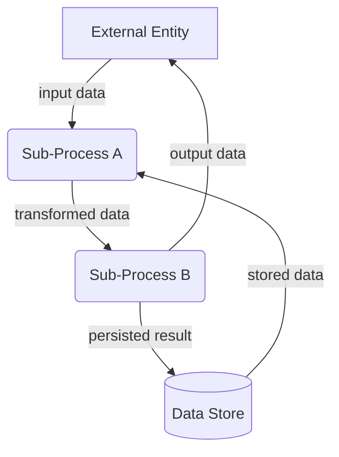
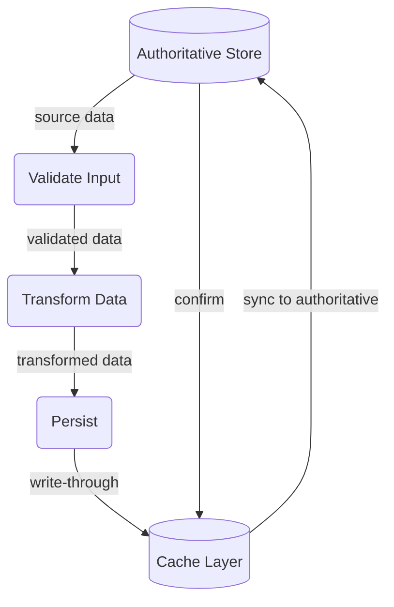

# dfd-md — Data Flow Diagram (dfd) Guide in Markdown

## Purpose

DFDs model **how data moves** — _what_ flows, not _how_ it's implemented. Every
DFD must be:

- **Data-movement focused** — arrows are data packets, not control flow, UI, or
  implementation details
- **Level-appropriate** — one level per diagram; don't mix levels
- **Verifiable** — every flow maps to a real API call, function parameter, DB
  read/write, or message queue in the codebase
- **Constraint-verified** — DFDs are verified against explicit constraints (e.g.,
  top-10 user stories, nonfunctional requirements); every constraint must be
  traceable to ≥1 flow in the diagram. Constraints are never complete — extra
  flows beyond those required by the specified constraints are expected and
  allowed
- **Compact & cohesive** — one DFD per subsystem; split large systems across
  multiple files. Each Level 1 DFD is composed of several small, standalone,
  simple happy flows — not one monolithic diagram
- **Low redundancy** — cross-reference instead of duplicating flows. Never
  repeat the same data structure or flow in multiple DFDs; reference the
  original document instead
- **Data-structure coupled** — DFDs are linked together through shared data
  structures: an upstream DFD produces a data shape that a downstream DFD
  consumes. Every cross-DFD reference must name the specific data structure
  (section 3 table) that forms the coupling

## DFD-Driven Development Workflow ("DFD Dev Flow")

The DFD development process is complemented by a **comprehensive three-part test
suite**. Together they form the following iterative workflow:

1. **Revise DFD** — design or update the DFD so it accurately models the
   desired data movement. Keep it at the correct level; use the notation and
   structure rules above.
2. **Real integration test (data collection)** — write a real integration test
   (no mocking; targets a live server, API, or resource) and run it to collect
   actual data shapes and verify the DFD flows work end-to-end against reality.
   Use this data as reference for the implementation phase.
3. **Concrete implementation** — code the types, core logic, and wiring
   described by the DFD. Favour incremental, type-first implementation.
4. **Comprehensive test suite** — build and run the three test layers until
   every test passes:

   | Layer | Name | Description |
   | ----- | ---- | ----------- |
   | **Core** | Core test suite | Per-DFD, fine-grained tests against a single diagram's processes and data structures — analogous to unit tests. Each DFD gets its own core tests. |
   | **User** | User test suite | Tests driven by a user story, exceptional event, or end-to-end scenario — analogous to system/integration tests. Verifies multiple DFDs work together to satisfy a real usage narrative. |
   | **Real** | Real test suite | Real integration tests against live resources or servers (no mocking). Usually `#[ignore]`-ed and run only on explicit request. Used to collect real-world data for reference during development or debugging. |

5. **Review all DFDs** — once the implementation and test suite are stable,
   re-read every DFD in the project and confirm it still matches the code.
   Update any DFD that has drifted.

## Notation

### Symbol Mapping

| Element                                                  | Mermaid Shape       | Example                    |
| -------------------------------------------------------- | ------------------- | -------------------------- |
| **External Entity** (person, org, external system)       | `[Square brackets]` | `USER[User]`               |
| **Process** (transforms input → output data)             | `(Rounded)`         | `VALIDATE(Validate Input)` |
| **Data Store** (persistent repository)                   | `[(Cylinder)]`      | `DB[(Database)]`           |
| **Data Flow** (directional data movement)                | `-->                | label                      |
| **Flow Split/Join** (same data to/from multiple targets) | Multiple arrows     | See examples               |

### Naming Conventions

| Element         | Convention                    | ✓ Good                                | ✗ Bad                        |
| --------------- | ----------------------------- | ------------------------------------- | ---------------------------- |
| External Entity | Singular noun, Title Case     | `Customer`, `PaymentGateway`          | `customers`, `my-api`        |
| Process         | Verb phrase, imperative       | `ValidateOrder`, `SendEmail`          | `OrderValidation`, `sending` |
| Data Store      | Singular noun, Title Case     | `OrderDb`, `ConfigStore`              | `database`, `orders_db`      |
| Data Flow       | Lowercase noun phrase, quoted | `"invoice pdf"`, `"user credentials"` | `send data`, `InvoicePDF`    |

## DFD Levels

DFDs use exactly three levels (0, 1, 2). No deeper decomposition is needed.

### Level 0 — Context (`flowchart LR`)

Single process = entire system. External entities only. No internal processes or
data stores.

**Rules:**

- One system process
- All external entities that directly exchange data with the system
- Every external entity has ≥1 flow to/from the system
- No data stores

### Level 1 — Sub-Process Decomposition (`flowchart TD`)

Decomposes the Context diagram's single process into major sub-processes. Adds
data stores where processes read/write persistent data.

A Level 1 DFD is composed of several **small, standalone, simple happy flows**
(2a, 2b, …), each covering a distinct sub-process or data path. Keep each happy
flow under 5–7 nodes. Exception handling, non-functional concerns, and abstract
components belong in Level 2 inline diagrams — never mixed into the happy flow.

**Happy Flow example (one of several):**

**Rules:**

- Each process maps to one identifiable subsystem or module
- Each happy flow is a self-contained data path — a reader can understand it
  without consulting other happy flows
- Data stores appear only when ≥2 processes read/write the same store
- Every process must be reachable from ≥1 flow
- Caching layers are Level 2 details; at Level 1, show only the authoritative
  store
- Error paths, fallbacks, rate limits, and other non-functional concerns go in
  Level 2 inline diagrams — not in the happy flow

### Level 2 — Inline Detail Diagrams

Level 2 diagrams live **inline** within the parent Level 1 `.md` file as
`2c`, `2d`, … — not as separate files. One diagram per Level 1 process or
concern needing deeper detail.

Level 2 inline diagrams cover four categories of detail that are
never mixed into the happy flow:

| Category | When to use |
| -------- | ----------- |
| **Exceptional Handling** | Error paths, fallbacks, retries, edge-case recovery diverging from the happy path |
| **Non-Functional Requirements** | Rate limits, throttling, debouncing, security checkpoints, input sanitization, data retention/cleanup |
| **Abstract Components** | Caching layers, shared utilities, retry mechanics, cross-cutting infrastructure |
| **Process Deep Dive** | Internal transformation logic inside a Level 1 process that is too complex for Level 1 |

**Example — Abstract Component (Cache Layer):**

**Rules:**

- Inline within the parent Level 1 file as `2c`, `2d`, etc.
- One diagram per concern or process
- Dashed `-.->` arrows for fallback paths (cache-miss reads, retries, error
  recovery)
- Use `shared/{concern}.md` when the same detail diagram is reused across
  multiple Level 1 DFDs

## File Naming

| Level                  | Filename                                                                 |
| ---------------------- | ------------------------------------------------------------------------ |
| Context (Level 0)      | `context-diagram.md` (one per project)                                   |
| Level 1                | `{dfd-name}.md` (e.g. `image-generate.md`)                               |
| Level 2                | Inline within the parent Level 1 file — no separate file                 |
| Shared (cross-cutting) | `shared/{concern}.md` — for concerns reused across multiple Level 1 DFDs |

## Document Structure

Every DFD `.md` file uses the numbered sections below. Section 3 is only for
Level 1 diagrams — do not include section 3 (not even as a "skipped"
placeholder) in Context (Level 0) files.

### Anti-Patterns

- **Context diagram references** — do not list `context-diagram.md` in
  References. Every DFD lives in the same project; the reader already knows the
  context diagram exists. Only link diagrams with direct data-flow coupling.
- **Duplicate data structures** — if a data shape already appears in another
  DFD, reference that file's section 3 instead of copying the table.
- **Boilerplate "See also" blocks** — section 1 References should list only
  files that are _functional prerequisites or shared dependencies_ of this
  diagram's flows. Omit the section entirely when there are no such links.

### 1. Purpose

Single sentence describing the subsystem or scope. May include an optional
**References** bullet list linking to upstream/downstream DFDs, API docs, or
shared diagrams.

**Do not** include a reference to the context diagram (`context-diagram.md`) —
it is the project-level entry point already known to every reader. Only link
DFDs whose _data flows directly feed into or consume from_ this diagram's flows
(upstream/downstream), plus any shared cross-cutting diagrams actually used.

### 2. Diagram

Mermaid `flowchart` block. `LR` for Level 0, `TD` for Level 1+. Keep under 20
nodes. Apply shape conventions from the notation table above.

For Level 1, split into sub-sections as needed:

- **2a, 2b, … — Happy Flows** — _required_. Each is a small, standalone,
  simple data path (one sub-process or subsystem). No error handling, no
  non-functional concerns. Keep each happy flow under 5–7 nodes. A typical
  Level 1 DFD has 2–4 happy flows.
- **2c+. Level 2 Inline Diagrams** — one per exceptional handling path,
  non-functional requirement, abstract component, or process deep dive:
  numbered `2c`, `2d`, `2e`, … as needed. Each diagram is scoped to a single
  concern or process.

### 3. Data Structures (Level 1 only)

One table per distinct data shape flowing through the diagram. Keep fields
compact — link full schemas where applicable.

#### `OrderRequest`

| Field              | Type      |
| ------------------ | --------- |
| `items`            | `Item[]`  |
| `shipping_address` | `Address` |
| `payment`          | `Payment` |

#### `OrderConfirmation`

| Field      | Type     |
| ---------- | -------- |
| `order_id` | `string` |
| `status`   | `string` |
| `eta`      | `date`   |
