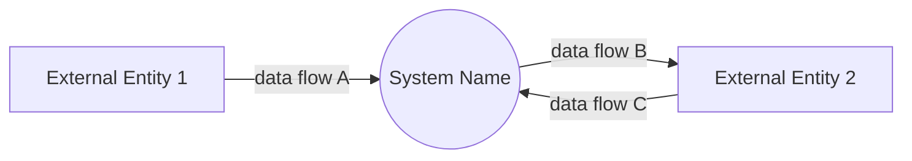
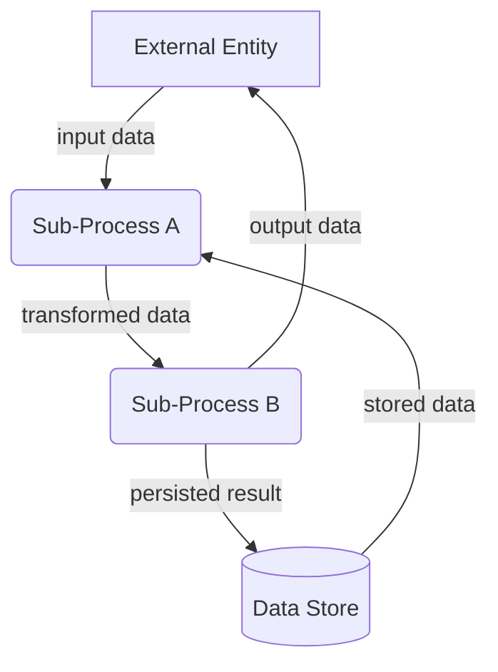
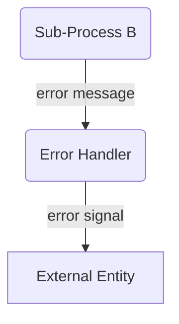
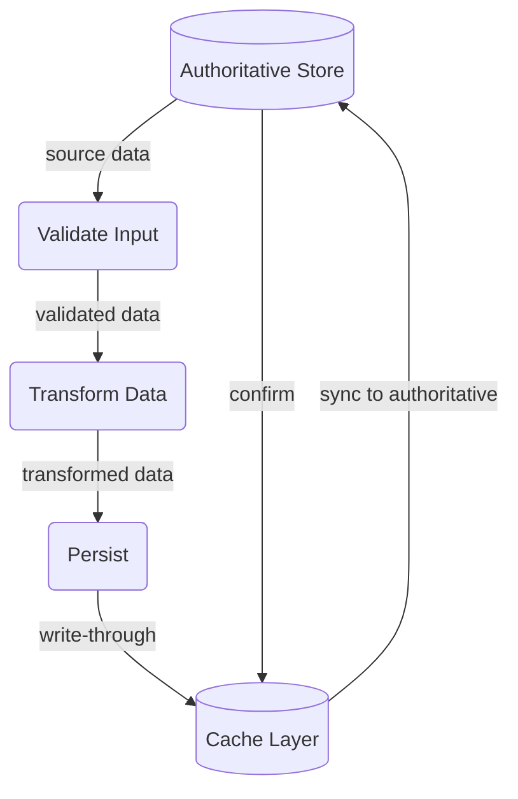

# dfd-md — Data Flow Diagram (dfd) Guide in Markdown

## Purpose

DFDs model **how data moves** — _what_ flows, not _how_ it's implemented. Every
DFD must be:

- **Data-movement focused** — arrows are data packets, not control flow, UI, or
  implementation details
- **Level-appropriate** — one level per diagram; don't mix levels
- **Verifiable** — every flow maps to a real API call, function parameter, DB
  read/write, or message queue in the codebase
- **Constraint-verified** — DFDs are verified against explicit constraints (e.g.,
  top-10 user stories, nonfunctional requirements); every constraint must be
  traceable to ≥1 flow in the diagram. Constraints are never complete — extra
  flows beyond those required by the specified constraints are expected and
  allowed
- **Compact & cohesive** — one DFD per subsystem; split large systems across
  multiple files
- **Low redundancy** — cross-reference instead of duplicating flows. Never
  repeat the same data structure or flow in multiple DFDs; reference the
  original document instead

## DFD-Driven Development Workflow

DFDs drive implementation, not the other way around. Follow this process:

1. **DFD first** — design or update the DFD before writing any implementation
   code. The diagram defines the data flows, processes, and stores before
   any source file is touched.
2. **Review each DFD alongside its implementation** — after coding, re-read
   the DFD and verify every flow, process, and store is correctly realized
   in the code. Fix gaps or mismatches before moving on.
3. **Implement one DFD at a time** — complete all implementation, review, and
   testing for a single DFD before starting the next. Do not work on multiple
   DFDs in parallel.
4. **Run the full test suite comprehensively** — after implementing each DFD,
   run `cargo test` (or the project's equivalent) and fix all failures before
   proceeding. This ensures each DFD's implementation is fully functional and
   doesn't regress existing code.

## Notation

### Symbol Mapping

| Element                                                  | Mermaid Shape       | Example                    |
| -------------------------------------------------------- | ------------------- | -------------------------- |
| **External Entity** (person, org, external system)       | `[Square brackets]` | `USER[User]`               |
| **Process** (transforms input → output data)             | `(Rounded)`         | `VALIDATE(Validate Input)` |
| **Data Store** (persistent repository)                   | `[(Cylinder)]`      | `DB[(Database)]`           |
| **Data Flow** (directional data movement)                | `-->                | label                      |
| **Flow Split/Join** (same data to/from multiple targets) | Multiple arrows     | See examples               |

### Naming Conventions

| Element         | Convention                    | ✓ Good                                | ✗ Bad                        |
| --------------- | ----------------------------- | ------------------------------------- | ---------------------------- |
| External Entity | Singular noun, Title Case     | `Customer`, `PaymentGateway`          | `customers`, `my-api`        |
| Process         | Verb phrase, imperative       | `ValidateOrder`, `SendEmail`          | `OrderValidation`, `sending` |
| Data Store      | Singular noun, Title Case     | `OrderDb`, `ConfigStore`              | `database`, `orders_db`      |
| Data Flow       | Lowercase noun phrase, quoted | `"invoice pdf"`, `"user credentials"` | `send data`, `InvoicePDF`    |

## DFD Levels

DFDs use exactly three levels (0, 1, 2). No deeper decomposition is needed.

### Level 0 — Context (`flowchart LR`)

Single process = entire system. External entities only. No internal processes or
data stores.

**Rules:**

- One system process
- All external entities that directly exchange data with the system
- Every external entity has ≥1 flow to/from the system
- No data stores

### Level 1 — Sub-Process Decomposition (`flowchart TD`)

Decomposes the Context diagram's single process into major sub-processes. Adds
data stores where processes read/write persistent data.

Split into two diagrams to keep the happy flow clean:

**2a. Happy Flow:**

**2b. Error Handling:**

**Rules:**

- Each process maps to one identifiable subsystem or module
- Data stores appear only when ≥2 processes read/write the same store
- Every process must be reachable from ≥1 flow
- Caching layers (e.g. IndexedDB) are Level 2 details; at Level 1, show only the
  authoritative store

### Level 2 — Process Deep Dive (inline)

Decompose a single Level 1 process into internal sub-processes and flows. Use
when a Level 1 process hides significant transformation logic or caching. Level
2 diagrams live **inline** within the parent Level 1 `.md` file as subsection
`2c`, `2d`, etc. — not as separate files.

**Rules:**

- Inline within the parent Level 1 file as `2c`, `2d`, etc.
- One diagram per Level 1 process needing decomposition
- Dashed `-.->` arrows for fallback paths (cache-miss reads, retries)
- Caching layers and retry logic live here — not at Level 1

## File Naming

| Level                  | Filename                                                                 |
| ---------------------- | ------------------------------------------------------------------------ |
| Context (Level 0)      | `context-diagram.md` (one per project)                                   |
| Level 1                | `{dfd-name}.md` (e.g. `image-generate.md`)                               |
| Level 2                | Inline within the parent Level 1 file — no separate file                 |
| Shared (cross-cutting) | `shared/{concern}.md` — for concerns reused across multiple Level 1 DFDs |

## Document Structure

Every DFD `.md` file uses the numbered sections below. Section 3 is only for
Level 1 diagrams — do not include section 3 (not even as a "skipped"
placeholder) in Context (Level 0) files.

### Anti-Patterns

- **Context diagram references** — do not list `context-diagram.md` in
  References. Every DFD lives in the same project; the reader already knows the
  context diagram exists. Only link diagrams with direct data-flow coupling.
- **Duplicate data structures** — if a data shape already appears in another
  DFD, reference that file's section 3 instead of copying the table.
- **Boilerplate "See also" blocks** — section 1 References should list only
  files that are _functional prerequisites or shared dependencies_ of this
  diagram's flows. Omit the section entirely when there are no such links.

### 1. Purpose

Single sentence describing the subsystem or scope. May include an optional
**References** bullet list linking to upstream/downstream DFDs, API docs, or
shared diagrams.

**Do not** include a reference to the context diagram (`context-diagram.md`) —
it is the project-level entry point already known to every reader. Only link
DFDs whose _data flows directly feed into or consume from_ this diagram's flows
(upstream/downstream), plus any shared cross-cutting diagrams actually used.

### 2. Diagram

Mermaid `flowchart` block. `LR` for Level 0, `TD` for Level 1+. Keep under 20
nodes. Apply shape conventions from the notation table above.

For Level 1, split into sub-sections as needed. The first two are required when
applicable; the rest are optional inline Level 2 diagrams:

- **2a. Happy Flow (Main Success Path)** — _required_. Success path only; no
  error processes or fallback flows.
- **2b. Error Handling & Fallbacks** — error processes and fallback flows
  diverging from the happy path. Use dashed `-.->` for silent fallbacks (no
  user-visible error). Omit when there are no error paths.
- **2c+. Additional Level 2 Inline Diagrams** — any of the following, numbered
  `2c`, `2d`, `2e`, … as needed:

  | Sub-diagram type                | When to include                                                                                                                                         |
  | ------------------------------- | ------------------------------------------------------------------------------------------------------------------------------------------------------- |
  | **Process Deep Dive**           | A Level 1 process hides significant transformation logic, caching, or retry mechanics                                                                   |
  | **UI/UX Flow**                  | User-facing states matter — loading spinners, empty states, progressive disclosure, interaction sequences, optimistic updates                           |
  | **Non-Functional Concerns**     | Performance boundaries (rate limits, throttling, debouncing), security checkpoints (auth gates, input sanitization paths), data retention/cleanup flows |
  | **Other Implementation Detail** | Any cross-cutting concern or subsystem internals that don't fit the categories above but are worth documenting                                          |

  Each sub-diagram must be scoped to a single concern or process. Title as
  `2c. {Concern}`, e.g. `2c. Loading States`, `2d. Rate Limiting`,
  `2e. Validate Prompt Deep Dive`.

  When a concern is **shared across multiple Level 1 DFDs** (e.g. a common UI
  component, auth flow, or error boundary used by many pages), extract it into
  `shared/{concern}.md` and reference it instead of duplicating inline.

### 3. Data Structures (Level 1 only)

One table per distinct data shape flowing through the diagram. Keep fields
compact — link full schemas where applicable.

#### `OrderRequest`

| Field              | Type      |
| ------------------ | --------- |
| `items`            | `Item[]`  |
| `shipping_address` | `Address` |
| `payment`          | `Payment` |

#### `OrderConfirmation`

| Field      | Type     |
| ---------- | -------- |
| `order_id` | `string` |
| `status`   | `string` |
| `eta`      | `date`   |
