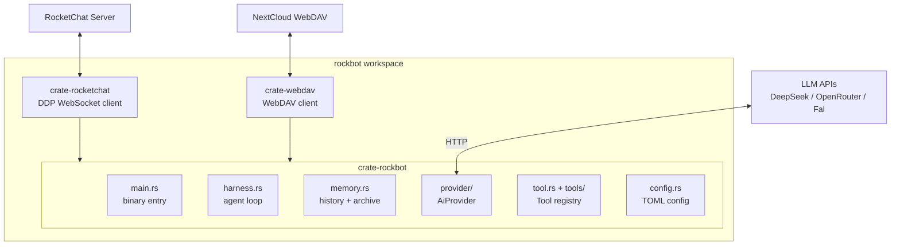

# RockBot

AI-powered RocketChat bot written in Rust. Responds to DMs and @mentions with
agentic capabilities — web search, URL fetching, image vision, image generation,
calendar/todo management, knowledge storage, and file operations — backed
by a NextCloud WebDAV server for persistent state.

## Quick Start

```bash
cp example.config.toml config.toml
# edit config.toml with your RocketChat, provider, and WebDAV credentials
cargo build --release
./target/release/rockbot
```

## Architecture



Three crates: `rocketchat` (DDP WebSocket client), `rockbot` (bot logic), `webdav` (NextCloud storage).

### Key design decisions

- **No local disk** — all persistent state on NextCloud WebDAV
- **`AiProvider` trait** — single OpenAI-compatible interface; separate `[[chat_providers]]` and `[[image_providers]]` tables for text and image backends (DeepSeek, OpenRouter, Fal)
- **`Tool` trait with `ToolRegistry`** — tools registered dynamically; agent loop dispatches and feeds results back
- **Three-layer memory** — chat history (short-term), daily summaries (mid-term), soul archive (long-term) on WebDAV per room
- **Knowledge store** — persistent skill/secret/note entries per room with WebDAV-backed `index.json`

## Prerequisites

- Rust 1.85+ (edition 2024)
- RocketChat server with WebSocket
- NextCloud WebDAV (optional — bot runs without it)
- API key for DeepSeek, OpenRouter, or Fal
- Exa API key (optional, for web search/fetch)

## Configuration

Copy `example.config.toml` to `config.toml`. Config path is set via `CONFIG_FILE`
env var (defaults to `config.toml`, not a CLI argument).

See [`example.config.toml`](example.config.toml) for the annotated template.

## Build & test

```bash
cargo build --release                # workspace build (3 crates)
cargo test                           # unit + mock integration tests
cargo test -- --ignored              # real integration tests (needs credentials)
```

Test inventory and run instructions: [`_docs/test_suite/`](_docs/test_suite/).

## Reference docs

| Component | DFD | Detailed notes |
| --------- | --- | -------------- |
| Agent loop | [`_dfds/agent-loop.md`](_dfds/agent-loop.md) | — |
| Agent harness | [`_dfds/agent-harness.md`](_dfds/agent-harness.md) | [`_docs/agent-harness.md`](_docs/agent-harness.md) |
| RocketChat client | [`_dfds/base/rocketchat.md`](_dfds/base/rocketchat.md) | [`_docs/rocketchat-client.md`](_docs/rocketchat-client.md) |
| AI Provider | [`_dfds/base/ai-provider.md`](_dfds/base/ai-provider.md) | — |
| Config | [`_dfds/base/config.md`](_dfds/base/config.md) | — |
| Memory | [`_dfds/base/memory.md`](_dfds/base/memory.md) | — |
| Knowledge | [`_dfds/base/knowledge.md`](_dfds/base/knowledge.md) | — |
| Context diagram | [`_dfds/context-diagram.md`](_dfds/context-diagram.md) | — |
| WebDAV tool | [`_dfds/tools/webdav.md`](_dfds/tools/webdav.md) | — |
| Calendar tool | [`_dfds/tools/calendar.md`](_dfds/tools/calendar.md) | — |
| Web search / fetch | [`_dfds/tools/exa-search.md`](_dfds/tools/exa-search.md) | [`_dfds/tools/web-fetch.md`](_dfds/tools/web-fetch.md) |
| Test suite | — | [`_docs/test_suite/running.md`](_docs/test_suite/running.md) |

## Environment variables

| Variable | Purpose |
| -------- | ------- |
| `CONFIG_FILE` | Config path (default: `config.toml`) |

## License

MIT
