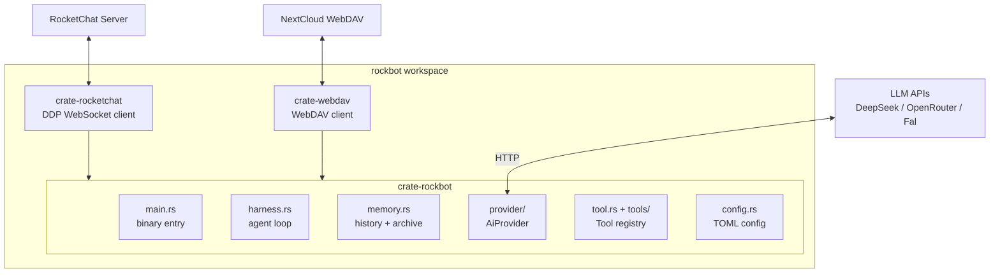

# RockBot

AI-powered RocketChat bot written in Rust. Responds to DMs and @mentions with
agentic capabilities — web search, URL fetching, image vision, image generation,
calendar/todo management, knowledge storage, and file operations — backed
by a NextCloud WebDAV server for persistent state.

## User Stories

> **Priority**: P0 = critical, P1 = core, P2 = enhancement
> Full details: [`_docs/constraints/`](_docs/constraints/)

1. **DM Conversation** (P0) — DMs bot, gets AI replies with per-room conversation history across sessions.
2. **@Mention & Display Name in Channels** (P0) — `@rockbot` or display name triggers reply in-thread; per-room isolation.
3. **Web Search via Exa** (P1) — Returns summarized results with URLs, dates, snippets (auto/fast/deep modes).
4. **HTTP Fetch & Web Requests** (P1) — Full HTTP client (all methods, custom headers, JSON body); returns raw/markdown/JSON.
5. **Image Generation & Editing** (P2) — Text-to-image and image-to-image via fal.ai or OpenRouter; saves to WebDAV, returns share link.
6. **Image Attachment → Conversation Memory** (P2) — Pasted/dropped RocketChat images intercepted, encoded as `data:` URIs, stored in per-room conversation history; visible to vision LLMs, available to `image_gen` for editing.
7. **Vision LLM Sees Images** (P2) — Vision-capable providers (OpenRouter) receive multipart image content; LLM describes, analyzes, and edits images it sees in memory.
8. **Vision Tool Image Fetch** (P2) — Downloads image from public URL into memory; vision LLMs see it, `image_gen` can edit it.
9. **Calendar Events & Todos (CalDAV)** (P2) — Creates/lists/updates/deletes events and todos; per-room calendars, ICS generation, recurrence (rrule), reminders.
10. **Knowledge Persistence** (P2) — Save/recall/forget facts with categories (skill/secret/note), tags, priorities (P0-P3), `when_useful` hints; automatic contextual recall.
11. **Permanent Soul Memory** (P1) — Sets identity, preferences, facts via `edit_soul`; persists to WebDAV, syncs display name, survives restarts.
12. **WebDAV File Operations** (P1) — Reads/writes/lists/edits/deletes files; per-room scoped paths; images returned as base64 markdown.

## Quick Start

```bash
cp example.config.toml config.toml
# edit config.toml with your RocketChat, provider, and WebDAV credentials
cargo build --release
./target/release/rockbot
```

## Architecture



Three crates: `rocketchat` (DDP WebSocket client), `rockbot` (bot logic), `webdav` (NextCloud storage).

### Key design decisions

- **No local disk** — all persistent state on NextCloud WebDAV
- **`AiProvider` trait** — single OpenAI-compatible interface; separate `[[chat_providers]]` and `[[image_providers]]` tables for text and image backends (DeepSeek, OpenRouter, Fal)
- **`Tool` trait with `ToolRegistry`** — tools registered dynamically; agent loop dispatches and feeds results back
- **Three-layer memory** — chat history (short-term), daily summaries (mid-term), soul archive (long-term) on WebDAV per room
- **Knowledge store** — persistent skill/secret/note entries per room with WebDAV-backed `index.json`

## Prerequisites

- Rust 1.85+ (edition 2024)
- RocketChat server with WebSocket
- NextCloud WebDAV (optional — bot runs without it)
- API key for DeepSeek, OpenRouter, or Fal
- Exa API key (optional, for web search/fetch)

## Configuration

Copy `example.config.toml` to `config.toml`. Config path is set via `CONFIG_FILE`
env var (defaults to `config.toml`, not a CLI argument).

See [`example.config.toml`](example.config.toml) for the annotated template.

## Build & test

```bash
cargo build --release                # workspace build (3 crates)
cargo test                           # unit + mock integration tests
cargo test -- --ignored              # real integration tests (needs credentials)
```

Test inventory and run instructions: [`_docs/test_suite/`](_docs/test_suite/).

## Reference docs

### Constraints & user stories
| Document | Description |
| -------- | ----------- |
| [`_docs/constraints/README.md`](_docs/constraints/README.md) | Directory index |
| [`_docs/constraints/top-10-user-stories.md`](_docs/constraints/top-10-user-stories.md) | Top-level user-facing features |
| [`_docs/constraints/image-generation-user-stories.md`](_docs/constraints/image-generation-user-stories.md) | Image pipeline: 5 detailed stories |
| [`_docs/constraints/non-functional-requirements.md`](_docs/constraints/non-functional-requirements.md) | Quality attributes |

### DFDs
| Component | DFD | Detailed notes |
| --------- | --- | -------------- |
| Agent loop | [`_dfds/agent-loop.md`](_dfds/agent-loop.md) | — |
| Agent harness | [`_dfds/agent-harness.md`](_dfds/agent-harness.md) | [`_docs/agent-harness.md`](_docs/agent-harness.md) |
| Image interception | [`_dfds/image-interception.md`](_dfds/image-interception.md) | — |
| RocketChat client | [`_dfds/base/rocketchat.md`](_dfds/base/rocketchat.md) | [`_docs/rocketchat-client.md`](_docs/rocketchat-client.md) |
| AI Provider | [`_dfds/base/ai-provider.md`](_dfds/base/ai-provider.md) | — |
| Config | [`_dfds/base/config.md`](_dfds/base/config.md) | — |
| Memory | [`_dfds/base/memory.md`](_dfds/base/memory.md) | — |
| Knowledge | [`_dfds/base/knowledge.md`](_dfds/base/knowledge.md) | — |
| Context diagram | [`_dfds/context-diagram.md`](_dfds/context-diagram.md) | — |
| WebDAV tool | [`_dfds/tools/webdav.md`](_dfds/tools/webdav.md) | — |
| Calendar tool | [`_dfds/tools/calendar.md`](_dfds/tools/calendar.md) | — |
| Web search / fetch | [`_dfds/tools/exa-search.md`](_dfds/tools/exa-search.md) | [`_dfds/tools/web-fetch.md`](_dfds/tools/web-fetch.md) |
| Test suite | — | [`_docs/test_suite/running.md`](_docs/test_suite/running.md) |

## Environment variables

| Variable | Purpose |
| -------- | ------- |
| `CONFIG_FILE` | Config path (default: `config.toml`) |

## License

MIT
