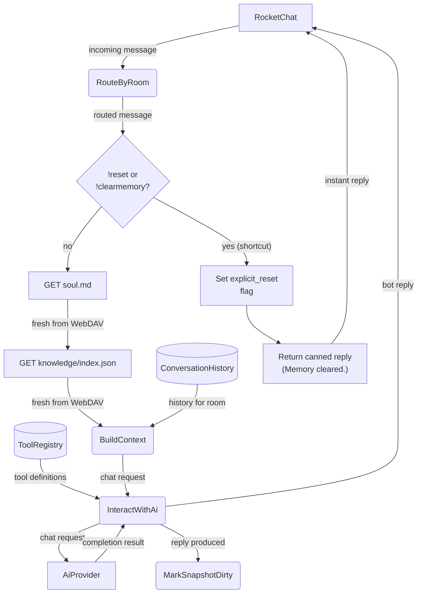
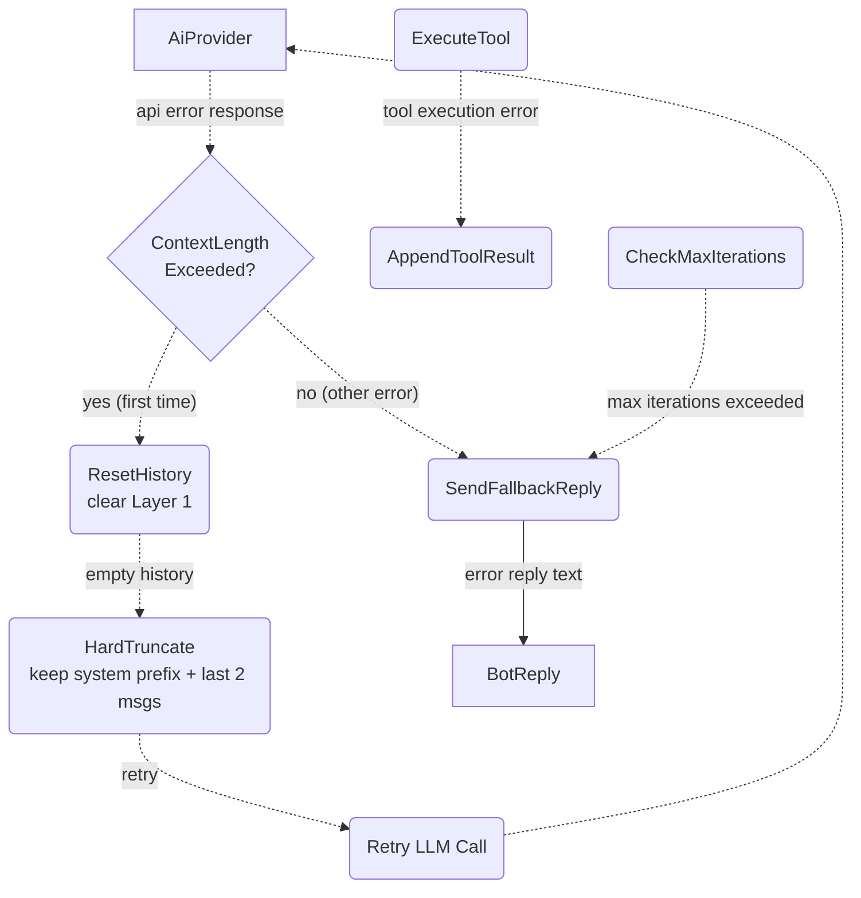
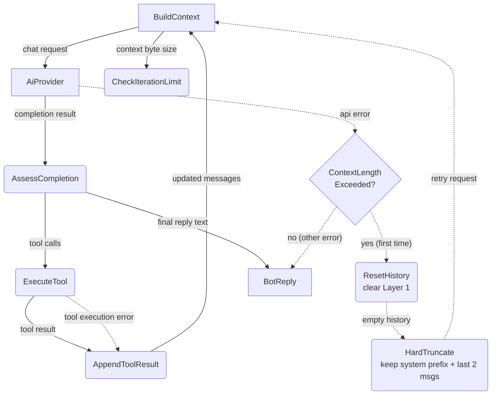
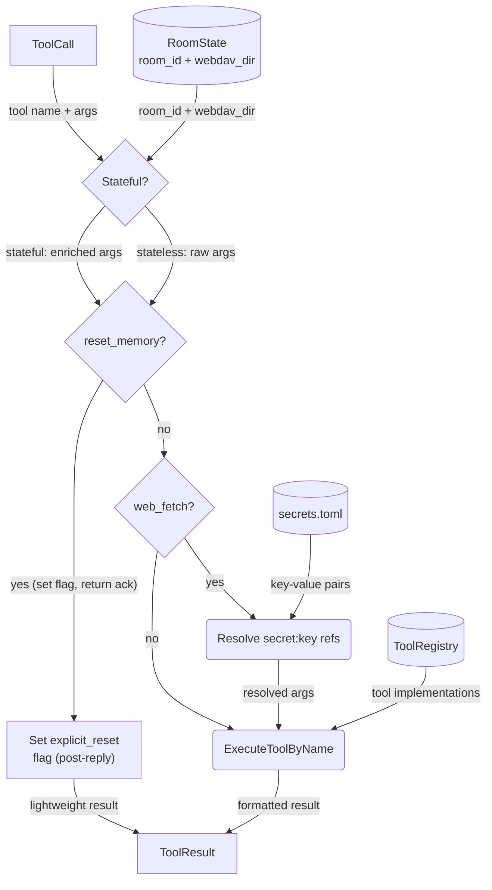
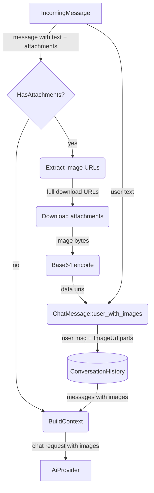
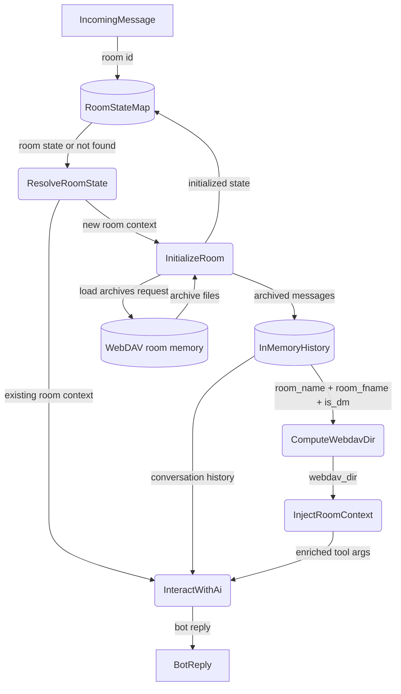
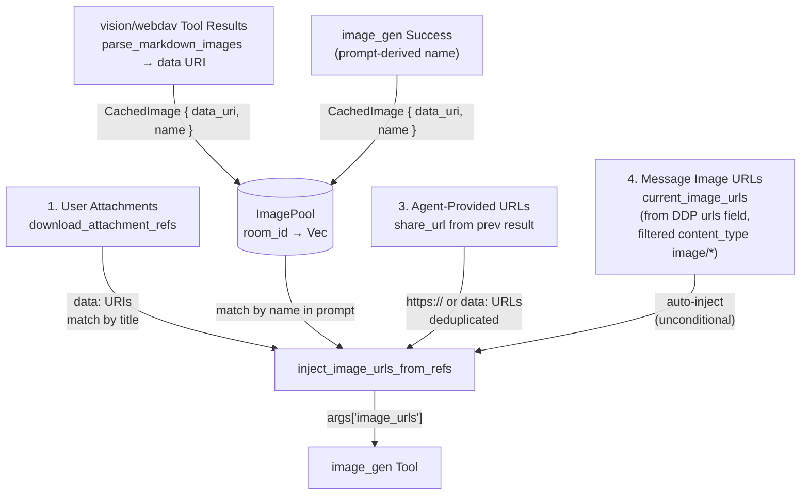
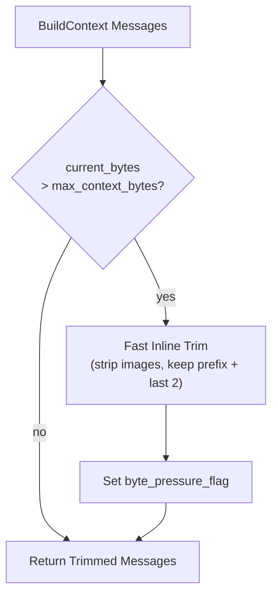
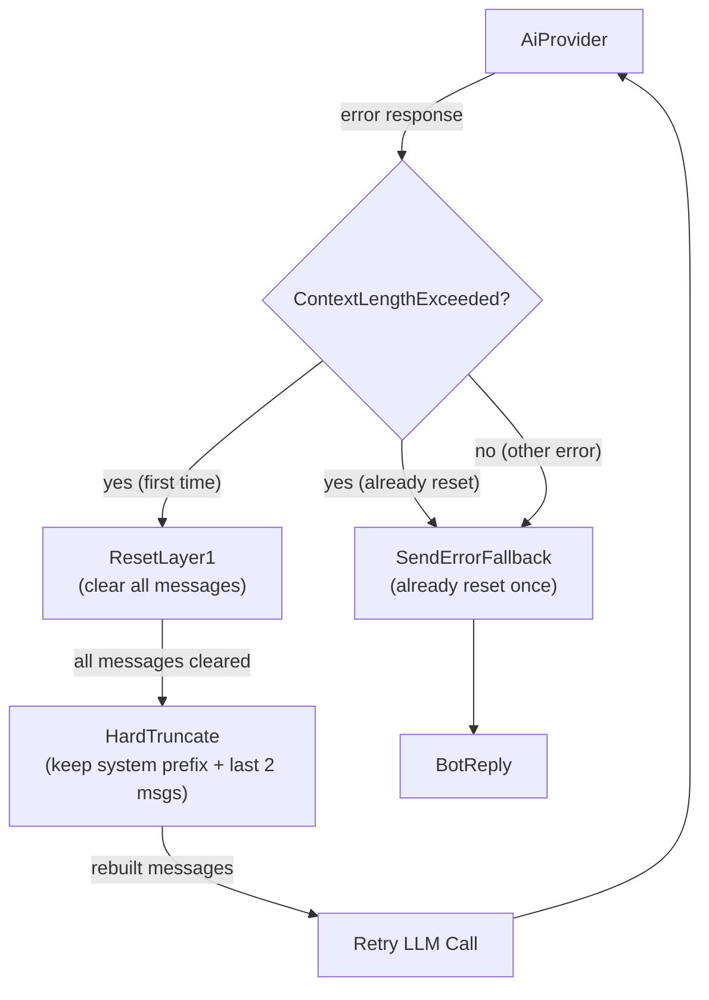
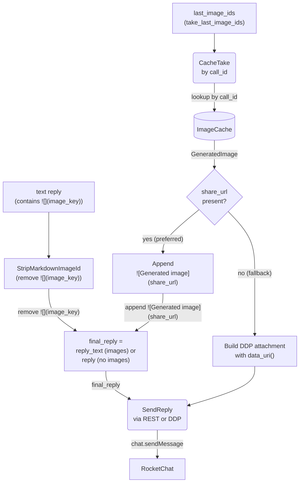

# Agent Harness

## 1. Purpose

The operational environment that wraps the agent loop — the invariant core
cycle of `LLM → tools → LLM → ...`. The harness layers Tools, Knowledge, and
Context around this loop without modifying it.

### 1a. Micro Harness Scope

rockbot implements a **micro harness**: a minimal harness with only the
mechanisms needed for a single-agent, single-channel chatbot. Three of the six
standard harness mechanisms are present:

| Mechanism   | Coverage | Details |
|-------------|----------|---------|
| **Tools**   | Full     | Abstract tool calling via `ToolRegistry` — individual tools each have their own DFD |
| **Context** | Full     | Per-room conversation history buffer, hard reset (see [Memory Reset](../memory/memory-reset.md)), archive loading — see [Memory Management](../memory/memory.md); plus iteration limits, room state routing, system prompt assembly (with live UTC time injection via `now_utc_human()`). Soul (`soul.md`) is **re-read from WebDAV on every message** to ensure multi-instance consistency. |
| **Knowledge** | Full     | `save_knowledge`, `forget_knowledge`, `recall_knowledge`; retrieval via keyword-matching against `when_useful` + filename — see [Knowledge Management](base/knowledge.md) |

Intentionally absent — not needed for rockbot's scope:

| Mechanism       | Reason |
|-----------------|--------|
| **Permissions** | Single-user bot — no sandbox or approval flows |
| **Extensions**  | No plugin/hook system — tools are statically registered |
| **Coordination**| Single agent — no subagents, teams, or worktrees |

- Upstream: [Agent Loop](agent-loop.md) feeds `IncomingMessage`
  into the loop and consumes `BotReply`
- Downstream: [AI Provider](base/ai-provider.md) receives `ChatRequest` and returns
  `CompletionResult` with tool calls or final text
- Downstream: [Memory Management](base/memory.md) provides `ConversationHistory` per
  room and receives new messages for archival
- Downstream: [Knowledge Management](base/knowledge.md) extracts and persists
  domain facts, loads entries into agent context on room init
 - Downstream: Individual tools (see `tools/` directory) are registered in
   `ToolRegistry` and invoked by the agent loop via `execute_by_name()`
 - Shared: `ImageCache` (`image_cache.rs`) stores `GeneratedImage` entries keyed by call_id for the image upload pipeline (§2i)

## 2. Diagram

### 2a. Agent Loop (Main Success Path)

After every response (including errors and fallbacks), the room is marked dirty for
snapshot persistence. The room is also marked dirty immediately when a new user message
is appended to history. The periodic maintenance timer (every `persist_interval_secs`)
flushes all dirty snapshots to WebDAV.

### 2b. Error Handling & Fallbacks

### 2c. Agent Loop Deep Dive

Level 2 decomposition of the invariant agent loop (`while True: LLM → tools →
LLM`): queries the AI provider, executes any tool calls, feeds results back, and
loops until a final text reply is produced.

### 2d. Tool Execution Deep Dive

Room context (`room_id` UUID + `webdav_dir` path key) is injected into
stateful tools that need it (tools backed by WebDAV or room-scoped storage).
Stateless tools (web search, fetch, vision, etc.) receive raw arguments
without room context. The `ToolRegistry` maps tool names to implementations;
calls are dispatched generically via `execute_by_name()`.

**Exception**: `reset_memory` is intercepted before `execute_by_name()`.
Instead of running reset synchronously (which would clear history
mid-conversation), it sets an `explicit_reset` flag on the room. Actual
reset runs post-reply via `reset_room_if_needed()`. The tool's own `execute()`
is a stub that returns an error — this avoids both the deadlock from
re-acquiring `Arc<Mutex<AgentHarness>>` and the data loss from clearing
history while the LLM is still generating a reply. See
[memory-reset.md §2b2](base/memory-reset.md#2b2-explicit-reset--reset_memory-tool) for the full flow.

**Secret interception**: `web_fetch` arguments are scanned for `secret:<key>`
references in header values before dispatch. The harness loads `secrets.toml`
from WebDAV once per tool-call batch and replaces references with actual secret
values. The tool receives resolved headers — it is unaware of the interception.
See [secret-interception.md](tools/secret-interception.md) for the full flow.

### 2e. Auto-Attachment Vision Pipeline

When an incoming message contains image attachments (`IncomingMessage.attachments`
is non-empty), the harness downloads each attachment, encodes it as a base64 data
URI, and embeds it directly in the user's `ChatMessage` as `ContentPart::ImageUrl`
parts. The agent harness natively "sees" these images — no tool call is involved.
The vision tool is only invoked by the LLM for images at public URLs or WebDAV
file URLs.

**Image selection**: uses `attachments[0].title_link` (original file) over
`image_url` (thumbnail). The server base URL is prepended to construct the full
download URL: `{server_config.host()}{title_link}`. Multiple attachments are
supported — all are encoded and embedded in the same message.

**Prompt construction**: if the user included text with the image (e.g. "B78"),
that text is prepended with the sender name (e.g. "User: B78"). If no text is
present, the prompt becomes `"SenderName: Describe this image in detail."`.

**Chat history preservation**: when `build_context()` builds messages for the AI
provider, `ContentPart::ImageUrl` parts are preserved only on the most recent
user message. Earlier user messages with images are collapsed to `[image]` text
placeholders (see `memory.rs:strip_images_from_message`).

**Text-only LLM handling**: after context is built, text-only providers (DeepSeek)
additionally strip all `ImageUrl` parts from every message — including the
most recent — replacing them with `[image]` placeholders via
`strip_message_images()` at the provider layer. This is a provider-level
concern separate from memory reset; the harness always embeds images
in `ChatMessage` regardless of the provider. See
[ai-provider.md §2c](../ai/ai-provider.md#2c-vision-payload-deep-dive).

### 2f. Per-Room State Routing

Each room maintains independent state — conversation history, agent context, and
WebDAV archive path. The agent routes incoming messages to the correct room's
pipeline. Room context (`room_id` UUID + `webdav_dir` path key) is computed from
`room_name`, `room_fname`, and `is_dm` and injected into stateful tool calls
(tools backed by WebDAV or room-scoped storage).

> **Note**: `compute_webdav_dir` **panics** if `room_fname` is empty — there is
> no fallback to `room_name`. Rooms must have a display name (`fname`) configured
> on the RocketChat server. See [`room-name-fields.md`](../../_doc/rocketchat/room-name-fields.md).

### 2g. Image Interception for Editing — inject_image_urls_from_refs

When the LLM calls `image_gen` for editing, the harness intercepts the arguments
and injects real image data from **four sources** into `image_urls`:

1. **User attachments** — downloaded from RocketChat as `data:` URIs, matched by
   filename substring in the LLM prompt (e.g. "edit apple.png")
2. **WebDAV File / Public URL / image_gen results** — all cached in `image_pool`
   as `CachedImage { data_uri, name }`. Populated from three origins:
   - **vision/webdav tool results**: `parse_markdown_images()` extracts
     `` markdown from successful tool results and adds them to
     `image_pool` (plus `pending_vision_images` for ContentPart injection)
   - **image_gen results**: added to `image_pool` on success with prompt-derived
     name (truncated to 80 chars)
   - Matched by name substring in the LLM prompt (e.g. "edit the cat photo" matches
     a vision-fetched "cat.png" or an image_gen result with prompt "a fluffy cat")
3. **Agent-provided URLs** — any `share_url` or `https://` URL the LLM explicitly
   includes in `image_urls` (e.g. from a previous `image_gen` result)
4. **Message image URLs** — from `IncomingMessage.urls` (filtered by
   `content_type: image/*`). Auto-injected unconditionally — no prompt matching
   required — so text-only models can edit images without vision.

All four sources converge in the `image_gen` argument injection: attachment data
URIs and image_pool entries matched by prompt text, agent-provided URLs merged
with deduplication, and message image URLs auto-injected unconditionally. The
`image_gen` tool then uploads `data:` URIs to the provider's CDN (Fal) or passes
`https://` URLs directly. Deduplication is by URL string equality.

`reference_image_key` is **not** handled by the harness — it is resolved inside
`ImageGenTool::execute()`: the tool looks up the cached image by `call_id` in
`ImageCache`, uploads the data URI to the provider's CDN, and appends the
resulting `https://` URL to `image_urls`.

This covers all image sources for editing:
- Previous `image_gen` results (via agent-provided `share_url` in `image_urls`,
  or `reference_image_key` via `ImageCache`, or `image_pool` name match)
- User-attached images (via `AttachmentRef` title match)
- Vision/webdav-fetched images (via `image_pool` name match)
- DDP message URLs with image content types (via `current_image_urls` —
  auto-injected without prompt matching)

### 2i. Safety Net — Inline Context Truncation (Pre-LLM, No Delay)

Before each LLM call, the harness checks if the total JSON byte size of the
messages exceeds `max_context_bytes`. If so, it trims older messages inline —
**no LLM call involved** — keeping the system prefix and last 2 conversation
messages, stripping images from older entries. This is a fast in-memory
operation that prevents provider rejection.

When inline truncation fires, it also sets a `byte_pressure_flag` so the room
receives a hard reset **after the reply is delivered**. See
[Memory Reset](base/memory-reset.md) for the full pipeline.

**This is fast** — no LLM call, no WebDAV I/O. Just in-memory message array
manipulation. At least the last 2 messages plus the system prompt are always
preserved. If the total message count is ≤ system prefix + 4, trimming is
skipped entirely regardless of byte limit. Sets `byte_pressure_flag` so the
room gets a hard reset after reply delivery.

### 2i2. Context-Length-Exceeded Retry — Provider-Triggered Reset

When the AI provider returns a `ContextLengthExceeded` error (HTTP 400 with
"context length" or "maximum context" in the error message), the harness
runs a hard reset (clear Layer 1) and retries the request once. No LLM
summarization — just wipe and retry.

**Reset** (`reset_room_if_needed`): clears all Layer 1 messages instantly —
no LLM call, no WebDAV write. See
[Memory Reset §2e](base/memory-reset.md#2e-context-length-exceeded-retry--provider-triggered-reset).

After reset, rebuilds context with `max_history: Some(4)` and applies
**hard truncation**: keep system/front-matter messages at the front, and
only the last 2 conversation messages at the end. After hard truncation,
**per-message content truncation** caps each remaining conversation message
at 200K chars to handle cases where individual tool results or user pastes
are themselves enormous.

**Retry limit**: reset is attempted at most once per call. If the
provider still returns `ContextLengthExceeded` after reset, the
harness falls back to the standard error reply. The `context_reset`
flag is per-`process_message` call, not per-room.

This recovery path handles token-limit breaches that the byte-based
`max_context_bytes` check cannot catch (e.g., base64-encoded images that
are small in bytes but consume many tokens).

### 2j. Generated Image Sharing via NextCloud Share Links

The `image_gen` tool creates a NextCloud public share link (7-day expiry)
during tool execution and stores it in `ImageCache`. The harness records the
call IDs in `last_image_ids` and returns the LLM's reply text with the
`image_key` placeholder still intact — **the harness does not modify the
reply text for images**. After `process_message()` returns, the agent loop
(main.rs) retrieves the IDs, takes images from the cache, replaces the
placeholder with the share URL markdown, and sends the final message.

**Harness role** (`process_message`): tracks `image_ids_this_turn` during
the agent loop, stores them in `last_image_ids` before returning, and exposes
them via `take_last_image_ids()`. Returns the LLM's reply text unmodified —
the `image_key` placeholder is still present for main.rs to replace.

**ImageGenTool role**: calls `create_nextcloud_share_link()` on `WebDavClient`
right after WebDAV upload — `POST /ocs/v2.php/apps/files_sharing/api/v1/shares`
with `shareType=3`, `permissions=1`, `expireDate={today+7d}`. Stores the
result (with `/download` suffix for direct raw image access) as
`GeneratedImage.share_url`. Stores the entire `GeneratedImage` in `ImageCache`
keyed by `call_id`.

**Agent loop role** (main.rs): after `process_message()` returns, calls
`take_last_image_ids()` to get the call IDs, then `take_image()` for each one.
If `share_url` is present, appends ``
to the reply text and strips the original `` markdown.
If `share_url` is `None`, falls back to a DDP attachment with `data_uri()`.
Uses `final_reply` (the modified text or original) for the outgoing message.

**Fallback**: if share generation fails (`share_url` is `None`), the agent loop
builds a DDP `sendMessage` with a `data:` URI in the `attachments` field, using
`GeneratedImage::data_uri()`. This is a worst-case path for when NextCloud's
sharing API is unavailable.

**Design rationale**: NextCloud share URLs are short — the `/download` endpoint
returns raw image bytes with correct `Content-Type` for inline rendering in
RocketChat. This eliminates both the `Message_MaxAllowedSize` REST limit
(short URL, no base64 in msg text) and the DDP attachments schema restriction
(Match failed [400]). Share links expire after 7 days, longer than typical
chat message lifetimes.

## 3. Data Structures

- **AgentContext** — does not exist as a struct. The harness constructs these values on the fly: `system_prompt` is built by `build_system_prompt()` (which injects the current UTC time via `now_utc_human()` into `{current_utc_time}` in the `DEFAULT_SYSTEM_PROMPT` template), `history` by `build_context()`, `tools` by `ToolRegistry::definitions()`, `room_id` is a method parameter, `webdav_dir` is computed by `compute_webdav_dir()`.

#### `ToolResult`

| Field      | Type     | Notes                                      |
| ---------- | -------- | ------------------------------------------ |
| `call_id`  | `NonEmptyString` | Matches `ToolCall.id`; validated in factory methods |
| `name`     | `NonEmptyString` | Tool name                                  |
| `content`  | `String` | Result text (returned to LLM as tool msg)  |
| `is_error` | `bool`   | True if tool execution failed              |

#### `ToolRegistry`

| Field      | Type                    | Notes                          |
| ---------- | ----------------------- | ------------------------------ |
| `tools`    | `HashMap<String, Box<dyn Tool>>` | Name → implementation |

#### `ToolDef`

| Field           | Type            | Notes                                   |
| --------------- | --------------- | --------------------------------------- |
| `tool_type`     | `String`        | Always `"function"`                     |
| `function`      | `FunctionDef`   | Nested function definition object       |

#### `FunctionDef`

| Field        | Type            | Notes                                   |
| ------------ | --------------- | --------------------------------------- |
| `name`       | `String`        | Function name                           |
| `description`| `Option<String>`| Human-readable description for the LLM  |
| `parameters` | `Option<Value>` | JSON Schema for arguments               |
| `strict`     | `Option<bool>`  | Whether to enforce strict schema        |

#### `GeneratedImage` (ImageCache Entry)

Stored in `Arc<Mutex<HashMap<String, GeneratedImage>>>` keyed by tool call_id.

| Field          | Type           | Description                                   |
| -------------- | -------------- | --------------------------------------------- |
| `webdav_path`  | `NonEmptyString` | WebDAV path where the image was persisted; validated at construction |
| `image_bytes`  | `Vec<u8>`       | Raw image bytes for fallback data URI         |
| `mime_type`    | `NonEmptyString` | MIME type, e.g. `image/png`; validated at construction |
| `share_url`    | `Option<string>`| NextCloud public share link (7-day expiry)    |

#### Registered Tools

Tools are registered at startup via `ToolRegistry::register()`. Each tool
implements the `Tool` trait (`name`, `description`, `parameters`, `execute`).
The registry exposes `definitions()` for the LLM and dispatches calls via
`execute_by_name()`. See individual tool DFDs under `tools/` for each tool's
implementation.
