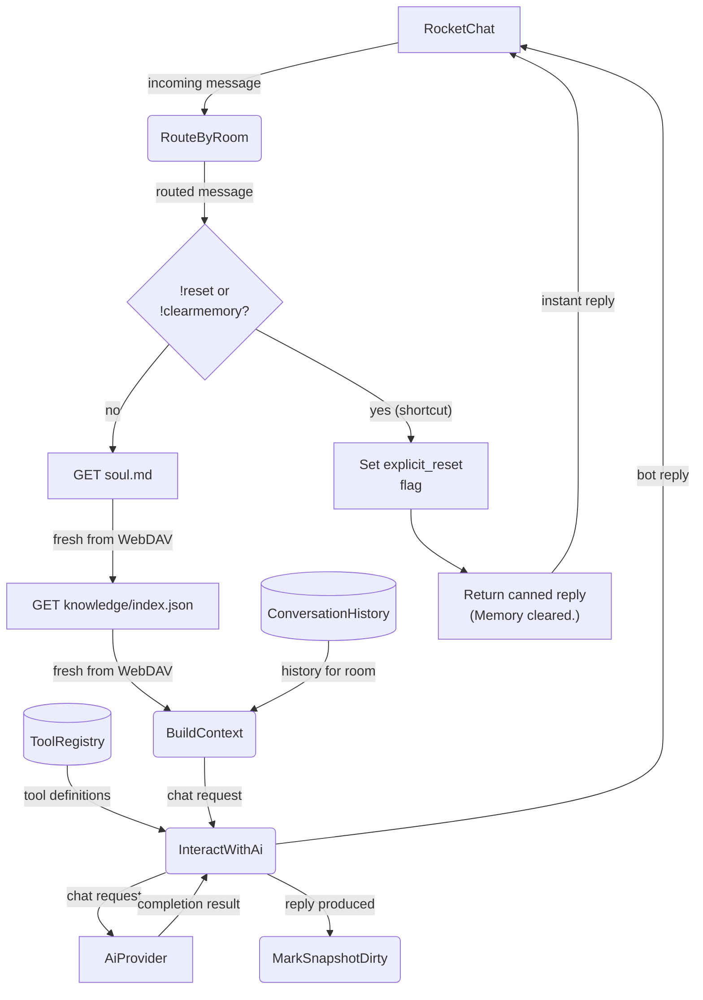

# Agent Loop (Main Success Path)

## 1. Purpose

The main success path of the agent loop: an incoming RocketChat message is routed to its room, fresh `soul.md` and `knowledge/index.json` are pulled from WebDAV, a chat request is built from per-room history and tool definitions (`ToolRegistry`), the AI provider is called, and the resulting bot reply is returned to RocketChat with the room marked dirty for snapshot persistence.

**References:**
- [Per-Room State Routing](./per-room-routing.md) — `RouteByRoom` dispatch and room state
- [Error Handling & Fallbacks](./level-2/error-handling.md) — error/fallback and retry paths diverging from this happy path
- [Agent Loop Deep Dive](./level-2/agent-loop-deep-dive.md) — internals of `InteractWithAi`
- [Memory Management](../../memory/memory/retrieve-two-layers.md) — `ConversationHistory` per room
- [Knowledge Management](../../knowledge/knowledge/write.md) — `knowledge/index.json` index summary injected into agent context
- [Memory Reset — post-reply decision](../../memory/memory-reset/post-reply-decision.md) — `!reset` / `!clearmemory` shortcut replies and explicit-reset flag
- [Generated Image Sharing via NextCloud Share Links](./image-sharing.md) — post-`process_message` image placeholder replacement (main.rs)

## 2. Diagram

After every response (including errors and fallbacks), the room is marked dirty for
snapshot persistence. The room is also marked dirty immediately when a new user message
is appended to history. The periodic maintenance timer (every `persist_interval_secs`)
flushes all dirty snapshots to WebDAV.
