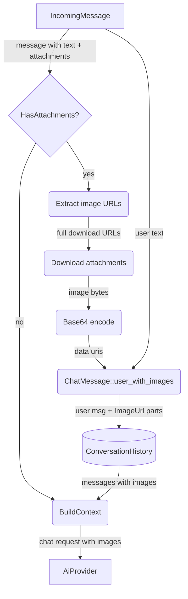

# Auto-Attachment Vision Pipeline

## 1. Purpose

When an incoming message contains image attachments (`IncomingMessage.attachments`
is non-empty), the harness downloads each attachment, encodes it as a base64 data
URI, and embeds it directly in the user's `ChatMessage` as `ContentPart::ImageUrl`
parts. The agent harness natively "sees" these images — no tool call is involved.
The vision tool is only invoked by the LLM for images at public URLs or WebDAV
file URLs.

## 2. Diagram

**Image selection**: uses `attachments[0].title_link` (original file) over
`image_url` (thumbnail). The server base URL is prepended to construct the full
download URL: `{server_config.host()}{title_link}`. Multiple attachments are
supported — all are encoded and embedded in the same message.

**Prompt construction**: if the user included text with the image (e.g. "B78"),
that text is prepended with the sender name (e.g. "User: B78"). If no text is
present, the prompt becomes `"SenderName: Describe this image in detail."`.

**Chat history preservation**: when `build_context()` builds messages for the AI
provider, `ContentPart::ImageUrl` parts are preserved only on the most recent
user message. Earlier user messages with images are collapsed to `[image]` text
placeholders (see `memory.rs:strip_images_from_message`).

**Text-only LLM handling**: after context is built, text-only DeepSeek models
(anything except `deepseek-v4-flash-vision-exp`, decided by
`AiProvider::supports_vision()`) additionally strip all `ImageUrl` parts from
every message — including the most recent — replacing them with `[image]`
placeholders via `strip_message_images()` at the provider layer. Vision-capable
DeepSeek models keep images in **user** messages (system/assistant images are
rejected with HTTP 400, so those roles are still converted to `[image]` text).
This is a provider-level concern separate from memory reset; the harness always
embeds images in `ChatMessage` regardless of the provider. See
[ai-provider.md §2c](../../ai/ai-provider/level-2/vision-payload.md).
