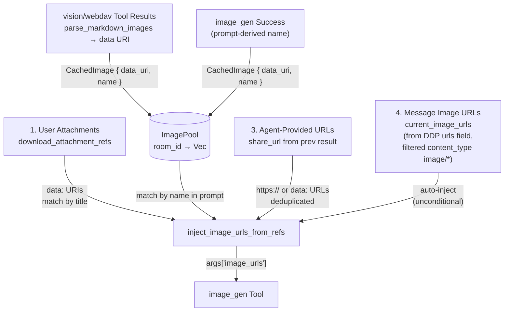

# Image Interception for Editing — inject_image_urls_from_refs

## 1. Purpose

When the LLM calls `image_gen` for editing, the harness intercepts the arguments
and injects real image data from **four sources** into `image_urls`:

1. **User attachments** — downloaded from RocketChat as `data:` URIs, matched by
   filename substring in the LLM prompt (e.g. "edit apple.png")
2. **WebDAV File / Public URL / image_gen results** — all cached in `image_pool`
   as `CachedImage { data_uri, name }`. Populated from three origins:
   - **vision/webdav tool results**: `parse_markdown_images()` extracts
     `` markdown from successful tool results and adds them to
     `image_pool` (plus `pending_vision_images` for ContentPart injection)
   - **image_gen results**: added to `image_pool` on success with prompt-derived
     name (truncated to 80 chars)
   - Matched by name substring in the LLM prompt (e.g. "edit the cat photo" matches
     a vision-fetched "cat.png" or an image_gen result with prompt "a fluffy cat")
3. **Agent-provided URLs** — any `share_url` or `https://` URL the LLM explicitly
   includes in `image_urls` (e.g. from a previous `image_gen` result)
4. **Message image URLs** — from `IncomingMessage.urls` (filtered by
   `content_type: image/*`). Auto-injected unconditionally — no prompt matching
   required — so text-only models can edit images without vision.

**References:**
- [Auto-Attachment Vision Pipeline](./auto-attachment-vision.md) — downlodable attachment refs (`AttachmentRef`)
- [Generated Image Sharing via NextCloud Share Links](./image-sharing.md) — `share_url` production and `ImageCache` (`call_id` keying)
- [Image Generation](../../tools/image-gen/) — the `image_gen` tool that consumes the injected `args['image_urls']`

## 2. Diagram

All four sources converge in the `image_gen` argument injection: attachment data
URIs and image_pool entries matched by prompt text, agent-provided URLs merged
with deduplication, and message image URLs auto-injected unconditionally. The
`image_gen` tool then uploads `data:` URIs to the provider's CDN (Fal) or passes
`https://` URLs directly. Deduplication is by URL string equality.

`reference_image_key` is **not** handled by the harness — it is resolved inside
`ImageGenTool::execute()`: the tool looks up the cached image by `call_id` in
`ImageCache`, uploads the data URI to the provider's CDN, and appends the
resulting `https://` URL to `image_urls`.

This covers all image sources for editing:
- Previous `image_gen` results (via agent-provided `share_url` in `image_urls`,
  or `reference_image_key` via `ImageCache`, or `image_pool` name match)
- User-attached images (via `AttachmentRef` title match)
- Vision/webdav-fetched images (via `image_pool` name match)
- DDP message URLs with image content types (via `current_image_urls` —
  auto-injected without prompt matching)
