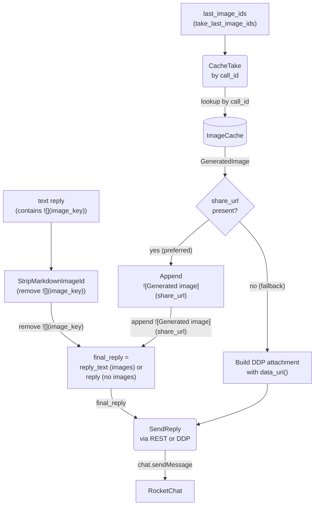

# Generated Image Sharing via NextCloud Share Links

## 1. Purpose

The `image_gen` tool creates a NextCloud public share link (7-day expiry)
during tool execution and stores it in `ImageCache`. The harness records the
call IDs in `last_image_ids` and returns the LLM's reply text with the
`image_key` placeholder still intact — **the harness does not modify the
reply text for images**. After `process_message()` returns, the agent loop
(main.rs) retrieves the IDs, takes images from the cache, replaces the
placeholder with the share URL markdown, and sends the final message.

**References:**
- [Agent Loop (Main Success Path)](./agent-loop.md) — `process_message()` and post-reply main.rs handling
- [Image Interception for Editing](./image-interception.md) — `ImageCache` `ImageGenTool` result handling
- [Image Generation](../../tools/image-gen/) — `create_nextcloud_share_link()` provider
- [WebDAV](../../tools/webdav/) — persistence of the uploaded image before sharing

## 2. Diagram

**Harness role** (`process_message`): tracks `image_ids_this_turn` during
the agent loop, stores them in `last_image_ids` before returning, and exposes
them via `take_last_image_ids()`. Returns the LLM's reply text unmodified —
the `image_key` placeholder is still present for main.rs to replace.

**ImageGenTool role**: calls `create_nextcloud_share_link()` on `WebDavClient`
right after WebDAV upload — `POST /ocs/v2.php/apps/files_sharing/api/v1/shares`
with `shareType=3`, `permissions=1`, `expireDate={today+7d}`. Stores the
result (with `/download` suffix for direct raw image access) as
`GeneratedImage.share_url`. Stores the entire `GeneratedImage` in `ImageCache`
keyed by `call_id`.

**Agent loop role** (main.rs): after `process_message()` returns, calls
`take_last_image_ids()` to get the call IDs, then `take_image()` for each one.
If `share_url` is present, appends ``
to the reply text and strips the original `` markdown.
If `share_url` is `None`, falls back to a DDP attachment with `data_uri()`.
Uses `final_reply` (the modified text or original) for the outgoing message.

**Fallback**: if share generation fails (`share_url` is `None`), the agent loop
builds a DDP `sendMessage` with a `data:` URI in the `attachments` field, using
`GeneratedImage::data_uri()`. This is a worst-case path for when NextCloud's
sharing API is unavailable.

**Design rationale**: NextCloud share URLs are short — the `/download` endpoint
returns raw image bytes with correct `Content-Type` for inline rendering in
RocketChat. This eliminates both the `Message_MaxAllowedSize` REST limit
(short URL, no base64 in msg text) and the DDP attachments schema restriction
(Match failed [400]). Share links expire after 7 days, longer than typical
chat message lifetimes.
