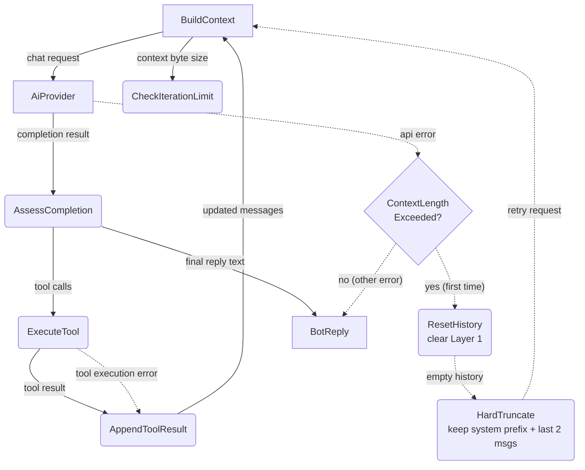

# Agent Loop Deep Dive

## 1. Purpose

Level 2 decomposition of the invariant agent loop (`while True: LLM → tools →
LLM`): queries the AI provider, executes any tool calls, feeds results back, and
loops until a final text reply is produced.

**References:**
- [Agent Loop (Main Success Path)](../agent-loop.md) — parent Level 1 flow
- [Tool Execution Deep Dive](../tool-dispatch.md) — `ExecuteTool` dispatch and injection rules

## 2. Diagram

