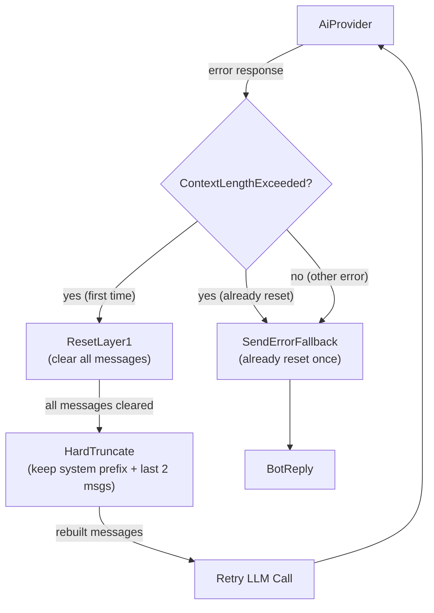

# Context-Length-Exceeded Retry — Provider-Triggered Reset

## 1. Purpose

Recovery path of [the agent loop](../agent-loop.md) when the AI provider returns a
`ContextLengthExceeded` error (HTTP 400 with "context length" or "maximum
context" in the error message): the harness runs a hard reset (clear Layer 1)
and retries the request once — no LLM summarization, just wipe and retry.
The pre-LLM byte-check counterpart is in [context-truncation.md](./context-truncation.md).

## 2. Diagram

**Reset** (direct clear, not via `reset_room_if_needed()`): clears all
Layer 1 messages instantly — no LLM call, no WebDAV write. See
[Memory Reset](../../../memory/memory-reset/post-reply-decision.md).

After reset, rebuilds context with `max_history: Some(4)` and applies
**hard truncation**: keep system/front-matter messages at the front, and
only the last 2 conversation messages at the end. After hard truncation,
**per-message content truncation** caps each remaining conversation message
at 200K chars to handle cases where individual tool results or user pastes
are themselves enormous.

**Retry limit**: reset is attempted at most once per call. If the
provider still returns `ContextLengthExceeded` after reset, the
harness falls back to the standard error reply. The `context_reset`
flag is per-`process_message` call, not per-room.

This recovery path handles token-limit breaches that the byte-based
`max_context_bytes` check cannot catch (e.g., base64-encoded images that
are small in bytes but consume many tokens).
