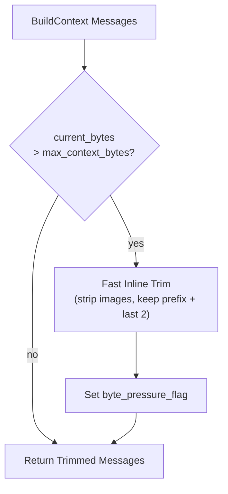

# Safety Net — Inline Context Truncation (Pre-LLM, No Delay)

## 1. Purpose

Inline safety-net truncation inside `BuildContext` of [the agent loop](../agent-loop.md):
before each LLM call the harness trims oversized context in memory — no LLM call, no
WebDAV I/O — preventing provider rejection. The provider-triggered counterpart
after a `ContextLengthExceeded` error is in [context-length-retry.md](./context-length-retry.md).

## 2. Diagram

Before each LLM call, the harness checks if the total JSON byte size of the
messages exceeds `max_context_bytes`. If so, it trims older messages inline —
**no LLM call involved** — keeping the system prefix and last 2 conversation
messages, stripping images from older entries. This is a fast in-memory
operation that prevents provider rejection.

When inline truncation fires, it also sets a `byte_pressure_flag` so the room
receives LLM summarization **after the reply is delivered**. See
[Memory Reset](../../../memory/memory-reset/post-reply-decision.md) for the full pipeline.

**This is fast** — no LLM call, no WebDAV I/O. Just in-memory message array
manipulation. At least the last 2 messages plus the system prompt are always
preserved. If the total message count is ≤ system prefix + 4, trimming is
skipped entirely regardless of byte limit. Sets `byte_pressure_flag` so the
room gets LLM summarization after reply delivery.
