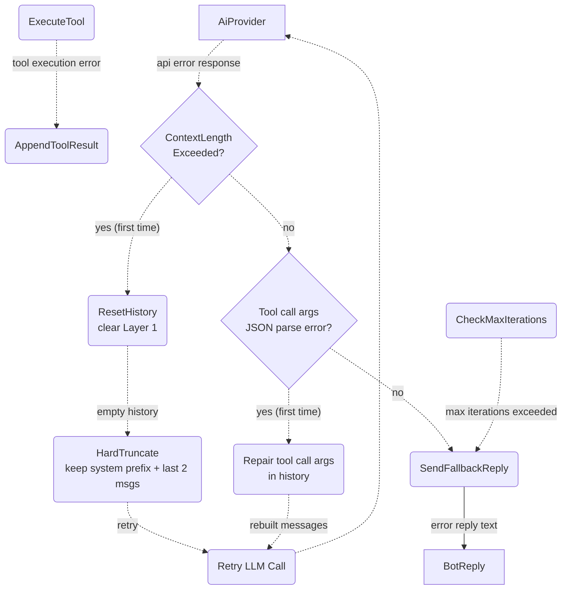

# Error Handling & Fallbacks

## 1. Purpose

Descends from [the agent loop](../agent-loop.md): how API errors, tool execution
errors, and iteration-limit breaches lead to context reset/repair retries or a
fallback error reply.

**References:**
- [Agent Loop (Main Success Path)](../agent-loop.md) — parent Level 1 flow
- [Context-Length-Exceeded Retry](./context-length-retry.md) — `ContextLengthExceeded` reset/retry path
- [Tool-Call JSON Parse Error Recovery](./tool-call-repair.md) — tool-call args parse error repair path

## 2. Diagram

