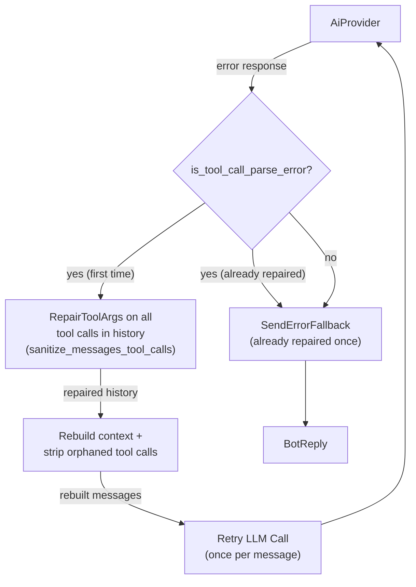

# Tool-Call JSON Parse Error Recovery — Provider-Triggered Repair

## 1. Purpose

Recovery path of [the agent loop](../agent-loop.md) when the AI provider returns an
error whose body indicates a **tool-call arguments JSON parse failure** (e.g.
HTTP 500 with nlohmann/json `[json.exception.parse_error.101] ... invalid
string: missing closing quote` — Gitea issue #80): the harness treats it as
recoverable — it repairs all tool call `arguments` in the room history and
retries the request once.

## 2. Diagram

When the AI provider returns an error whose body indicates a **tool-call
arguments JSON parse failure** (e.g. HTTP 500 with nlohmann/json
`[json.exception.parse_error.101] ... invalid string: missing closing quote` —
Gitea issue #80), the harness treats it as recoverable: it repairs all tool
call `arguments` in the room history (string-aware `RepairToolArgs`, shared
with the providers — see [AI Provider — Data Structures](../../../ai/ai-provider/structures.md))
and retries the request once. This covers both truncated arguments that
slipped into history (restored snapshots, legacy saves) and long free-text
arguments the provider itself could not re-parse.

**Repair**: every `function.arguments` field in the room's history messages is
re-validated; malformed documents are repaired by the shared string-aware
scanner (close unterminated strings, escape control chars, balance
braces/brackets outside strings) or reset to `{}` when irrecoverable. Then
context is rebuilt and orphaned tool calls are stripped.

**Retry limit**: repair is attempted at most once per `process_message` call
(the `tool_call_recovery` flag, parallel to `context_reset`). If the provider
still returns a parse error, the harness falls back to the standard error
reply. Non-parse errors (auth, rate limit, generic 5xx) are unaffected.
