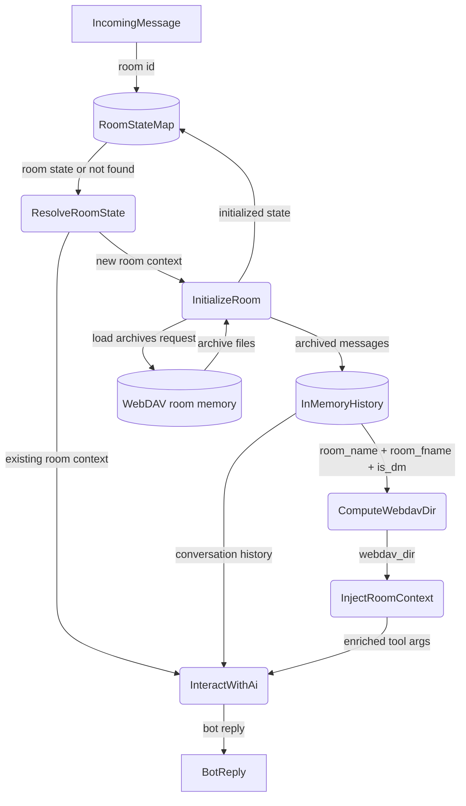

# Per-Room State Routing

## 1. Purpose

Each room maintains independent state — conversation history, agent context, and
WebDAV archive path. The agent routes incoming messages to the correct room's
pipeline. Room context (`room_id` UUID + `webdav_dir` path key) is computed from
`room_name`, `room_fname`, and `is_dm` and injected into stateful tool calls
(tools backed by WebDAV or room-scoped storage).

## 2. Diagram

> **Note**: `compute_webdav_dir` **panics** if `room_fname` is empty — this is a
> safety net for programmer error. The `room_fname` is always resolved upstream
> (via DDP or REST fallback) before reaching the harness, so this assert should
> never fire at runtime. See [`room-name-fields.md`](../../../_doc/rocketchat/room-name-fields.md).
