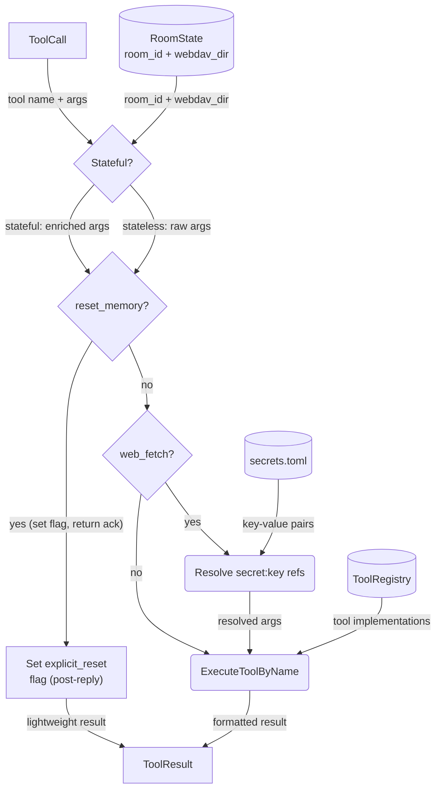

# Tool Execution Deep Dive

## 1. Purpose

Room context (`room_id` UUID + `webdav_dir` path key) is injected into
stateful tools that need it (tools backed by WebDAV or room-scoped storage).
Stateless tools (web search, fetch, vision, etc.) receive raw arguments
without room context. The `ToolRegistry` maps tool names to implementations;
calls are dispatched generically via `execute_by_name()`.

**References:**
- [Memory Reset — post-reply decision](../../memory/memory-reset/post-reply-decision.md) — `reset_memory` interception and the explicit-reset flag
- [Secret Interception](../../interception/secret-interception/deep-traversal.md) — `secret:<key>` reference resolution for `web_fetch`
- [Per-Room State Routing](./per-room-routing.md) — where `room_id` + `webdav_dir` come from
- [Agent Loop (Main Success Path)](./agent-loop.md) — the tool dispatch is called from `InteractWithAi`

## 2. Diagram

**Exception**: `reset_memory` is intercepted before `execute_by_name()`.
Instead of running reset synchronously (which would clear history
mid-conversation), it sets an `explicit_reset` flag on the room. Actual
reset runs post-reply via `reset_room_if_needed()`. The tool's own `execute()`
is a stub that returns an error — this avoids both the deadlock from
re-acquiring `Arc<Mutex<AgentHarness>>` and the data loss from clearing
history while the LLM is still generating a reply. See
[memory-reset.md](../../memory/memory-reset/post-reply-decision.md) for the full flow.

**Secret interception**: `web_fetch` arguments are scanned for `secret:<key>`
references in header values before dispatch. The harness loads `secrets.toml`
from WebDAV once per tool-call batch and replaces references with actual secret
values. The tool receives resolved headers — it is unaware of the interception.
See [secret-interception.md](../../interception/secret-interception/deep-traversal.md) for the full flow.
