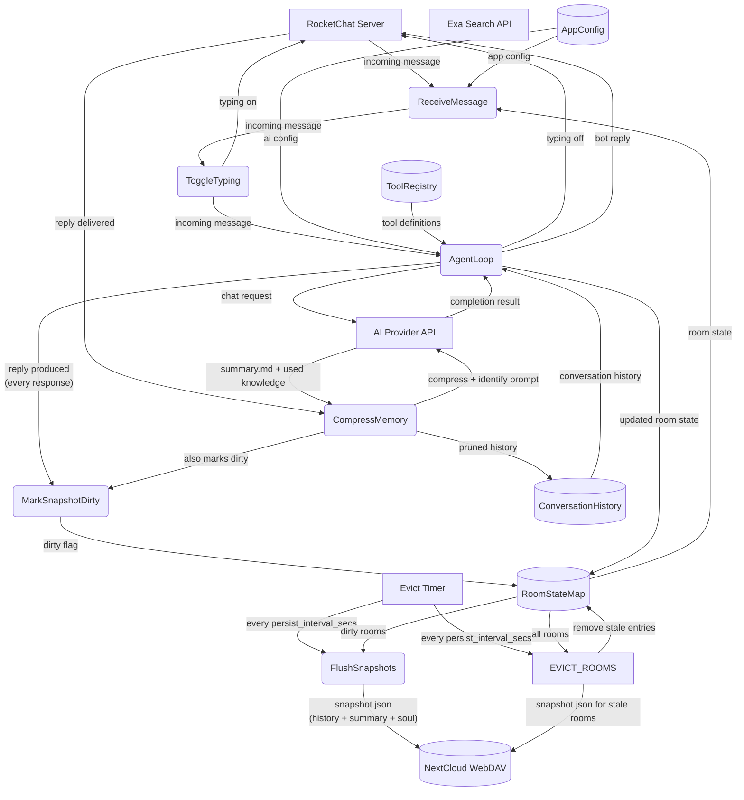
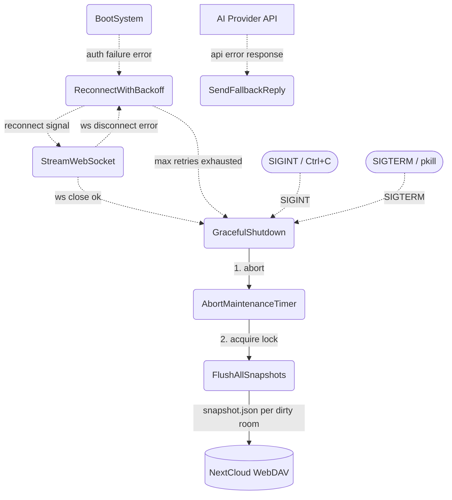
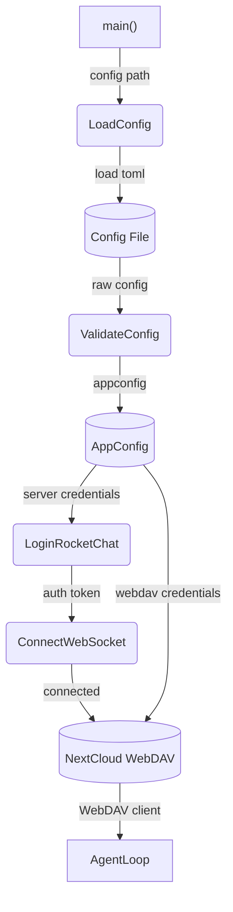
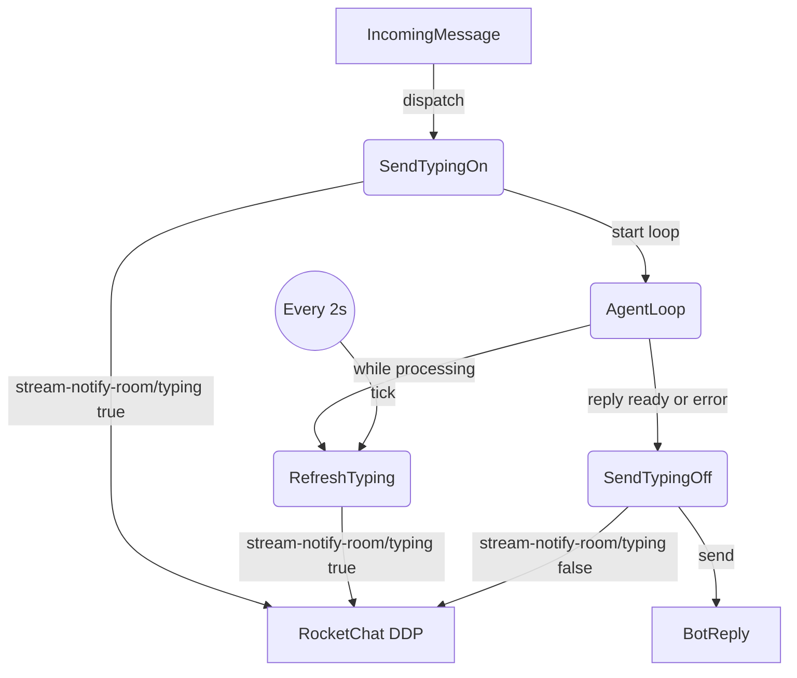

# Agent Loop

## 1. Purpose

Shows how all subsystems — RocketChat client, AI provider, tools, memory,
WebDAV, config — are wired together to run the agent harness. This is the
top-level process decomposition of RockBot: a single event loop that connects to
RocketChat, routes incoming messages to the agent harness, executes tool calls,
manages per-room memory, and persists everything to WebDAV.

- Upstream: [Configuration Management](base/config.md) provides `AppConfig`
- Downstream: [Agent Harness](agent-harness.md) receives `IncomingMessage` and
  returns `BotReply` (see agent-harness.md for loop internals and tool execution)
- Downstream: [RocketChat Connection](base/rocketchat.md) handles auth, WebSocket
  streaming, and message filtering
- Downstream: [RocketChat REST API](base/rocketchat-rest.md) handles room name
  resolution and alias message sending (production path for bot replies)
- Downstream: [AI Provider](base/ai-provider.md) handles chat completion requests
- Downstream: [Memory Management](base/memory.md) manages per-room conversation history,
  compression (threshold-based, produces summary.md — see [Memory Compression](base/memory-compression.md)),
  snapshot persist, and TTL-based room eviction
- Downstream: [WebDAV Tool](tools/webdav.md) persists image assets

## 2. Diagram

### 2a. Happy Flow (Main Success Path)

### 2b. Error Handling & Fallbacks

On graceful shutdown (SIGINT, SIGTERM, normal WS close, or max reconnect retries), the bot:
1. Aborts the periodic maintenance timer to prevent races on the harness mutex.
2. Acquires the harness lock and calls `flush_all_snapshots()`, which iterates every dirty room (soul/knowledge/summary changes), builds a `PersistSnapshot`, serializes to JSON, and uploads `snapshot.json` to WebDAV via `write_file_with_fallback`.

Typing indicator failures are non-critical: if `sender.typing()` returns an error (e.g. WebSocket disconnected), the heartbeat task silently catches it and stops refreshing. The main agent loop is unaffected — it continues processing and sends the reply without typing cleanup.

### 2c. Startup Sequence

Note: History loading is lazy — each room's memory (summary, soul, knowledge) is restored on first message per room via `restore_history()`, not eagerly at startup. No batch restore occurs at boot time.

### 2d. Typing Indicator Heartbeat

Level 2 decomposition of `ToggleTyping` and the typing flows during `AgentLoop`. The bot sends an initial `typing=true` signal before the agent loop begins, then a background task refreshes it every 2 seconds while the loop runs. When the loop produces a reply (or errors out), typing is set to `false`.

The heartbeat task is a `tokio::spawn` that runs concurrently with the agent loop, refreshing the typing indicator every 2 seconds. If the WebSocket disconnects, `sender.typing()` returns an error — the heartbeat task breaks its loop and exits silently. The main agent loop is unaffected.

Typing indicator state is intentionally not retried or persisted — it is a transient UI affordance with no durability requirements.

## 3. Data Structures

#### `AgentHarness` (harness.rs:55-65)

| Field            | Type                  | Notes                                      |
| ---------------- | --------------------- | ------------------------------------------ |
| `config`         | `Arc<AppConfig>`      | Immutable configuration shared across subsystems |
| `provider`       | `Box<dyn AiProvider>` | AI provider for chat completions           |
| `memory`         | `MemoryManager`       | Per-room conversation history              |
| `tools`          | `ToolRegistry`        | Registered tool definitions                |
| `webdav`         | `Option<WebDavClient>`| Optional WebDAV handle for persistent storage |
| `rest_client`    | `Option<RestApiClient>`| Optional REST API client for alias sends  |
| `max_iterations` | `u32`                 | Max agent loop iterations per message      |
| `max_attachment_bytes` | `u64`           | Max size for attachment download           |
| `image_pool`     | `HashMap<String, Vec<CachedImage>>` | Per-room image_gen-generated images (for same-turn edit name-matching) |
| `image_cache`    | `Arc<ImageCache>`     | Generated image cache (by call_id)         |
| `last_image_ids` | `Vec<String>`         | IDs of images generated this turn          |
| `current_image_urls` | `Vec<String>`     | Image URLs from current message (auto-injected into image_gen) |

#### `RoomState`

| Field           | Type                | Notes                                      |
| --------------- | ------------------- | ------------------------------------------ |
| `room_id`       | `String`            | RocketChat room UUID (in-memory lookup key) |
| `room_name`     | `String`            | URL slug (ASCII)                           |
| `room_fname`    | `String`            | Friendly display name (Unicode)            |
| `is_dm`         | `bool`              | True if direct message room                |
| `history`       | `ConversationHistory`| In-memory message buffer for this room     |
| `last_activity` | `u64`               | Unix timestamp of last interaction; checked against `memory_ttl_secs` for eviction |

`webdav_dir` is not a stored field — it is computed on-the-fly from `room_name`/`room_fname`/`is_dm` via `compute_webdav_dir()`.

The main loop uses `tokio::signal::unix::signal(SignalKind::terminate())` raced with
`tokio::signal::ctrl_c()` for shutdown (both SIGTERM and SIGINT), and a local
`retry_count: u32` variable for reconnect backoff. Graceful shutdown calls
`AgentHarness::flush_all_snapshots()` (harness.rs:1126) to sync dirty per-room
state to WebDAV before exiting.

## 4. Non-Functional Requirements

- **No local file access**: The agent loop and all subsystems MUST NOT read from or
  write to the local filesystem at runtime. The only local file read is `config.toml`
  (and `default.config.toml`) at startup. All persistent state lives in WebDAV.
- **No tool touches local files**: Every tool (web_fetch, webdav, calendar, datetime,
  vision, web_search, image_gen, edit_soul, knowledge tools) MUST NOT access the
  local filesystem. All I/O goes through WebDAV or HTTP.
- **Config-only startup**: The application only loads `config.toml` (merged with
  `default.config.toml`) on startup. No other local files are read or created.
- **Avatar from URL only**: Avatar changes use the `users.setAvatar` REST API
  (`setAvatarFromService` DDP method) with a URL parameter. Local file paths are
  never used for avatar images.
