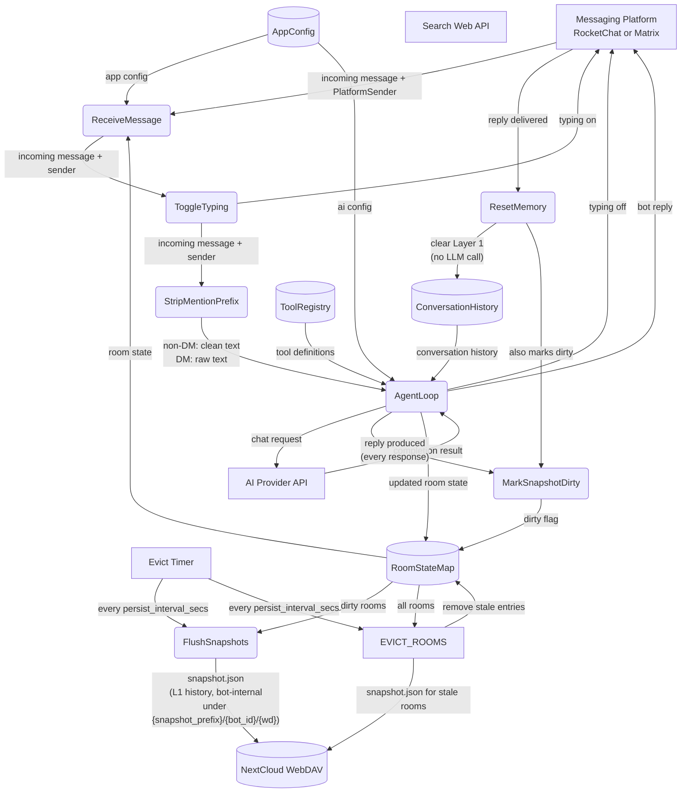
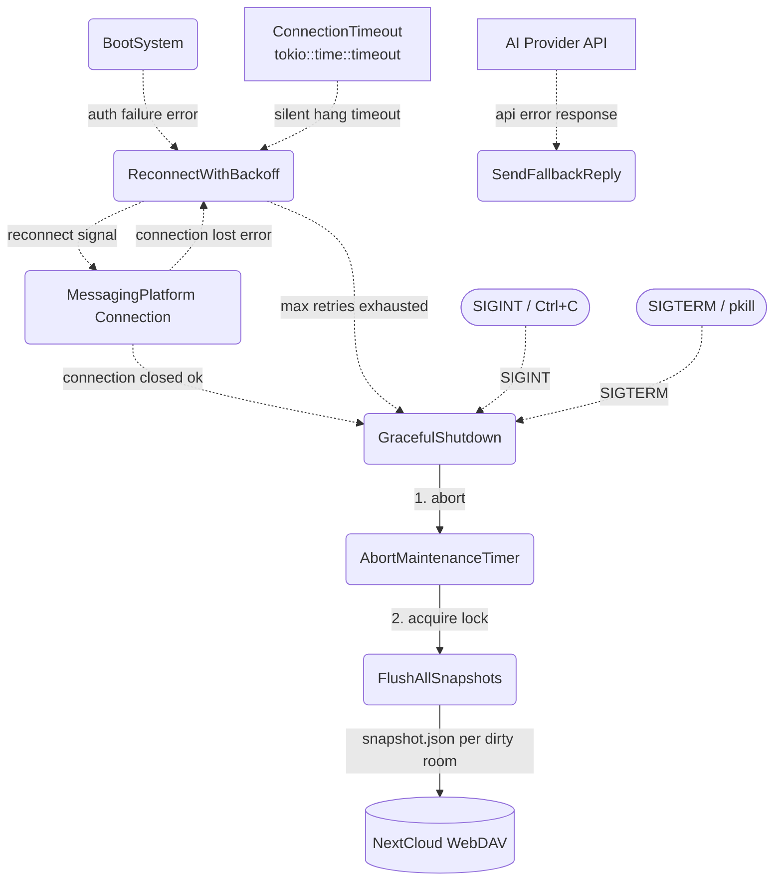
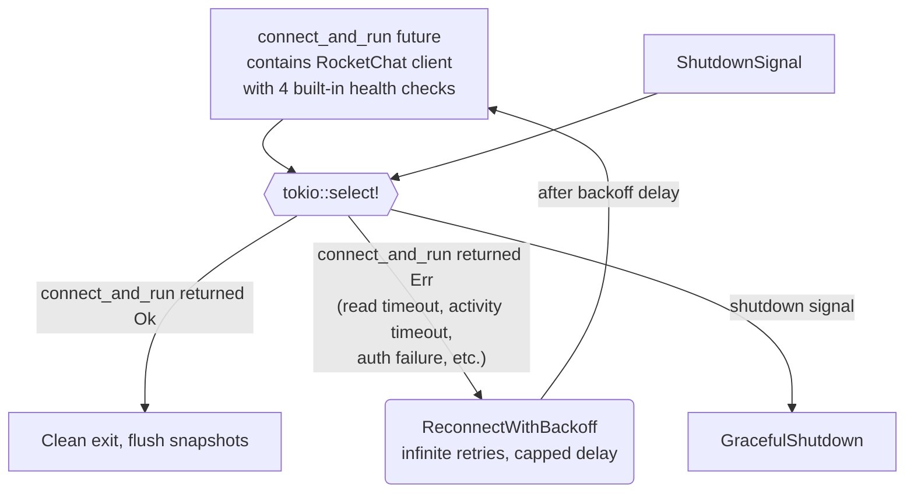
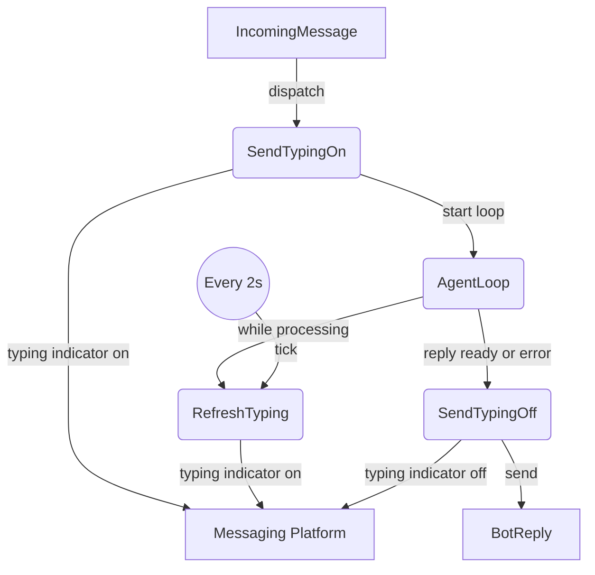

# Agent Loop

## 1. Purpose

Shows how all subsystems — messaging platform client, AI provider, tools, memory,
WebDAV, config — are wired together to run the agent harness. This is the
top-level process decomposition of RockBot: a single event loop that connects to
a messaging platform (RocketChat or Matrix, selected by `[platform] name`),
routes incoming messages to the agent harness, executes tool calls,
manages per-room memory, and persists everything to WebDAV.

The messaging platform is abstracted behind a `MessagingClient` trait
(defined in `crate-rockbot/src/platform/mod.rs`). Both `RocketChatPlatform`
and `MatrixPlatform` implement this trait, producing the same `IncomingMessage`
type and consuming `BotReply`. The agent harness and tool execution are
platform-agnostic.

- Upstream: [Configuration Management](../infra/config.md) provides `AppConfig`
- Upstream: [Boot Sequence](boot-sequence.md) covers config loading, provider
  selection, tool registration, and platform connection — all boot steps
  that precede entering this event loop
- Downstream: [Agent Harness](agent-harness.md) receives `IncomingMessage` and
  returns `BotReply` (see agent-harness.md for loop internals and tool execution)
- Downstream: [RocketChat Connection](../infra/rocketchat.md) or
  [Matrix Connection](../infra/matrix.md) — implements `MessagingClient` trait
- Downstream: [RocketChat REST API](../infra/rocketchat-rest.md) handles room name
  resolution and alias message sending (RocketChat-only production path for bot replies)
- Downstream: [AI Provider](../ai/ai-provider.md) handles chat completion requests
- Downstream: [Memory Management](../memory/memory.md) manages per-room conversation history,
  hard reset (threshold-based, clears Layer 1 — see [Memory Reset](../memory/memory-reset.md)),
  snapshot persist, and TTL-based room eviction
- Downstream: [WebDAV Tool](../tools/webdav.md) persists image assets

## 2. Diagram

### 2a. Happy Flow (Main Success Path)



### 2b. Error Handling & Fallbacks



On graceful shutdown (SIGINT, SIGTERM, normal connection close, or max reconnect retries), the bot:
1. Aborts the periodic maintenance timer to prevent races on the harness mutex.
2. Acquires the harness lock and calls `flush_all_snapshots()`, which iterates every dirty room, builds a `PersistSnapshot` (Layer 1 history only), serializes to JSON, and uploads to `{snapshot_prefix}/{bot_id}/{wd}/snapshot.json` on WebDAV via `write_file_with_fallback`.

Typing indicator failures are non-critical: if `sender.typing()` returns an error (e.g. WebSocket disconnected), the heartbeat task silently catches it and stops refreshing. The main agent loop is unaffected — it continues processing and sends the reply without typing cleanup.

### 2c. Connection Health Monitoring

Level 2 decomposition of the reconnect loop, showing how connection hangs
(silent TCP drops, stalled event loops, silent DDP subscription drops) are
detected and recovered from. All health checking is handled internally by the
RocketChat client (`connect_and_run`). The application layer (`main.rs`) simply
races `connect_fut` against the shutdown signal — there is no app-level
activity timeout.

This design reflects that the WebSocket session is only needed for two things:
receiving incoming user messages (DDP `changed` events) and ping/pong keepalive.
Replies are sent via REST API independently. "No user messages" is normal idle,
not a connection failure.



**Built-in health checks** (RocketChat `client.rs`, see
[rocketchat.md:2d](../infra/rocketchat.md#2d-pingpong-keepalive-deep-dive) and
[rocketchat.md:2h](../infra/rocketchat.md#2h-application-activity-timeout)):

1. **TCP keepalive** (60s idle, 10s interval) — kernel-level dead peer detection
2. **WebSocket Ping frames** (30s interval) — detects transport dead via send failure
3. **Read timeout** (300s) — detects complete silence (no bytes on socket)
4. **Application activity timeout** (1800s) — detects silent DDP subscription drops where the transport is alive but no `changed` events arrive. Tracks the timestamp of the last incoming DDP message independently of WebSocket control frames.

When any of these detect a dead connection, `connect_and_run()` returns an
`Err` variant (`ReadTimeout`, `AppActivityTimeout`, `SetupTimeout`, etc.),
which the reconnect loop catches and handles with backoff.

**Reconnect strategy** (`main.rs`): The reconnect loop has no retry limit —
it reconnects indefinitely on any error. Backoff delay is capped at 120s
(`2^retry_count` seconds, max 120). Only a shutdown signal (SIGTERM/SIGINT)
or a successful normal close (`Ok(())`) exits the loop. This prevents the bot
from permanently self-terminating during idle periods or transient network
issues.

**Data flow summary**:

| Path | Trigger | Action |
|------|---------|--------|
| `connect_and_run` returns `Ok(())` | Normal close (server Close frame, FIN) | Clean exit, flush snapshots |
| `connect_and_run` returns `Err` | Transport error, read timeout, activity timeout, auth failure, etc. | Reconnect with capped backoff (no retry limit) |
| `shutdown` future fires | SIGTERM / SIGINT | Graceful shutdown |

### 2c. Typing Indicator Heartbeat

Level 2 decomposition of `ToggleTyping` and the typing flows during `AgentLoop`. The bot sends an initial `typing=true` signal before the agent loop begins, then a background task refreshes it every 2 seconds while the loop runs. When the loop produces a reply (or errors out), typing is set to `false`.



The heartbeat task is a `tokio::spawn` that runs concurrently with the agent loop, refreshing the typing indicator every 2 seconds. If the WebSocket disconnects, `sender.typing()` returns an error — the heartbeat task breaks its loop and exits silently. The main agent loop is unaffected.

Typing indicator state is intentionally not retried or persisted — it is a transient UI affordance with no durability requirements.

## 3. Data Structures

#### `MessagingClient` trait (platform/mod.rs)

Async trait defining the connection contract. Both `RocketChatPlatform` and
`MatrixPlatform` implement this trait.

```rust
#[async_trait]
pub trait MessagingClient: Send + Sync {
    async fn connect_and_run(&self, handler: MessageHandler) -> Result<()>;
    fn bot_id(&self) -> &str;
}
```

- `connect_and_run` — long-running method that connects to the platform,
  subscribes to messages, and invokes `handler` for each `IncomingMessage`.
  Returns `Err` on connection failure (triggers reconnect in the agent loop).
  For RocketChat: DDP WebSocket connect → auth → subscribe → event loop.
  For Matrix: login → start `/sync` loop → dispatch room messages.
- `bot_id` — platform-canonical identifier of this bot instance, used as the
  per-bot namespace in WebDAV snapshot paths
  (`{snapshot_prefix}/{bot_id}/{wd}/snapshot.json`). The platform owns the
  canonical form: RocketChat returns `@username` (the `bot_name` passed to
  `RocketChatPlatform::new`), Matrix returns the full MXID `@bot:server`
  (from `[matrix.server] user_id`). Non-emptiness is guaranteed by each
  platform's config validation (`#[validate(min_length = 1)]` on
  `ServerConfig.username` and `MatrixServerConfig.user_id`). The harness
  receives this value as a constructor parameter and never derives it from
  `config.platform.name` itself.

#### `PlatformSender` trait (platform/mod.rs)

Per-message platform handle passed to the handler alongside each
`IncomingMessage`. Each platform's concrete sender implements this trait.
The agent loop uses it for replies, typing indicators, and mention stripping.

```rust
#[async_trait]
pub trait PlatformSender: Send + Sync {
    async fn send_reply(&self, text: &str, alias: Option<&str>) -> Result<()>;
    async fn send_reply_with_attachments(
        &self, text: &str, attachments: &[serde_json::Value],
        alias: Option<&str>,
    ) -> Result<()>;
    async fn send_typing(&self, typing: bool) -> Result<()>;
    fn room_id(&self) -> &str;
    fn as_any(&self) -> &dyn std::any::Any;
    fn clone_box(&self) -> Box<dyn PlatformSender>;
    fn strip_mention_prefix(&self, text: &str) -> String;
}
```

- `send_reply` — send a text message to a room. For RocketChat: REST
  `chat.sendMessage` with alias fallback to DDP. For Matrix:
  `Client::room_send()` with `RoomMessageEventContent::text_markdown()`.
- `send_typing` — send typing indicator. For Matrix: `m.typing` state event.
- `strip_mention_prefix` — strip the bot's @mention prefix from message text
  (non-DM only). Platform-specific: RocketChat strips `@username`, Matrix
  strips `@localpart` or full MXID. See [Mention Prefix Stripping](#mention-prefix-stripping-platformsenderstrip_mention_prefix) below.

> **Design note**: The traits are intentionally narrow — they only cover the
> bidirectional message flow and per-message text cleaning. Platform-specific
> features (REST alias, file uploads, room name resolution) remain on the
> concrete types and are accessed by the agent loop through platform-specific
> code paths or `as_any()` downcasting.

#### Mention Prefix Stripping (`PlatformSender::strip_mention_prefix`)

Non-DM messages arrive with the bot's @mention prefix in the text (e.g.
`"@rockai hello"` on RocketChat, `"@rockbot hello"` on Matrix). The agent
loop strips this prefix before passing the text to `process_message()` so
the LLM receives clean user text.

The stripping logic is platform-specific and implemented as a
`PlatformSender` trait method:

```rust
fn strip_mention_prefix(&self, text: &str) -> String;
```

- **RocketChat** (`RcPlatformSender`): strips `@username ` or `@username`
  (derived from `[rocketchat.server] username`).
- **Matrix** (`MatrixSender`): strips the full MXID (`@bot:server`) or the
  localpart (`@bot`), with or without trailing space. Matrix clients put the
  localpart in the message body, not the full MXID — so both forms are tried.

The agent loop calls `sender.strip_mention_prefix(&msg.text)` for non-DM
messages only. DM messages are passed through unchanged (no @mention prefix
to strip).

`bot_name` is obtained from `MessagingClient::bot_id()` at boot (the
platform is constructed before the harness; the resulting `bot_id` is passed
into `AgentHarness::new()`). For RocketChat it is `@username` from
`[rocketchat.server] username`; for Matrix it is the full MXID from
`[matrix.server] user_id`. The value is passed to
`RocketChatPlatform::new()` for mention **checking** in the RocketChat DDP
client. It is no longer used for prefix-stripping in the agent loop — that
responsibility belongs to the `PlatformSender` trait. The harness no longer
matches on `config.platform.name` to derive `bot_id`; the platform is the
single source of truth.

#### `AgentHarness` (harness.rs:55-78)

| Field            | Type                  | Notes                                      |
| ---------------- | --------------------- | ------------------------------------------ |
| `config`         | `Arc<AppConfig>`      | Immutable configuration shared across subsystems |
| `provider`       | `Box<dyn AiProvider>` | AI provider for chat completions           |
| `memory`         | `MemoryManager`       | Per-room conversation history              |
| `tools`          | `ToolRegistry`        | Registered tool definitions                |
| `webdav`         | `Option<WebDavClient>`| Optional WebDAV handle for persistent storage |
| `rest_client`    | `Option<RestApiClient>`| Optional REST API client for alias sends  |
| `max_iterations` | `u32`                 | Max agent loop iterations per message      |
| `max_attachment_bytes` | `u64`           | Max size for attachment download           |
| `bot_id`         | `String`              | Platform-canonical bot identifier, passed into `AgentHarness::new()` (obtained from `MessagingClient::bot_id()` in `main.rs`). Used as the per-bot namespace in WebDAV snapshot paths. The harness does **not** derive this from `config.platform.name`. |
| `snapshot_prefix`| `String`              | WebDAV path prefix for snapshots (default `.snapshots`) |
| `image_pool`     | `HashMap<String, Vec<CachedImage>>` | Per-room cached images from vision/webdav tool results and image_gen (for edit name-matching) |
| `pending_vision_images` | `HashMap<String, Vec<CachedImage>>` | Vision-fetched images awaiting ContentPart injection into the next user message |
| `image_cache`    | `Arc<ImageCache>`     | Generated image cache (by call_id)         |
| `last_image_ids` | `Vec<String>`         | IDs of images generated this turn          |
| `current_image_urls` | `Vec<String>`     | Image URLs from current message (auto-injected into image_gen) |

`AgentHarness::new` signature:

```rust
pub fn new(
    config: AppConfig,
    provider: Box<dyn AiProvider>,
    webdav: Option<WebDavClient>,
    image_cache: Arc<ImageCache>,
    bot_id: String,
) -> Self
```

`bot_id` is supplied by the caller (`main.rs` at boot, test harnesses in
unit/integration tests). In `main.rs`, the `MessagingClient` is constructed
**before** the harness and its `bot_id()` trait method supplies the value,
removing the previous `match config.platform.name.as_str() { "matrix" => ..., _ => ... }`
block from the harness constructor (issue #58).

#### `RoomState`

| Field           | Type                | Notes                                      |
| --------------- | ------------------- | ------------------------------------------ |
| `room_id`       | `String`            | RocketChat room UUID (in-memory lookup key) |
| `room_name`     | `String`            | URL slug (ASCII)                           |
| `room_fname`    | `String`            | Friendly display name (Unicode)            |
| `is_dm`         | `bool`              | True if direct message room                |
| `history`       | `ConversationHistory`| In-memory message buffer for this room     |
| `last_activity` | `u64`               | Unix timestamp of last interaction; checked against `memory_ttl_secs` for eviction |

`webdav_dir` is not a stored field — it is computed on-the-fly from `room_name`/`room_fname`/`is_dm` via `compute_webdav_dir()`.

The main loop uses `tokio::signal::unix::signal(SignalKind::terminate())` raced with
`tokio::signal::ctrl_c()` for shutdown (both SIGTERM and SIGINT), and a local
`retry_count: u32` variable for reconnect backoff. Graceful shutdown calls
`AgentHarness::flush_all_snapshots()` (harness.rs:1126) to sync dirty per-room
state to WebDAV before exiting.

## 4. Non-Functional Requirements

- **No local file access**: The agent loop and all subsystems MUST NOT read from or
  write to the local filesystem at runtime. The only local file read is `config.toml`
  at startup (defaults embedded in Rust source). All persistent state lives in WebDAV.
  Exception: `matrix-rust-sdk` stores an encryption key store and sync state in a
  configurable state directory (`[matrix.server] state_dir`, default `./tmp/matrix-sdk`).
- **No tool touches local files**: Every tool (web_fetch, webdav, calendar,
  vision, web_search, image_gen, edit_soul, knowledge tools) MUST NOT access the
  local filesystem. All I/O goes through WebDAV or HTTP.
- **Config-only startup**: The application only loads `config.toml` (with
  embedded Rust defaults) on startup. No other local files are read or created.
- **Avatar from URL only**: Avatar changes use the `users.setAvatar` REST API
  (`setAvatarFromService` DDP method) with a URL parameter. Local file paths are
  never used for avatar images.
- **Platform parity**: The `IncomingMessage` type is shared across all platforms.
  Platform-specific fields (e.g. Matrix `event_id`, RocketChat `msg_id`) are mapped
  to the shared `msg_id: Option<String>` field. The agent harness and tools MUST NOT
  depend on platform-specific message fields.
