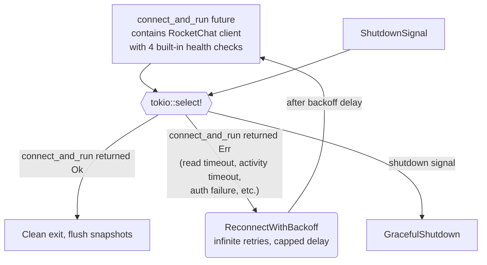

# Connection Health Monitoring

## 1. Purpose

Level 2 decomposition of the reconnect loop, showing how connection hangs
(silent TCP drops, stalled event loops, silent DDP subscription drops) are
detected and recovered from. All health checking is handled internally by the
RocketChat client (`connect_and_run`). The application layer (`main.rs`) simply
races `connect_fut` against the shutdown signal — there is no app-level
activity timeout.

This design reflects that the WebSocket session is only needed for two things:
receiving incoming user messages (DDP `changed` events) and ping/pong keepalive.
Replies are sent via REST API independently. "No user messages" is normal idle,
not a connection failure.

**References:** Parent flow [main path](../main-path.md); shutdown behavior
falls back to [error handling](error-handling.md)

## 2. Diagram

**Built-in health checks** (RocketChat `client.rs`, see
[pingpong-keepalive.md](../../../infra/rocketchat/level-2/pingpong-keepalive.md) and
[app-activity-timeout.md](../../../infra/rocketchat/level-2/app-activity-timeout.md)):

1. **TCP keepalive** (60s idle, 10s interval) — kernel-level dead peer detection
2. **WebSocket Ping frames** (30s interval) — detects transport dead via send failure
3. **Read timeout** (300s) — detects complete silence (no bytes on socket)
4. **Application activity timeout** (1800s) — detects silent DDP subscription drops where the transport is alive but no `changed` events arrive. Tracks the timestamp of the last incoming DDP message independently of WebSocket control frames.

When any of these detect a dead connection, `connect_and_run()` returns an
`Err` variant (`ReadTimeout`, `AppActivityTimeout`, `SetupTimeout`, etc.),
which the reconnect loop catches and handles with backoff.

**Reconnect strategy** (`main.rs`): The reconnect loop uses two counters:

- `retry_count: u64` — controls exponential backoff (`2^retry_count` seconds,
  capped at 120s). Reset to 0 after a connection lasting >= 60 seconds, so
  transient errors always start with a short backoff.
- `auth_fail_count: u32` — tracks consecutive `AuthFailed` errors. After 5
  consecutive auth failures, the bot exits with an error rather than retrying
  indefinitely. Reset to 0 on any non-auth error or on a connection lasting
  >= 60 seconds.

Only a shutdown signal (SIGTERM/SIGINT), a successful normal close (`Ok(())`),
or 5 consecutive auth failures exits the loop.

**Data flow summary**:

| Path | Trigger | Action |
|------|---------|--------|
| `connect_and_run` returns `Ok(())` | Normal close (server Close frame, FIN) | Clean exit, flush snapshots |
| `connect_and_run` returns `Err` (non-auth) | Transport error, read timeout, activity timeout, etc. | Reset `auth_fail_count`; if connected >= 60s, reset `retry_count`; reconnect with capped backoff |
| `connect_and_run` returns `Err(AuthFailed)` | M_UNKNOWN_TOKEN, login failure | Increment `auth_fail_count`; after 5 consecutive, exit with error |
| `shutdown` future fires | SIGTERM / SIGINT | Graceful shutdown |
