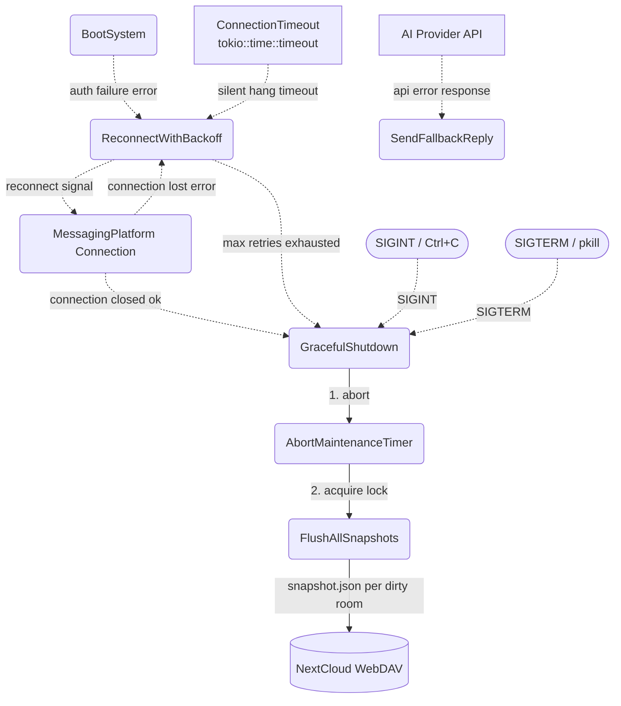

# Error Handling & Fallbacks

## 1. Purpose

Describes how the agent loop reacts to failures: connection and auth errors
trigger reconnect with exponential backoff, AI provider errors trigger a
fallback reply, and SIGINT/SIGTERM, normal connection close, or exhausted
reconnect retries lead to a graceful shutdown that flushes all dirty
snapshots.

**References:** Parent flow [main path](../main-path.md)

## 2. Diagram

On graceful shutdown (SIGINT, SIGTERM, normal connection close, or max reconnect retries), the bot:
1. Aborts the periodic maintenance timer to prevent races on the harness mutex.
2. Acquires the harness lock and calls `flush_all_snapshots()`, which iterates every dirty room, builds a `PersistSnapshot` (Layer 1 history only), serializes to JSON, and uploads to `{snapshot_prefix}/{bot_id}/{wd}/snapshot.json` on WebDAV via `write_file_with_fallback`.

Typing indicator failures are non-critical: if `sender.typing()` returns an error (e.g. WebSocket disconnected), the heartbeat task silently catches it and stops refreshing. The main agent loop is unaffected — it continues processing and sends the reply without typing cleanup.
