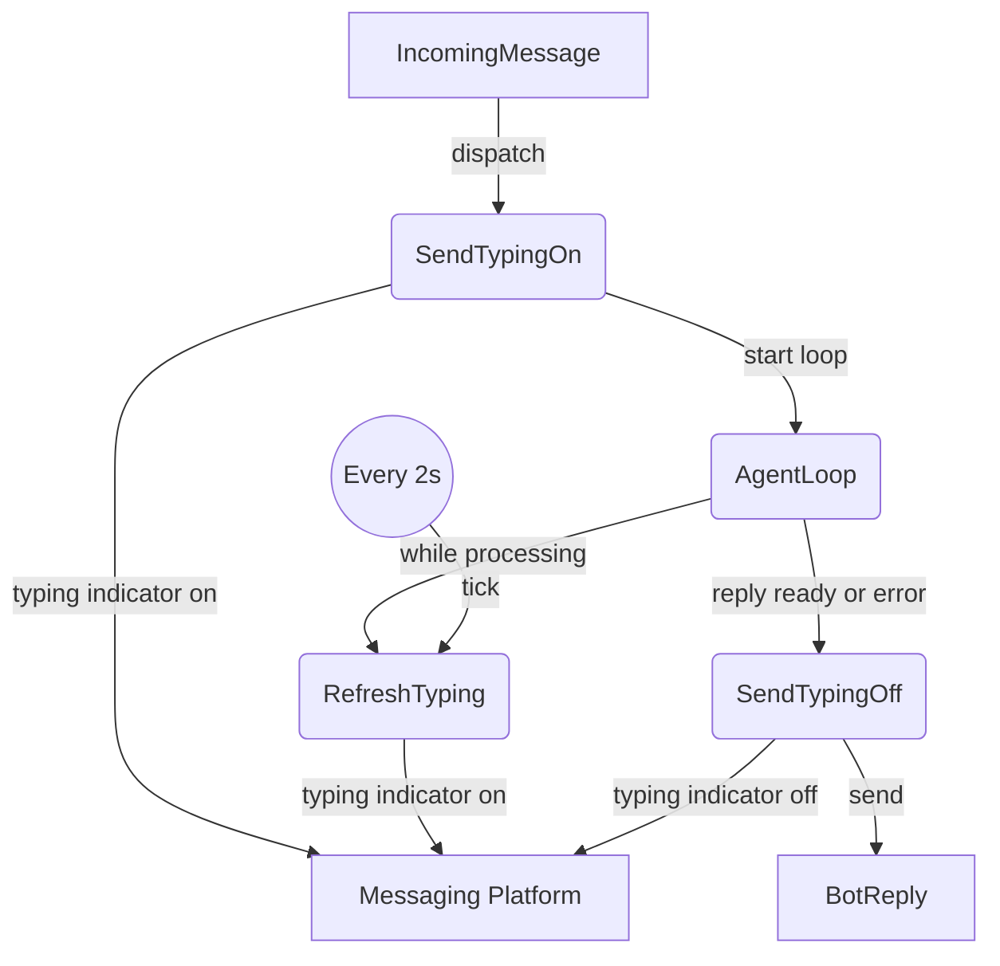

# Typing Indicator Heartbeat

## 1. Purpose

Level 2 decomposition of `ToggleTyping` and the typing flows during `AgentLoop`. The bot sends an initial `typing=true` signal before the agent loop begins, then a background task refreshes it every 2 seconds while the loop runs. When the loop produces a reply (or errors out), typing is set to `false`.

**References:** Parent flow [main path](../main-path.md); failure behavior in
[error handling](error-handling.md)

## 2. Diagram

The heartbeat task is a `tokio::spawn` that runs concurrently with the agent loop, refreshing the typing indicator every 2 seconds. If the WebSocket disconnects, `sender.typing()` returns an error — the heartbeat task breaks its loop and exits silently. The main agent loop is unaffected.

Typing indicator state is intentionally not retried or persisted — it is a transient UI affordance with no durability requirements.
