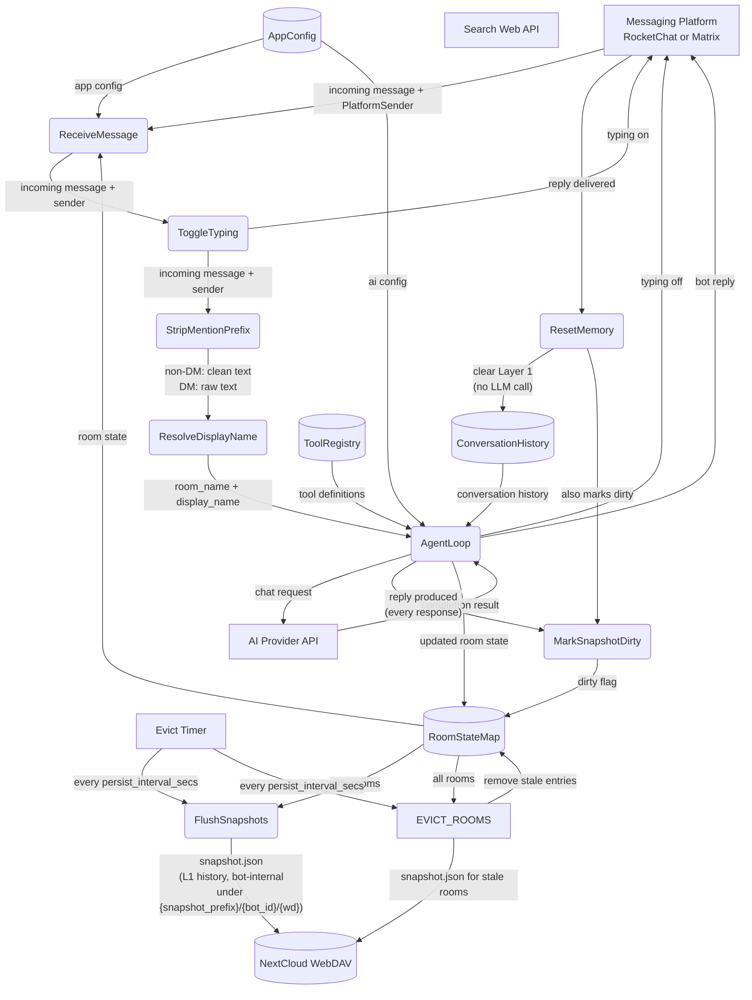

# Main Success Path

## 1. Purpose

The main success path of the agent loop: the messaging platform delivers an
incoming message with a per-message `PlatformSender` handle, the loop toggles
the typing indicator on, strips the bot's mention prefix, resolves the room's
display name, and hands the message to the agent harness (conversation history,
tool definitions, AI config) which sends the chat request and returns the
bot reply. Every reply marks the room state dirty, so the periodic persister
flushes `snapshot.json` for dirty rooms and evicts stale rooms. Shared data
structures and full subsystem wiring are documented in
[structures.md](structures.md).

## 2. Diagram

