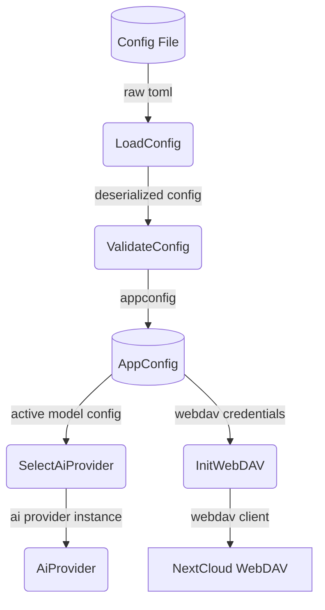
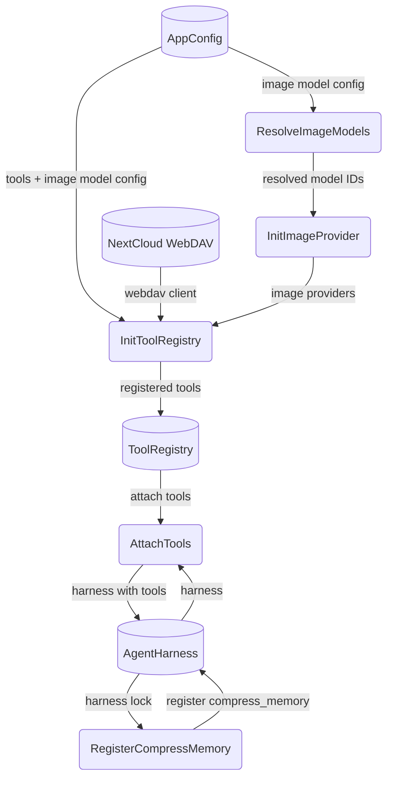
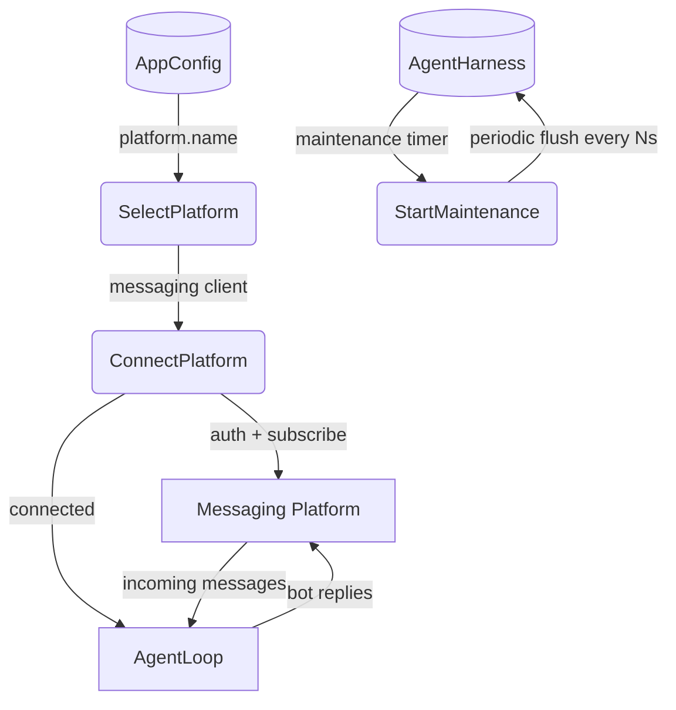

# Boot Sequence

## 1. Purpose

Covers the startup sequence from `main()` entry to entering the agent loop.
Includes config loading, AI provider selection, WebDAV initialization, tool
registry construction (with about-info logging at `INFO` level), image provider
setup, platform client creation, and maintenance timer start.

- Downstream: [Agent Loop](agent-loop.md) — enters the `AgentLoop` event loop
  after boot completes
- References: [Configuration Management](../infra/config.md) — provides
  `AppConfig` used throughout boot
- References: [AI Provider](../ai/ai-provider.md) — `AiProvider` trait
  implemented by DeepSeek, OpenRouter, llama.cpp

## 2. Diagram

### 2a. Config & Provider Boot

Config is loaded from `config.toml` (or `CONFIG_FILE` env var), merged with
`default.config.toml`, deserialized, and validated into an `AppConfig` instance.
The active model config selects which AI provider to instantiate
(DeepSeek / OpenRouter / llama.cpp). WebDAV client creation is conditional on
`[webdav]` config presence.

### 2b. Tool Registration

Tool registration is the core of boot. Every tool is registered conditionally
based on available config (search provider config for web search, WebDAV for
persistent tools, image provider for image_gen). Each registration and
model-resolution step emits an **about-info** log line (see §4).

Tools registered unconditionally:
- `WebFetchTool` (variant depends on Exa + WebDAV availability)
- `VisionTool`

Tools registered conditionally on config:
- `WebSearchTool` (requires configured search provider in `[search]` section)

Tools registered when WebDAV is configured:
- `WebDavTool`, `EditSoulTool`, `SaveKnowledgeTool`,
  `ForgetKnowledgeTool`, `RecallKnowledgeTool`
- `CalendarTool` (if `[webdav]` calendar settings present)
- `ImageGenTool` (if an `image_provider` config entry exists — uses
  `FalAiProvider` or `OpenRouterImageProvider` internally, with model
  aliases resolved via `resolve_image_model()`)

After all tools are registered, they are attached to `AgentHarness`. The
`CompressMemoryTool` is registered last (requires harness lock access).

### 2c. Platform Connect & Enter Loop

Platform is selected by `[platform] name` (rocketchat or matrix). A
`MessagingClient` is instantiated and the connect+run loop begins. The
maintenance timer is started just before entering the connection loop,
running every `persist_interval_secs` to flush dirty room snapshots to
WebDAV and evict stale rooms.

## 3. Data Structures

All boot-time data structures are defined in their respective subsystem DFDs.
Boot is a wiring layer — it does not define new data types.

| Structure | Defined In |
| --- | --- |
| `AppConfig` | [Configuration Management](../infra/config.md) §3 |
| `AiProvider` trait | [AI Provider](../ai/ai-provider.md) §3 |
| `ImageProvider` trait | [Image Generation](../tools/image-gen.md) §3 |
| `ToolRegistry` | [Agent Loop](agent-loop.md) §3 (`ToolRegistry` data store) |
| `AgentHarness` | [Agent Loop](agent-loop.md) §3 |
| `MessagingClient` trait | [Agent Loop](agent-loop.md) §3 |

## 4. Non-Functional Requirements

**About-info at default log level**: All about-info messages emitted during
boot — tool registration variant, image model resolution, WebDAV/tool status,
`WebFetchTool` support mode, calendar registration status — are logged at
`INFO` level. These are visible without `RUST_LOG=debug`. Only
WebSocket/DDP wire traffic, memory/secret debugging internals, and
per-invocation tool execution traces require `DEBUG`.

**Config-only startup**: The application only reads `config.toml` (merged
with `default.config.toml`) at startup. No other local files are read or
created.

**Fail-fast parse boundaries**: Config deserialization and validation
occur at the boundary. If config is malformed or a required provider is
missing, the boot terminates with an error log and exit code 1.
