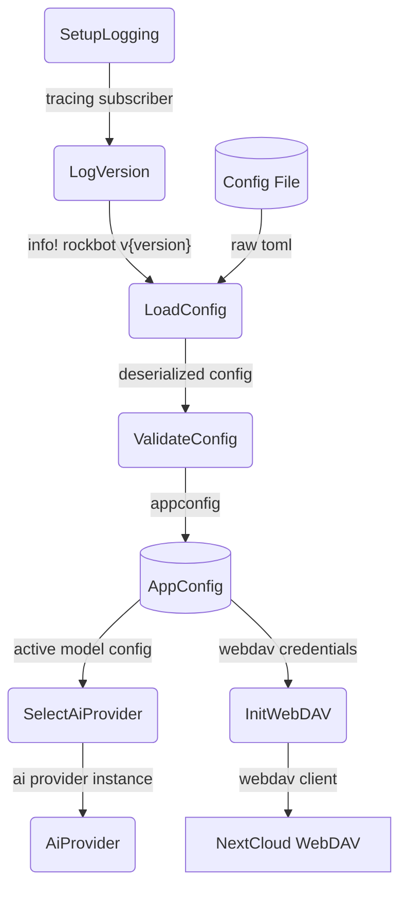

# Config & Provider Boot

## 1. Purpose

After logging is initialized, the bot logs its version (`rockbot v{version}`)
at `INFO` level. The version is embedded at compile time via
`env!("CARGO_PKG_VERSION")`, reading from `Cargo.toml` so it stays in sync
automatically. Config is loaded from `config.toml` (or `CONFIG_FILE` env var)
with embedded Rust defaults (`#[serde(default)]`), deserialized, and validated
into an `AppConfig` instance. The active model config selects which AI provider
to instantiate (DeepSeek / OpenRouter / llama.cpp). WebDAV client creation is
conditional on `[webdav]` config presence.

## 2. Diagram

