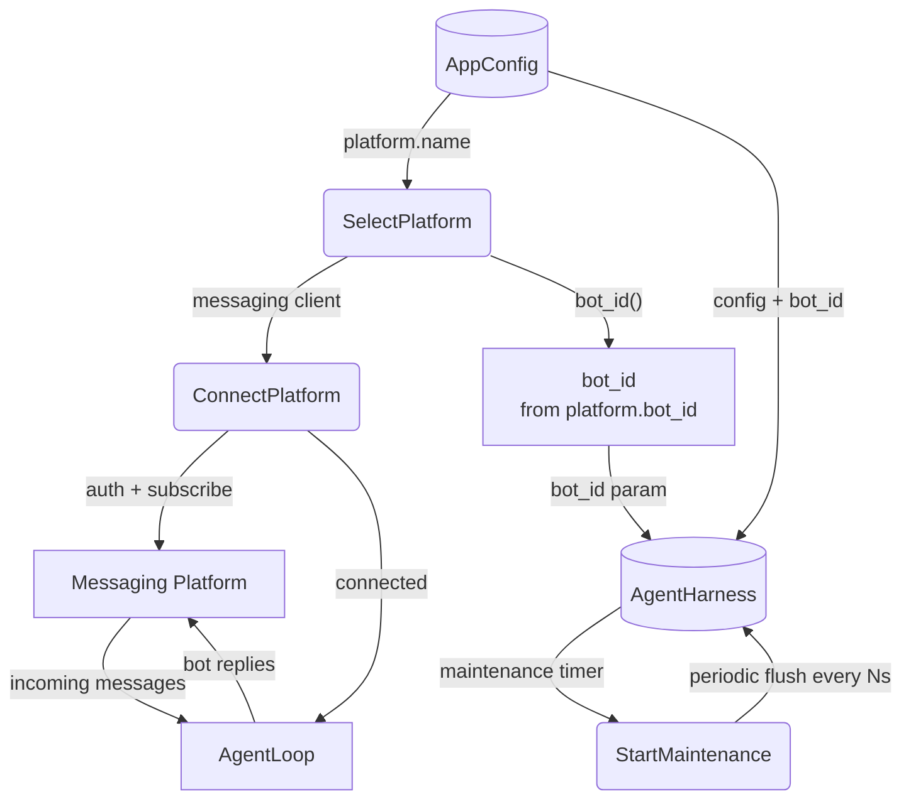

# Platform Connect & Enter Loop

## 1. Purpose

Platform is selected by `[platform] name` (rocketchat or matrix). A
`MessagingClient` is instantiated **before** the `AgentHarness` so its
`bot_id()` trait method can supply the per-bot identifier the harness needs
for WebDAV snapshot path isolation (issue #58 — the harness no longer derives
`bot_id` from `config.platform.name` itself). The connect+run loop then
begins. The maintenance timer is started just before entering the connection
loop, running every `persist_interval_secs` to flush dirty room snapshots to
WebDAV and evict stale rooms.

## 2. Diagram

