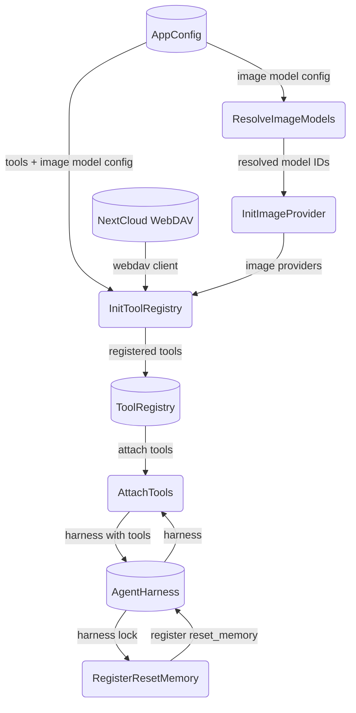

# Tool Registration

## 1. Purpose

Tool registration is the core of boot. Every tool is registered conditionally
based on available config (search provider config for web search, WebDAV for
persistent tools, image provider for image_gen). Each registration and
model-resolution step emits an **about-info** log line (see §4).

Tools registered unconditionally:
- `WebFetchTool` (variant depends on Exa + WebDAV availability)
- `VisionTool`

Tools registered conditionally on config:
- `WebSearchTool` (requires configured search provider in `[search]` section)
- `AcpTool` (`acp_delegate`) (requires `[acp] enabled = true` — the agent
  subprocess spawns lazily on first tool call, never at boot)

Tools registered when WebDAV is configured:
- `WebDavTool`, `EditSoulTool`, `SaveKnowledgeTool`,
  `ForgetKnowledgeTool`, `RecallKnowledgeTool`
- `CalendarTool` (if `[webdav]` calendar settings present)
- `ImageGenTool` (if an `image_provider` config entry exists — uses
  `FalAiProvider` or `OpenRouterImageProvider` internally, with model
  aliases resolved via `resolve_image_model()`)

## 2. Diagram

After all tools are registered, they are attached to `AgentHarness`. The
`ResetMemoryTool` is registered last (requires harness lock access).
