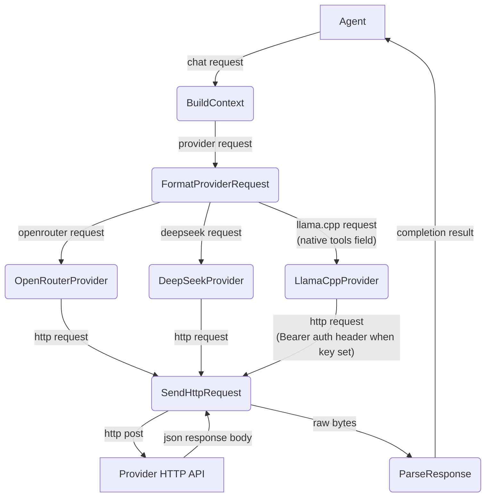
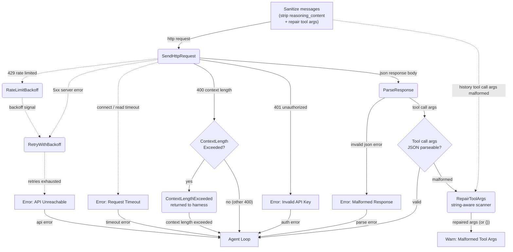
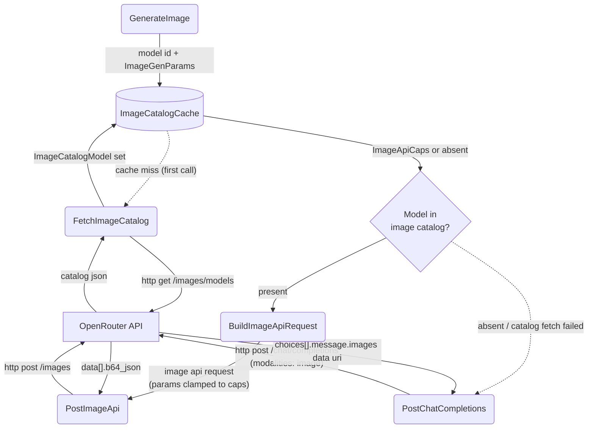

# AI Provider

## 1. Purpose

Configurable `AiProvider` trait abstracting over OpenAI-compatible chat
completion APIs and `ImageProvider` trait for image generation. Concrete
implementations include OpenRouter, DeepSeek, llama.cpp, OpenRouterImageProvider,
and FalAiProvider (image). Each handles provider-specific headers, model naming,
and payload formatting. Supports both base64 data URIs and remote URLs via
`ContentPart::ImageUrl`. The `stream` field is sent in request bodies but SSE
response parsing is not implemented — all responses are consumed as full JSON.

`OpenRouterImageProvider` targets two OpenRouter API surfaces (see §2d): the
dedicated **Image API** (`POST {base}/images`) for pure image models listed in
the image catalog (`GET {base}/images/models`), and the legacy chat
completions endpoint with `modalities: ["image"]` as fallback for models
absent from the catalog (Gitea issue #84).

- Upstream: [Configuration Management](config.md) provides `AiConfig`
- Downstream: [Agent Harness](../agent/agent-harness.md) calls `complete()` with `ChatRequest`
  (message history + tool definitions) and returns `CompletionResult`
- Downstream: [Image Gen Tool](../tools/image-gen.md) calls `generate_image()` via
  `ImageProvider` trait, implemented by `FalAiProvider` and `OpenRouterImageProvider`

### llama.cpp provider

`LlamaCppProvider` targets a local llama.cpp HTTP server (typically
`http://localhost:8080`). The llama.cpp server exposes an OpenAI-compatible
`/v1/chat/completions` endpoint, so the request/response format is shared
with `OpenRouterProvider`. Key differences:

- **Optional API key**: `api_key` is sent as an `Authorization: Bearer <key>`
  header **only when the key is non-empty**. The header is omitted when the key
  is empty, supporting local llama.cpp servers started without `--api-key`.
  When the server is started with `--api-key`, the configured key must be
  present or the server returns `401 Invalid API Key`.
- **Reasoning content extracted**: the `reasoning_content` field from the
  response message is extracted into `CompletionResult.reasoning_content`.
  Thinking models (e.g. lfm25) may put their entire output in
  `reasoning_content` and leave `content` empty. The harness uses this as
  a fallback when `content` is absent.
- **Native tool calling required**: tools are sent in the standard `tools`
  JSON field (same as OpenRouter and DeepSeek). The llama.cpp server must be
  started with `--jinja` so its Jinja2 chat template renders tool definitions
  in the model's native format. The model itself must support tool calling
  (e.g. Qwen2.5, Qwen3, Llama 3.x with tool-use chat template). The server
  returns tool calls in the standard OpenAI `tool_calls` response field with
  `finish_reason: "tool_calls"`. A text-based fallback parser
  (`✿FUNCTION✿` / `✿ARGS✿` / `✿END✿` delimiter scan) is retained for
  safety but should not trigger with properly configured servers.
- **Vision**: `ContentPart::ImageUrl` parts (data URIs) flow through to the
  server in the standard OpenAI multipart format. Vision works when the
  loaded GGUF is a multimodal model (e.g. llava, llava-llama3). For
  text-only models the server ignores or rejects the image part.
- **Single model**: `models` map typically has one entry. The model alias
  is required by config but the server ignores the `model` field in the
  request body (the loaded GGUF determines the model).
- **No retry on 429**: local servers do not rate-limit. Network errors
  (connection refused, timeout) are returned immediately as `ServerError`.
- **Leading system messages coalesced**: before serializing the request body,
  all leading `Role::System` messages are merged into a single system message
  (joined by `\n\n`). Defense-in-depth for strict Jinja chat templates (e.g.
  Qwen3.5/3.6-derived templates used by Bonsai-27B, run with `--jinja`) that
  hard-fail with HTTP 400 *"System message must be at the beginning"* when any
  system message appears at an index ≥ 1 — see Gitea issue #77. `BuildContext`
  already emits a single merged system message; this coalesce protects every
  current and future code path regardless of how the context was assembled.

## 2. Diagram

### 2a. Happy Flow (Main Success Path)

```mermaid
flowchart TD
    AGENT[Agent]
    BUILD(BuildContext)
    FORMAT(FormatProviderRequest)
    OPENROUTER(OpenRouterProvider)
    DEEPSEEK(DeepSeekProvider)
    LLAMA(LlamaCppProvider)
    HTTP(SendHttpRequest)
    PARSE(ParseResponse)
    PROVIDER_API[Provider HTTP API]

    AGENT -->|"chat request"| BUILD
    BUILD -->|"provider request"| FORMAT
    FORMAT -->|"openrouter request"| OPENROUTER
    FORMAT -->|"deepseek request"| DEEPSEEK
    FORMAT -->|"llama.cpp request<br/>(native tools field)"| LLAMA
    OPENROUTER -->|"http request"| HTTP
    DEEPSEEK -->|"http request"| HTTP
    LLAMA -->|"http request<br/>(Bearer auth header when key set)"| HTTP
    HTTP -->|"http post"| PROVIDER_API
    PROVIDER_API -->|"json response body"| HTTP
    HTTP -->|"raw bytes"| PARSE
    PARSE -->|"completion result"| AGENT
```

### 2b. Error Handling & Fallbacks

```mermaid
flowchart TD
    HTTP(SendHttpRequest)
    PARSE(ParseResponse)
    RATE(RateLimitBackoff)
    RETRY(RetryWithBackoff)
    CTX_ERR{ContextLength<br/>Exceeded?}
    CTX_RET(ContextLengthExceeded<br/>returned to harness)
    ERR_TIMEOUT[Error: Request Timeout]
    ERR_API[Error: API Unreachable]
    ERR_PARSE[Error: Malformed Response]
    ERR_AUTH[Error: Invalid API Key]
    TOOL_PARSE{Tool call args<br/>JSON parseable?}
    REPAIR(RepairToolArgs<br/>string-aware scanner)
    SANITIZE["Sanitize messages<br/>(strip reasoning_content<br/>+ repair tool args)"]
    WARN[Warn: Malformed Tool Args]
    AGENT[Agent Loop]

    SANITIZE -->|"http request"| HTTP
    HTTP -.->|"429 rate limited"| RATE
    RATE -.->|"backoff signal"| RETRY
    HTTP -.->|"5xx server error"| RETRY
    HTTP -.->|"connect / read timeout"| ERR_TIMEOUT
    RETRY -.->|"retries exhausted"| ERR_API
    HTTP -->|"400 context length"| CTX_ERR
    CTX_ERR -->|"yes"| CTX_RET
    CTX_ERR -->|"no (other 400)"| AGENT
    HTTP -->|"401 unauthorized"| ERR_AUTH
    HTTP -->|"json response body"| PARSE
    PARSE -->|"invalid json error"| ERR_PARSE
    PARSE -->|"tool call args"| TOOL_PARSE
    TOOL_PARSE -->|"valid"| AGENT
    TOOL_PARSE -->|"malformed"| REPAIR
    REPAIR -->|"repaired args (or {})"| WARN
    ERR_TIMEOUT -->|"timeout error"| AGENT
    ERR_API -->|"api error"| AGENT
    ERR_AUTH -->|"auth error"| AGENT
    ERR_PARSE -->|"parse error"| AGENT
    CTX_RET -->|"context length exceeded"| AGENT
    SANITIZE -.->|"history tool call args malformed"| REPAIR
```

**Tool-call JSON repair**: tool call `arguments` arrive as JSON strings that
may be truncated (e.g. a length-limited response cut mid-string) or contain
unescaped quotes inside long free-text values (e.g. a report embedding JSON
code blocks). Before sending a request and after parsing a response, every
`function.arguments` field is validated; malformed documents are repaired by
`RepairToolArgs` (see §3 `ToolArgsRepair`), a string-aware scanner shared by
all providers:

- **String-state tracking**: the scanner walks the document tracking
  in-string/escape state (`\"` handling), so braces, brackets, and quotes
  *inside string values* are never misread as JSON structure — the old
  brace/quote parity heuristic could silently produce wrong JSON for content
  with embedded code blocks. A backslash is buffered until its escaped char
  is known: valid escapes pass through, invalid ones (e.g. a lone `\` before
  a raw newline, Windows-style paths) are emitted as literal backslashes.
- **Unterminated string closure**: if the document ends inside a string value
  (the truncation point), a closing `"` is appended — a trailing lone `\`
  that would escape it is emitted literally first.
- **Raw control characters** (newlines, tabs) inside string values are
  converted to their `\n`/`\t`/`\uFFFD` escapes.
- **Structural balance**: braces/brackets outside strings are closed in
  correct nesting order (stack-based).
- **Validation gate**: the repaired document must parse; otherwise it is
  reset to `{}` (irrecoverable — e.g. unescaped embedded quotes that make the
  truncation point ambiguous) with a warning naming the tool and size.

**Tool-call parse error detection**: provider errors (HTTP 500/400) whose body
indicates a tool-call arguments JSON parse failure — nlohmann/json style
`[json.exception.parse_error.101] ... invalid string: missing closing quote`
or serde-style messages containing "tool call" + parse keywords — are
recognized by `is_tool_call_parse_error`. The harness treats these as
recoverable: it repairs all tool call arguments in the room history and
retries the request once before falling back to the error reply (see
[Agent Harness §2k](../agent/agent-harness.md#2k-tool-call-json-parse-error-recovery--provider-triggered-repair)).

**Context-length detection**: HTTP 400 responses whose error message contains
"context length" or "maximum context" (case-insensitive) are mapped to
`RockBotError::ContextLengthExceeded` instead of `InvalidRequest`. The harness
uses this to trigger a hard memory reset and a one-time retry. This
applies to OpenRouter, DeepSeek, and llama.cpp providers.

**HTTP timeouts**: Every `reqwest::Client` used by AI providers is built with
`connect_timeout` and request-level `timeout` to prevent indefinite hangs from
silent TCP drops or unresponsive provider endpoints.

| Parameter | Default | Description |
|-----------|---------|-------------|
| `connect_timeout` | 10s | TCP/TLS handshake timeout |
| `request_timeout` | 300s | Total request duration from first byte sent to response completion |

These timeouts apply to all providers: `DeepSeekProvider`, `OpenRouterProvider`,
`LlamaCppProvider`, and `FalAiProvider` (both submit/poll and image download).
A timeout produces `RockBotError::HttpTimeout` which the harness treats as a
transient failure — it sends an error reply and moves on, releasing the harness
lock for the next message.

The Fal image generation poll loop additionally uses a separate per-HTTP-request
timeout (30s for status polls, 600s for image downloads) to prevent individual
polling requests from blocking the task.

A `tokio::time::timeout()` wrapper at the harness call site provides an additional
defense-in-depth layer: if the provider's own timeout fails to fire (e.g., due to
a bug in `reqwest`'s timeout implementation), the wrapper cancels the future after
a hard deadline (default 360s, one minute longer than the client request timeout).

**llama.cpp error handling**: The local server does not rate-limit (no 429).
Connection errors (server not running, port unreachable) map to `ServerError`
immediately with no retry. HTTP 400 with context-length keywords still triggers
`ContextLengthExceeded`. Tool call arguments arrive as standard JSON from the
server's native tool calling, same as OpenRouter and DeepSeek.

Before sending each request, messages are sanitized:
- `reasoning_content` is stripped from all messages (response-only field that
  some providers reject in request input)
- All `function.arguments` fields in tool calls are validated as parseable
  JSON; malformed arguments (e.g. truncated from length-limited responses or
  containing unescaped quotes in long free-text values) are auto-repaired by
  the string-aware `RepairToolArgs` scanner or reset to `{}`
- After parsing a response, tool call arguments are also validated at the
  parse stage to prevent malformed data from entering conversation history

The same repair engine is shared by DeepSeek, OpenRouter, and llama.cpp —
llama.cpp validates both native `tool_calls` response arguments and history
arguments on request, closing the gap that previously let malformed args
reach local servers that hard-fail with HTTP 500 (Gitea issue #80).

### 2c. Vision Payload Deep Dive

```mermaid
flowchart TD
    MSG[ChatMessage]
    CHECK(CheckContentType)
    TEXT_ONLY(FormatTextContent)
    MULTI(FormatMultipartContent)
    IMG_URL(FormatImageUrl)
    IMG_B64(FormatImageBase64)
    STRIP{Provider model<br/>supports vision?}
    ROLE{Message role<br/>user?}
    CONVERT["Convert ImageUrl<br/>to &#91;image&#93; text"]
    REQ[ProviderRequest]

    MSG -->|"chat message"| CHECK
    CHECK -->|"text content"| TEXT_ONLY
    CHECK -->|"multipart content"| MULTI
    CHECK -->|"image url"| IMG_URL
    CHECK -->|"image base64"| IMG_B64
    TEXT_ONLY -->|"content string"| REQ
    IMG_URL -->|"image url part"| MULTI
    IMG_B64 -->|"image base64 part"| MULTI
    MULTI -->|"content array"| STRIP
    STRIP -->|"yes (OpenRouter / llama.cpp / DeepSeek vision model)"| ROLE
    STRIP -->|"no (DeepSeek text-only model)"| CONVERT
    ROLE -->|"yes — images pass through unchanged"| REQ
    ROLE -->|"no — DeepSeek rejects images<br/>outside user messages (400)"| CONVERT
    CONVERT -->|"text-only content"| REQ
```

**Provider-specific handling**: stripping is decided per provider and per
resolved model via `AiProvider::supports_vision()`:

- **Vision-capable** (OpenRouter, llama.cpp with a multimodal GGUF, DeepSeek
  `deepseek-v4-flash-vision-exp`): `ContentPart::ImageUrl` parts pass through
  unchanged — the LLM sees the actual pixels. For DeepSeek, images are kept
  only in **user** messages: DeepSeek rejects `image_url` parts in system/
  assistant messages with HTTP 400 (`Image in system/assistant message is not
  supported`), so non-user roles still go through the `[image]` conversion.
- **Text-only DeepSeek models** (`deepseek-v4-pro` and friends): all
  `ImageUrl` parts from every `ChatMessage` are stripped via
  `DeepSeekProvider::strip_message_images()`, converting multipart content to
  plain text with `[image]` placeholders. This keeps the shared
  `ChatMessage`/`ContentPart` data structures intact across all providers while
  preventing 400 errors — historically `unknown variant 'image_url', expected
  'text'`, today `This model does not support image` (live probe,
  Gitea ReLab/Ideas #116).

llama.cpp servers with a multimodal GGUF (llava, llava-llama3, etc.) handle the
OpenAI-compatible image format natively. OpenRouter passes vision payloads
through as-is — any model-specific vision support is handled by OpenRouter's
API.

**DeepSeek image content limits** (verified live, vision guide
`api-docs.deepseek.com/guides/vision`): JPEG/PNG/GIF/WebP only; 48 MiB request
body; 32 MiB per image (20 MiB cap in rockbot's `vision` tool); ~384 tokens per
image cap (64×48 PNG measured at ~102 prompt tokens). The literal reserved
placeholder token is **not** the text `[image]` — plain-text `[image]` messages
are accepted (200), so memory summaries with `[image]` placeholders remain
compatible.

**Fal seedream5 safety checker**: When the resolved model ID contains `"seedream/v5"`,
`FalAiProvider::submit_request()` conditionally sends `enable_safety_checker` if
present in `ImageGenParams`. The default value comes from
  `ImageModelConfig::default_enable_safety_checker` (default `false`). This is gated
on the model ID to avoid sending the parameter to non-seedream5 Fal models that
may reject it.

### 2d. OpenRouter Image API Routing

OpenRouter keeps two separate model catalogs: the chat catalog
(`GET /api/v1/models`) and the image catalog (`GET /api/v1/images/models`).
Pure image models (e.g. `qwen/qwen-image-3-pro`, `bytedance-seed/seedream-4.5`,
`microsoft/mai-image-2.5`) exist **only** in the image catalog and are
rejected with HTTP 404 on `chat/completions`. Dual-modality models
(e.g. Gemini image models) appear in both catalogs and are routed to the
Image API as well. The catalog is fetched lazily on first generation and
cached for the provider's lifetime.

```mermaid
flowchart TD
    GEN(GenerateImage)
    CACHE[(ImageCatalogCache)]
    FETCH(FetchImageCatalog)
    ROUTE{Model in<br/>image catalog?}
    CAPS(BuildImageApiRequest)
    IMGAPI(PostImageApi)
    LEGACY(PostChatCompletions)
    OR_API[OpenRouter API]

    GEN -->|"model id + ImageGenParams"| CACHE
    CACHE -.->|"cache miss (first call)"| FETCH
    FETCH -->|"http get /images/models"| OR_API
    OR_API -->|"catalog json"| FETCH
    FETCH -->|"ImageCatalogModel set"| CACHE
    CACHE -->|"ImageApiCaps or absent"| ROUTE
    ROUTE -->|"present"| CAPS
    ROUTE -.->|"absent / catalog fetch failed"| LEGACY
    CAPS -->|"image api request<br/>(params clamped to caps)"| IMGAPI
    IMGAPI -->|"http post /images"| OR_API
    LEGACY -->|"http post /chat/completions<br/>(modalities: image)"| OR_API
    OR_API -->|"data[].b64_json"| IMGAPI
    OR_API -->|"choices[].message.images data uri"| LEGACY
```

**Capability clamping** (`ImageApiCaps`, §3): the image catalog's
`supported_parameters` descriptors are parsed once per model at boundary and
used to shape the request — unsupported parameters are omitted rather than
sent:

- `resolution` — requested tier (from `ImageGenParams.size_tier`) not in the
  allowed enum → clamp down to the highest allowed tier
  (order: `512` < `1K` < `2K` < `4K`); e.g. default `4K` becomes `2K` for
  `qwen/qwen-image-3-pro`.
- `aspect_ratio` — requested ratio not in the allowed enum → omitted
  (provider default applies).
- `n` — `num_images` clamped to the range descriptor `max`.
- `quality` / `output_format` — sent only when present in
  `supported_parameters`.
- `input_references` — img2img `image_urls` map to
  `[{"type": "image_url", "image_url": {"url": ...}}]`.

The Image API response is `{data: [{b64_json, media_type}], usage}`; the
first entry's `b64_json` is base64-decoded to the returned bytes.

## 3. Data Structures

#### `ChatRequest`

| Field              | Type                    | Notes                              |
| ------------------ | ----------------------- | ---------------------------------- |
| `messages`         | `Vec<ChatMessage>`      | Conversation history               |
| `tools`            | `Option<Vec<ToolDef>>`  | Available tool/function definitions (`None` = none; conditionally omitted from serialization) |
| `stream`           | `bool`                  | Enable streaming response          |
| `model`            | `String`                | Model identifier                   |
| `temperature`      | `Option<f32>`           | Sampling temperature               |
| `max_tokens`       | `Option<u32>`           | Maximum output tokens              |
| `thinking`         | `Option<ThinkingConfig>`| Thinking mode config               |
| `reasoning_effort` | `Option<String>`        | Reasoning effort level             |
| `tool_choice`      | `Option<Value>`         | Tool choice override               |

#### `ThinkingConfig`

| Field            | Type     | Notes                              |
| -----------------| -------- | ---------------------------------- |
| `thinking_type`  | `String` | Always `"enabled"` (serialized as `"type"`) |

#### `ChatMessage`

| Field               | Type                       | Notes                             |
| ------------------- | -------------------------- | --------------------------------- |
| `role`              | `Role`                     | `System`, `User`, `Assistant`, `Tool` |
| `content`           | `MessageContent`           | Text or multipart (text + images) |
| `name`              | `Option<String>`           | Tool result name                  |
| `tool_calls`        | `Option<Vec<ToolCall>>`    | Assistant tool call requests      |
| `tool_call_id`      | `Option<String>`           | Required for tool result messages |
| `reasoning_content` | `Option<String>`           | DeepSeek reasoning/chain-of-thought|

#### `MessageContent`

| Variant     | Fields                        | Notes                          |
| ----------- | ----------------------------- | ------------------------------ |
| `Text`      | `String`                      | Plain text content             |
| `Multipart` | `Vec<ContentPart>`            | Mixed text and images          |

#### `ContentPart`

| Variant    | Fields                          | Notes                         |
| ---------- | ------------------------------- | ----------------------------- |
| `Text`     | `String`                        | Text segment                  |
| `ImageUrl` | `ImageUrlPayload { url: String, detail: Option<String> }` | Remote or `data:` base64 URL. Nested `image_url` wrapper matches OpenAI API format `{"type": "image_url", "image_url": {"url": "...", "detail": "..."}}` |

#### `CompletionResult`

| Field               | Type                  | Notes                                |
| ------------------- | --------------------- | ------------------------------------ |
| `text`              | `Option<String>`      | Assistant text response              |
| `tool_calls`        | `Vec<ToolCall>`       | Tool/function calls requested by LLM |
| `finish`            | `FinishReason`        | `Stop`, `ToolUse`, `Length`, `ContentFilter`, `InsufficientSystemResource`, `Error` |
| `reasoning_content` | `Option<String>`      | DeepSeek-style chain-of-thought text |
| `usage`             | `Option<UsageInfo>`   | Token usage statistics               |

#### `ToolCall`

| Field       | Type           | Notes                             |
| ----------- | -------------- | --------------------------------- |
| `id`        | `String`       | Provider-assigned call ID         |
| `call_type` | `String`       | Always `"function"`               |
| `function`  | `FunctionCall` | Nested function details           |

#### `FunctionCall`

| Field       | Type     | Notes                 |
| ----------- | -------- | --------------------- |
| `name`      | `String` | Tool/function name    |
| `arguments` | `String` | JSON-encoded arguments|

#### `ToolDef`

| Field       | Type         | Notes                             |
| ----------- | ------------ | --------------------------------- |
| `tool_type` | `String`     | Always `"function"`               |
| `function`  | `FunctionDef`| Wrapped function definition       |

#### `FunctionDef`

| Field         | Type              | Notes                           |
| ------------- | ----------------- | ------------------------------- |
| `name`        | `String`          | Function name                   |
| `description` | `Option<String>`  | Human-readable description      |
| `parameters`  | `Option<Value>`   | JSON Schema for arguments       |
| `strict`      | `Option<bool>`    | Strict schema enforcement       |

#### `ToolArgsRepair` (shared — `provider/tool_args.rs`)

| Function | Signature | Notes |
| -------- | --------- | ----- |
| `repair_tool_args` | `(name: &str, args: &str) -> String` | String-aware scan: close unterminated strings, escape raw control chars, balance braces/brackets outside strings, validate; fallback `{}` |
| `sanitize_messages_tool_calls` | `(&mut [ChatMessage]) -> usize` | Repair every invalid `function.arguments` in a message list in place; returns repair count |
| `is_tool_call_parse_error` | `(&RockBotError) -> bool` | True when the provider error body indicates a tool-call arguments JSON parse failure (nlohmann `parse_error.10x` / "missing closing quote" / "invalid string" + tool-call keywords) |

#### `ImageCatalogModel` (OpenRouter image catalog entry, parsed at boundary)

Response shape of `GET {base}/images/models` → `data[]` (see §2d).

| Field                  | Type                                        | Notes                                          |
| ---------------------- | ------------------------------------------- | ---------------------------------------------- |
| `id`                   | `String`                                    | Model slug used in generation requests         |
| `supported_parameters` | `Option<HashMap<String, ParamDescriptor>>`  | Capability descriptors keyed by parameter name |

#### `ParamDescriptor` (capability descriptor)

| Variant   | Fields              | Notes                                   |
| --------- | ------------------- | --------------------------------------- |
| `Enum`    | `values: Vec<String>` | Discrete allowlist (e.g. resolutions) |
| `Range`   | `min: i64, max: i64` | Any integer in range (e.g. `n`)        |
| `Boolean` | —                   | Present = supported                     |

#### `ImageApiCaps` (domain caps derived from `ImageCatalogModel`)

| Field                     | Type                 | Notes                                                        |
| ------------------------- | -------------------- | ------------------------------------------------------------ |
| `resolutions`             | `Option<Vec<String>>`| Allowed tiers sorted ascending (`512` < `1K` < `2K` < `4K`)  |
| `aspect_ratios`           | `Option<Vec<String>>`| Allowed `W:H` strings                                        |
| `n_max`                   | `Option<u32>`        | Max images per call (from `n` range descriptor)              |
| `supports_quality`        | `bool`               | `quality` present in `supported_parameters`                  |
| `supports_output_format`  | `bool`               | `output_format` present in `supported_parameters`            |
