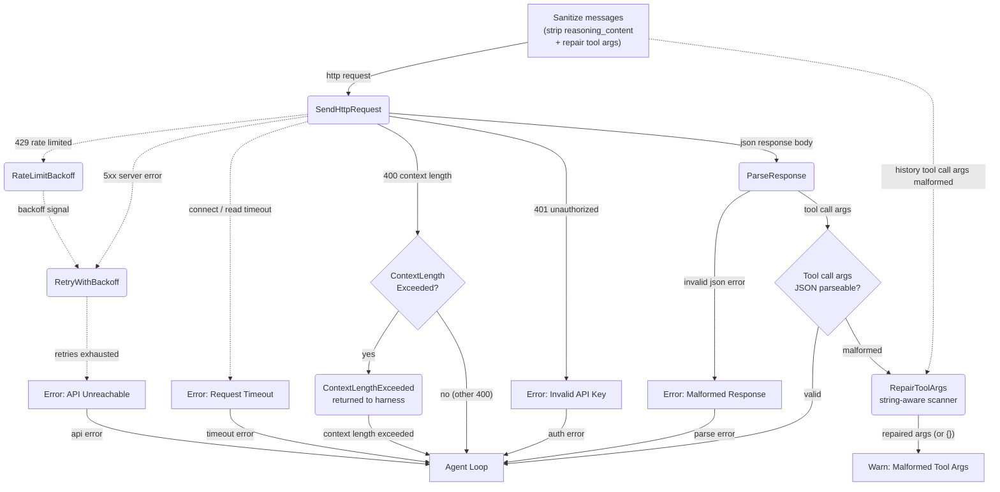

# Error Handling & Fallbacks

## 1. Purpose

How provider failures are handled: rate-limit backoff, retried 5xx errors,
explicit error mapping for timeouts, auth failures, context-length errors, and
malformed responses — plus repair of malformed tool call arguments and message
sanitization before each request.

References: [Main Path](../main-path.md)

## 2. Diagram

**Tool-call JSON repair**: tool call `arguments` arrive as JSON strings that
may be truncated (e.g. a length-limited response cut mid-string) or contain
unescaped quotes inside long free-text values (e.g. a report embedding JSON
code blocks). Before sending a request and after parsing a response, every
`function.arguments` field is validated; malformed documents are repaired by
`RepairToolArgs` (see [structures.md §3 `ToolArgsRepair`](../structures.md)), a
string-aware scanner shared by all providers:

- **String-state tracking**: the scanner walks the document tracking
  in-string/escape state (`\"` handling), so braces, brackets, and quotes
  *inside string values* are never misread as JSON structure — the old
  brace/quote parity heuristic could silently produce wrong JSON for content
  with embedded code blocks. A backslash is buffered until its escaped char
  is known: valid escapes pass through, invalid ones (e.g. a lone `\` before
  a raw newline, Windows-style paths) are emitted as literal backslashes.
- **Unterminated string closure**: if the document ends inside a string value
  (the truncation point), a closing `"` is appended — a trailing lone `\`
  that would escape it is emitted literally first.
- **Raw control characters** (newlines, tabs) inside string values are
  converted to their `\n`/`\t`/`\uFFFD` escapes.
- **Structural balance**: braces/brackets outside strings are closed in
  correct nesting order (stack-based).
- **Validation gate**: the repaired document must parse; otherwise it is
  reset to `{}` (irrecoverable — e.g. unescaped embedded quotes that make the
  truncation point ambiguous) with a warning naming the tool and size.

**Tool-call parse error detection**: provider errors (HTTP 500/400) whose body
indicates a tool-call arguments JSON parse failure — nlohmann/json style
`[json.exception.parse_error.101] ... invalid string: missing closing quote`
or serde-style messages containing "tool call" + parse keywords — are
recognized by `is_tool_call_parse_error`. The harness treats these as
recoverable: it repairs all tool call arguments in the room history and
retries the request once before falling back to the error reply (see
[Agent Harness §2k](../../../agent/agent-harness/agent-loop.md#2k-tool-call-json-parse-error-recovery--provider-triggered-repair)).

**Context-length detection**: HTTP 400 responses whose error message contains
"context length" or "maximum context" (case-insensitive) are mapped to
`RockBotError::ContextLengthExceeded` instead of `InvalidRequest`. The harness
uses this to trigger a hard memory reset and a one-time retry. This
applies to OpenRouter, DeepSeek, and llama.cpp providers.

**HTTP timeouts**: Every `reqwest::Client` used by AI providers is built with
`connect_timeout` and request-level `timeout` to prevent indefinite hangs from
silent TCP drops or unresponsive provider endpoints.

| Parameter | Default | Description |
|-----------|---------|-------------|
| `connect_timeout` | 10s | TCP/TLS handshake timeout |
| `request_timeout` | 300s | Total request duration from first byte sent to response completion |

These timeouts apply to all providers: `DeepSeekProvider`, `OpenRouterProvider`,
`LlamaCppProvider`, and `FalAiProvider` (both submit/poll and image download).
A timeout produces `RockBotError::HttpTimeout` which the harness treats as a
transient failure — it sends an error reply and moves on, releasing the harness
lock for the next message.

The Fal image generation poll loop additionally uses a separate per-HTTP-request
timeout (30s for status polls, 600s for image downloads) to prevent individual
polling requests from blocking the task.

A `tokio::time::timeout()` wrapper at the harness call site provides an additional
defense-in-depth layer: if the provider's own timeout fails to fire (e.g., due to
a bug in `reqwest`'s timeout implementation), the wrapper cancels the future after
a hard deadline (default 360s, one minute longer than the client request timeout).

**llama.cpp error handling**: The local server does not rate-limit (no 429).
Connection errors (server not running, port unreachable) map to `ServerError`
immediately with no retry. HTTP 400 with context-length keywords still triggers
`ContextLengthExceeded`. Tool call arguments arrive as standard JSON from the
server's native tool calling, same as OpenRouter and DeepSeek.

Before sending each request, messages are sanitized:
- `reasoning_content` is stripped from all messages (response-only field that
  some providers reject in request input)
- All `function.arguments` fields in tool calls are validated as parseable
  JSON; malformed arguments (e.g. truncated from length-limited responses or
  containing unescaped quotes in long free-text values) are auto-repaired by
  the string-aware `RepairToolArgs` scanner or reset to `{}`
- After parsing a response, tool call arguments are also validated at the
  parse stage to prevent malformed data from entering conversation history

The same repair engine is shared by DeepSeek, OpenRouter, and llama.cpp —
llama.cpp validates both native `tool_calls` response arguments and history
arguments on request, closing the gap that previously let malformed args
reach local servers that hard-fail with HTTP 500 (Gitea issue #80).
