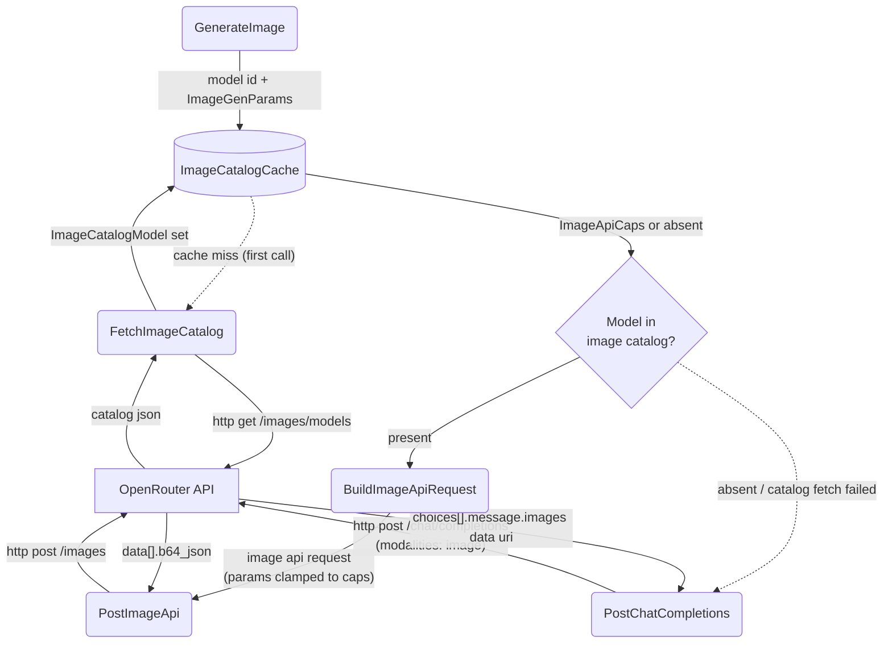

# OpenRouter Image API Routing

## 1. Purpose

OpenRouter keeps two separate model catalogs: the chat catalog
(`GET /api/v1/models`) and the image catalog (`GET /api/v1/images/models`).
Pure image models (e.g. `qwen/qwen-image-3-pro`, `bytedance-seed/seedream-4.5`,
`microsoft/mai-image-2.5-pro`) exist **only** in the image catalog and are
rejected with HTTP 404 on `chat/completions`. Dual-modality models
(e.g. Gemini image models) appear in both catalogs and are routed to the
Image API as well. The catalog is fetched lazily on first generation and
cached for the provider's lifetime.

References: [Main Path](../main-path.md)

## 2. Diagram

**Capability clamping** (`ImageApiCaps`, [structures.md §3](../structures.md)):
the image catalog's `supported_parameters` descriptors are parsed once per
model at boundary and used to shape the request — unsupported parameters are
omitted rather than sent:

- `resolution` — requested tier (from `ImageGenParams.size_tier`) not in the
  allowed enum → clamp down to the highest allowed tier
  (order: `512` < `1K` < `2K` < `4K`); e.g. default `4K` becomes `2K` for
  `qwen/qwen-image-3-pro`.
- `aspect_ratio` — requested ratio not in the allowed enum → omitted
  (provider default applies).
- `n` — `num_images` clamped to the range descriptor `max`.
- `quality` / `output_format` — sent only when present in
  `supported_parameters`.
- `input_references` — img2img `image_urls` map to
  `[{"type": "image_url", "image_url": {"url": ...}}]`.

The Image API response is `{data: [{b64_json, media_type}], usage}`; the
first entry's `b64_json` is base64-decoded to the returned bytes.
