# Vision Payload Deep Dive

## 1. Purpose

How image content (remote URLs or base64 data URIs) is formatted into
provider-specific multipart payloads, including per-provider vision stripping,
DeepSeek image restrictions, and the Fal seedream5 safety checker.

References: [Main Path](../main-path.md)

## 2. Diagram

```mermaid
flowchart TD
    MSG[ChatMessage]
    CHECK(CheckContentType)
    TEXT_ONLY(FormatTextContent)
    MULTI(FormatMultipartContent)
    IMG_URL(FormatImageUrl)
    IMG_B64(FormatImageBase64)
    STRIP{Provider model<br/>supports vision?}
    ROLE{Message role<br/>user?}
    CONVERT["Convert ImageUrl<br/>to &#91;image&#93; text"]
    REQ[ProviderRequest]

    MSG -->|"chat message"| CHECK
    CHECK -->|"text content"| TEXT_ONLY
    CHECK -->|"multipart content"| MULTI
    CHECK -->|"image url"| IMG_URL
    CHECK -->|"image base64"| IMG_B64
    TEXT_ONLY -->|"content string"| REQ
    IMG_URL -->|"image url part"| MULTI
    IMG_B64 -->|"image base64 part"| MULTI
    MULTI -->|"content array"| STRIP
    STRIP -->|"yes (OpenRouter / llama.cpp / DeepSeek vision model)"| ROLE
    STRIP -->|"no (DeepSeek text-only model)"| CONVERT
    ROLE -->|"yes — images pass through unchanged"| REQ
    ROLE -->|"no — DeepSeek rejects images<br/>outside user messages (400)"| CONVERT
    CONVERT -->|"text-only content"| REQ
```

**Provider-specific handling**: stripping is decided per provider and per
resolved model via `AiProvider::supports_vision()`:

- **Vision-capable** (OpenRouter, llama.cpp with a multimodal GGUF, DeepSeek
  `deepseek-v4-flash-vision-exp`): `ContentPart::ImageUrl` parts pass through
  unchanged — the LLM sees the actual pixels. For DeepSeek, images are kept
  only in **user** messages: DeepSeek rejects `image_url` parts in system/
  assistant messages with HTTP 400 (`Image in system/assistant message is not
  supported`), so non-user roles still go through the `[image]` conversion.
- **Text-only DeepSeek models** (`deepseek-v4-pro` and friends): all
  `ImageUrl` parts from every `ChatMessage` are stripped via
  `DeepSeekProvider::strip_message_images()`, converting multipart content to
  plain text with `[image]` placeholders. This keeps the shared
  `ChatMessage`/`ContentPart` data structures intact across all providers while
  preventing 400 errors — historically `unknown variant 'image_url', expected
  'text'`, today `This model does not support image` (live probe,
  Gitea ReLab/Ideas #116).

llama.cpp servers with a multimodal GGUF (llava, llava-llama3, etc.) handle the
OpenAI-compatible image format natively. OpenRouter passes vision payloads
through as-is — any model-specific vision support is handled by OpenRouter's
API.

**DeepSeek image content limits** (verified live, vision guide
`api-docs.deepseek.com/guides/vision`): JPEG/PNG/GIF/WebP only; 48 MiB request
body; 32 MiB per image (20 MiB cap in rockbot's `vision` tool); ~384 tokens per
image cap (64×48 PNG measured at ~102 prompt tokens). The literal reserved
placeholder token is **not** the text `[image]` — plain-text `[image]` messages
are accepted (200), so memory summaries with `[image]` placeholders remain
compatible.

**Fal seedream5 safety checker**: When the resolved model ID contains `"seedream/v5"`,
`FalAiProvider::submit_request()` conditionally sends `enable_safety_checker` if
present in `ImageGenParams`. The default value comes from
  `ImageModelConfig::default_enable_safety_checker` (default `false`). This is gated
on the model ID to avoid sending the parameter to non-seedream5 Fal models that
may reject it.
