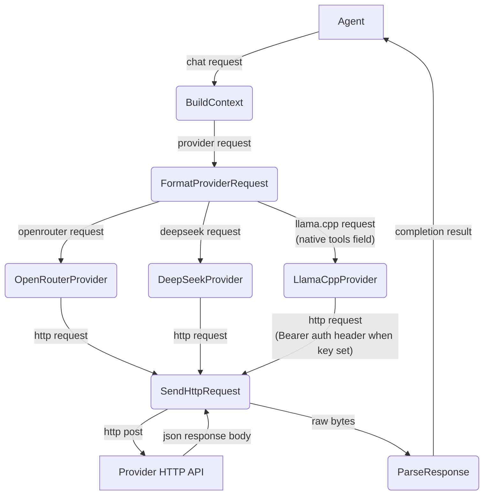

# Happy Flow (Main Success Path)

## 1. Purpose

The agent's chat request is built into a provider request, formatted per
provider (OpenRouter, DeepSeek, or llama.cpp), sent as an HTTP POST to the
provider API, parsed, and returned to the agent as a `CompletionResult`.

References: [Shared structures](structures.md)

## 2. Diagram

## 3. Data Structures

See [structures.md](structures.md).
