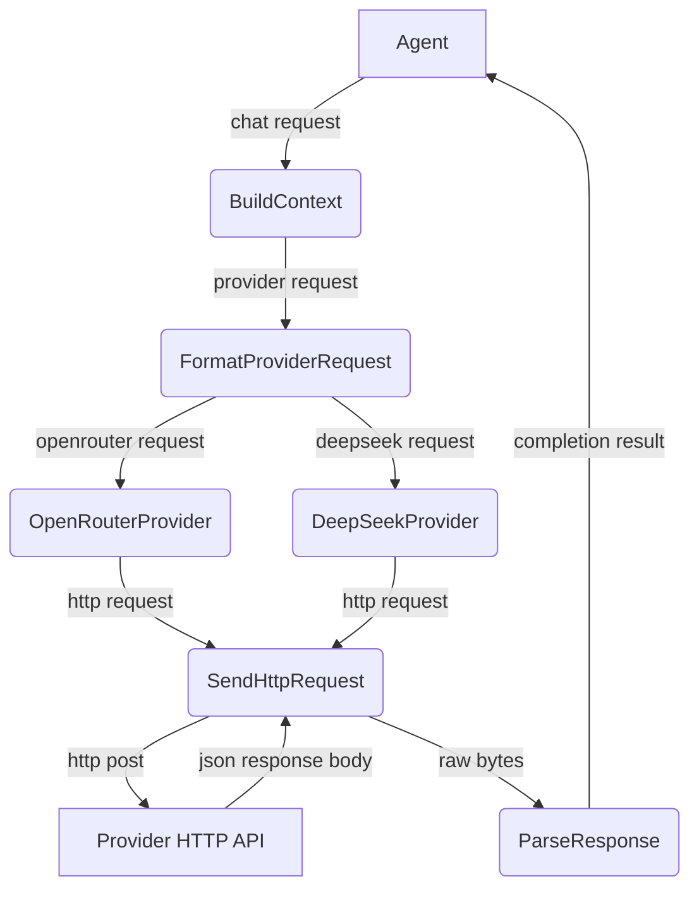
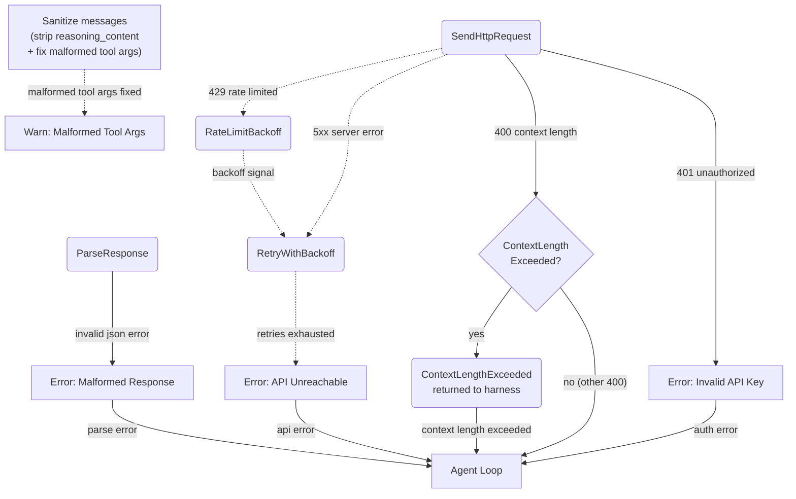

# AI Provider

## 1. Purpose

Configurable `AiProvider` trait abstracting over OpenAI-compatible chat
completion APIs and `ImageProvider` trait for image generation. Concrete
implementations include OpenRouter, DeepSeek (text), OpenRouterImageProvider,
and FalAiProvider (image). Each handles provider-specific headers, model naming,
and payload formatting. Supports both base64 data URIs and remote URLs via
`ContentPart::ImageUrl`. The `stream` field is sent in request bodies but SSE
response parsing is not implemented — all responses are consumed as full JSON.

- Upstream: [Configuration Management](config.md) provides `AiConfig`
- Downstream: [Agent Harness](../agent-harness.md) calls `complete()` with `ChatRequest`
  (message history + tool definitions) and returns `CompletionResult`
- Downstream: [Image Gen Tool](../tools/image-gen.md) calls `generate_image()` via
  `ImageProvider` trait, implemented by `FalAiProvider` and `OpenRouterImageProvider`

## 2. Diagram

### 2a. Happy Flow (Main Success Path)

### 2b. Error Handling & Fallbacks

**Context-length detection**: HTTP 400 responses whose error message contains
"context length" or "maximum context" (case-insensitive) are mapped to
`RockBotError::ContextLengthExceeded` instead of `InvalidRequest`. The harness
uses this to trigger aggressive memory compression and a one-time retry. This
applies to both OpenRouter and DeepSeek providers.

Before sending each request, messages are sanitized:
- `reasoning_content` is stripped from all messages (response-only field that
  some providers reject in request input)
- All `function.arguments` fields in tool calls are validated as parseable
  JSON; malformed arguments (e.g. truncated from length-limited responses) are
  auto-repaired (balance braces/quotes) or reset to `{}`
- After parsing a response, tool call arguments are also validated at the
  parse stage to prevent malformed data from entering conversation history

### 2c. Vision Payload Deep Dive

```mermaid
flowchart TD
    MSG[ChatMessage]
    CHECK(CheckContentType)
    TEXT_ONLY(FormatTextContent)
    MULTI(FormatMultipartContent)
    IMG_URL(FormatImageUrl)
    IMG_B64(FormatImageBase64)
    STRIP{Provider<br/>supports vision?}
    CONVERT["Convert ImageUrl<br/>to &#91;image&#93; text"]
    REQ[ProviderRequest]

    MSG -->|"chat message"| CHECK
    CHECK -->|"text content"| TEXT_ONLY
    CHECK -->|"multipart content"| MULTI
    CHECK -->|"image url"| IMG_URL
    CHECK -->|"image base64"| IMG_B64
    TEXT_ONLY -->|"content string"| REQ
    IMG_URL -->|"image url part"| MULTI
    IMG_B64 -->|"image base64 part"| MULTI
    MULTI -->|"content array"| STRIP
    STRIP -->|"yes (OpenRouter)"| REQ
    STRIP -->|"no (DeepSeek)"| CONVERT
    CONVERT -->|"text-only content"| REQ
```

**Provider-specific handling**: DeepSeek models currently do not support vision
(multimodal) input. Until DeepSeek adds `image_url` content part support, the
`DeepSeekProvider::build_request_body()` method strips all `ContentPart::ImageUrl`
parts from every `ChatMessage`, converting multipart content to plain text with
`[image]` placeholders. This keeps the shared `ChatMessage`/`ContentPart` data
structures intact across all providers while preventing 400 errors from
`unknown variant 'image_url', expected 'text'`. OpenRouter passes vision payloads
through as-is — any model-specific vision support is handled by OpenRouter's API.

## 3. Data Structures

#### `ChatRequest`

| Field              | Type                    | Notes                              |
| ------------------ | ----------------------- | ---------------------------------- |
| `messages`         | `Vec<ChatMessage>`      | Conversation history               |
| `tools`            | `Option<Vec<ToolDef>>`  | Available tool/function definitions (`None` = none; conditionally omitted from serialization) |
| `stream`           | `bool`                  | Enable streaming response          |
| `model`            | `String`                | Model identifier                   |
| `temperature`      | `Option<f32>`           | Sampling temperature               |
| `max_tokens`       | `Option<u32>`           | Maximum output tokens              |
| `thinking`         | `Option<ThinkingConfig>`| Thinking mode config               |
| `reasoning_effort` | `Option<String>`        | Reasoning effort level             |
| `tool_choice`      | `Option<Value>`         | Tool choice override               |

#### `ThinkingConfig`

| Field            | Type     | Notes                              |
| -----------------| -------- | ---------------------------------- |
| `thinking_type`  | `String` | Always `"enabled"` (serialized as `"type"`) |

#### `ChatMessage`

| Field               | Type                       | Notes                             |
| ------------------- | -------------------------- | --------------------------------- |
| `role`              | `Role`                     | `System`, `User`, `Assistant`, `Tool` |
| `content`           | `MessageContent`           | Text or multipart (text + images) |
| `name`              | `Option<String>`           | Tool result name                  |
| `tool_calls`        | `Option<Vec<ToolCall>>`    | Assistant tool call requests      |
| `tool_call_id`      | `Option<String>`           | Required for tool result messages |
| `reasoning_content` | `Option<String>`           | DeepSeek reasoning/chain-of-thought|

#### `MessageContent`

| Variant     | Fields                        | Notes                          |
| ----------- | ----------------------------- | ------------------------------ |
| `Text`      | `String`                      | Plain text content             |
| `Multipart` | `Vec<ContentPart>`            | Mixed text and images          |

#### `ContentPart`

| Variant    | Fields                          | Notes                         |
| ---------- | ------------------------------- | ----------------------------- |
| `Text`     | `String`                        | Text segment                  |
| `ImageUrl` | `ImageUrlPayload { url: String, detail: Option<String> }` | Remote or `data:` base64 URL. Nested `image_url` wrapper matches OpenAI API format `{"type": "image_url", "image_url": {"url": "...", "detail": "..."}}` |

#### `CompletionResult`

| Field               | Type                  | Notes                                |
| ------------------- | --------------------- | ------------------------------------ |
| `text`              | `Option<String>`      | Assistant text response              |
| `tool_calls`        | `Vec<ToolCall>`       | Tool/function calls requested by LLM |
| `finish`            | `FinishReason`        | `Stop`, `ToolUse`, `Length`, `ContentFilter`, `InsufficientSystemResource`, `Error` |
| `reasoning_content` | `Option<String>`      | DeepSeek-style chain-of-thought text |
| `usage`             | `Option<UsageInfo>`   | Token usage statistics               |

#### `ToolCall`

| Field       | Type           | Notes                             |
| ----------- | -------------- | --------------------------------- |
| `id`        | `String`       | Provider-assigned call ID         |
| `call_type` | `String`       | Always `"function"`               |
| `function`  | `FunctionCall` | Nested function details           |

#### `FunctionCall`

| Field       | Type     | Notes                 |
| ----------- | -------- | --------------------- |
| `name`      | `String` | Tool/function name    |
| `arguments` | `String` | JSON-encoded arguments|

#### `ToolDef`

| Field       | Type         | Notes                             |
| ----------- | ------------ | --------------------------------- |
| `tool_type` | `String`     | Always `"function"`               |
| `function`  | `FunctionDef`| Wrapped function definition       |

#### `FunctionDef`

| Field         | Type              | Notes                           |
| ------------- | ----------------- | ------------------------------- |
| `name`        | `String`          | Function name                   |
| `description` | `Option<String>`  | Human-readable description      |
| `parameters`  | `Option<Value>`   | JSON Schema for arguments       |
| `strict`      | `Option<bool>`    | Strict schema enforcement       |
